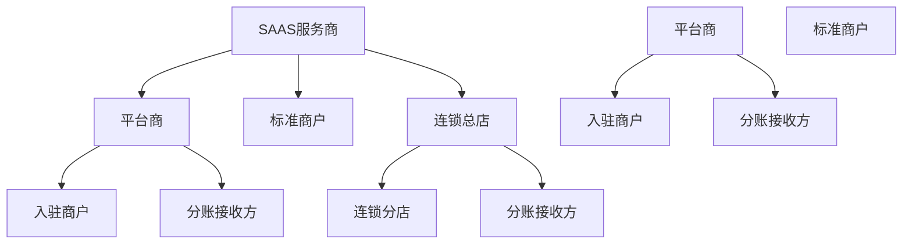
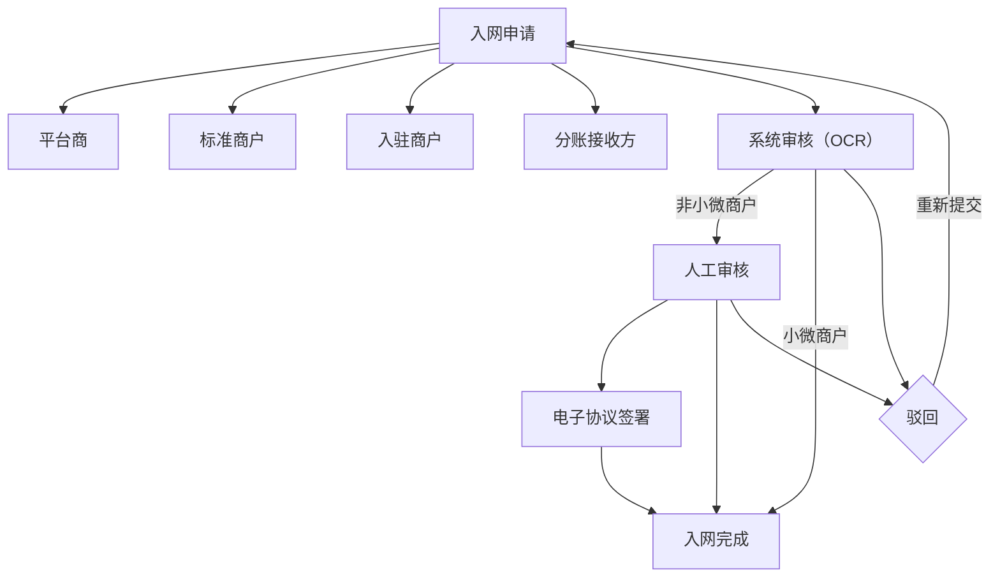
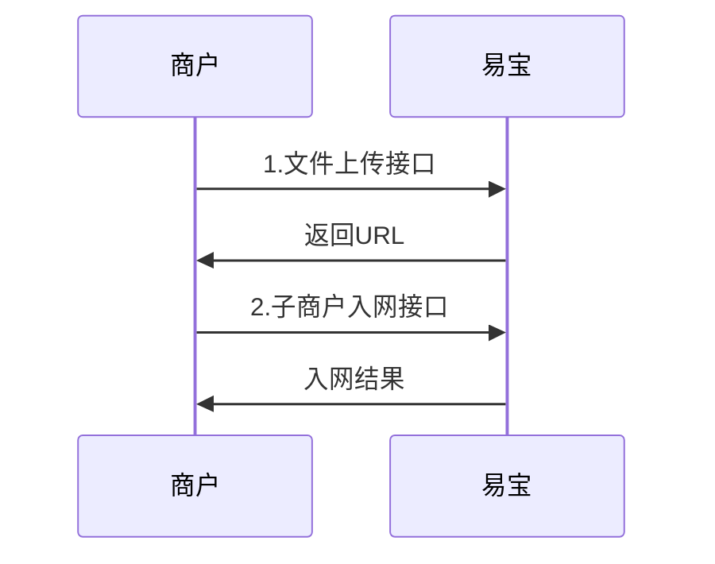

# 入网

入网是为服务商、平台商提供拓展子商户入网的能力，又称**进件、入件**。

> 接口字段以在线文档为准：按下表 catalog id 在 `../api-index.yaml`（`merchant-netin` 分组）取其 `doc_md`，执行
> `curl -sS "<doc_md>"` 后再实现（单文件含字段/示例/错误码/示例代码）。

## 易宝客户模型说明

图注：

- **通过上级携带来的商户**：可通过 API、商户后台、轻量化入网方式入网，不能通过流程魔方手提单入网。
- **非商户**：仅有身份，无商编，作为业务参与方一环存在（如入账方）。
- **直营**：直接跟易宝签约的客户，通过销售在流程魔方手提单入网。
- 层级说明：SaaS 服务商为「减二」层级，平台商/连锁总店为「减一」层级。

### 客户模型名词解释

| 商户类型    | 定义                                                                          | 主体类型      |
| ------- | --------------------------------------------------------------------------- | --------- |
| SaaS服务商 | 为商户提供软、硬件服务的技术服务方，有完整的技术团队、以及行业背景（比如餐饮saas、能源saas、医美saas、电商saas等），SaaS本身不收单 | 企业        |
| 连锁总店    | 连锁总分商户体系中的连锁总店，非直营商户，需要由服务商拓展，并且可以拓展分店                                      | 企业、个体     |
| 连锁分店    | 连锁总分商户体系中的连锁分店，是总店的下级                                                       | 企业、个体、小微  |
| 标准商户    | 单店/单独收单的商户，可以是直营商户，也可以是由SaaS拓展而来，不能拓展下级                                     | 企业、个体、小微  |
| 平台商     | 有自己的商户实际入驻到平台，有自己的平台系统，平台商可以收单，可以拓展入驻商户（有直营平台商和服务商拓展的平台商）                   | 企业类       |
| 入驻商户    | 平台商下面的子商户，依托于平台商                                                            | 企业类、个体、小微 |
| 分账接收方   | 仅用于分账结算的主体，入网流程快，不需要签署电子协议，第二天自动到银行卡                                        | 企业类、个体、小微 |

## 商户入网的审核流程

## 接口调用流程

## 场景 → 接口

### 入网

| 用途                                    | catalog id                         | 方法   | 路径                                            |
| ------------------------------------- | ---------------------------------- | ---- | --------------------------------------------- |
| 文件上传（图片类文件需先转为资质存储 URL，该 URL 无法在外网访问） | `merchant-qual-upload`             | POST | `/yos/v1.0/sys/merchant/qual/upload`          |
| 服务商入网-企业（服务商拓展的平台商发起子商户入网也用该接口）       | `mer-register-saas-merchant`       | POST | `/rest/v2.0/mer/register/saas/merchant`       |
| 服务商入网-小微（服务商拓展的平台商发起子商户入网也用该接口）       | `mer-register-saas-micro`          | POST | `/rest/v2.0/mer/register/saas/micro`          |
| 平台商入网-企业（直营平台商发起子商户入网用该接口）            | `mer-register-contribute-merchant` | POST | `/rest/v2.0/mer/register/contribute/merchant` |
| 平台商入网-小微（直营平台商发起子商户入网用该接口）            | `mer-register-contribute-micro`    | POST | `/rest/v2.0/mer/register/contribute/micro`    |
| 商户状态查询                                | `mer-status-query`                 | GET  | `/rest/v1.0/mer/status/query`                 |
| 商户入网进度查询                              | `mer-register-query`               | GET  | `/rest/v2.0/mer/register/query`               |
| 商户产品费率查询                              | `mer-product-fee-query`            | GET  | `/rest/v2.0/mer/product/fee/query`            |
| 查询经营省市区编码                             | `mer-area-query`                   | POST | `/rest/v1.0/mer/area/query`                   |

入网结果回调：入网接口传 `notifyUrl` 接收电子签章地址、驳回原因与入网完成通知；通知编码与报文字段以入网接口 doc_md「结果通知」节为准（索引提示：`mer.register-result`）。

### 商户管理

| 用途           | catalog id               | 方法   | 路径                                          |
| ------------ | ------------------------ | ---- | ------------------------------------------- |
| 商户信息变更       | `mer-info-modify`        | POST | `/rest/v1.0/mer/merchant/info/modify`       |
| 商户信息变更进度查询   | `mer-info-modify-query`  | GET  | `/rest/v1.0/mer/merchant/info/modify/query` |
| 产品变更         | `mer-product-fee-modify` | POST | `/rest/v2.0/mer/product/fee/modify`         |
| 沉默商户解冻申请     | `mer-dispose-unfreeze`   | POST | `/rest/v1.0/mer/merchant/dispose/unfreeze`  |
| 沉默商户解冻申请进度查询 | `mer-dispose-query`      | GET  | `/rest/v1.0/mer/merchant/dispose/query`     |

> 解冻接口**只适用于沉默商户的解冻**；其他类型冻结均需要联系运营、技术支持来处理。

### 实名认证（微信/支付宝/云闪付支付前置准备）

商户入网后，会进行微信、支付宝商户报备，报备通过后产品开通；产品开通后需要进行微信、支付宝实名认证，否则无法正常使用聚合产品。接口清单、认证方式与排障见本目录 `实名认证.md`。

## 流程

1. 有图片类资质材料时，先调 `merchant-qual-upload` 上传，取返回的资质存储 URL。
2. 按商户签约方案选入网接口：**服务商解决方案**走 `mer-register-saas-*`（服务商拓展的平台商入网同样走此接口）；**直营平台商拓展子商户**走 `mer-register-contribute-*`；主体为小微用 `*-micro`，企业/个体用 `*-merchant`。
3. 用业务唯一 `requestNo` 发起入网；同步返回的商编**不代表入网成功**。
4. 以「入网结果通知」（`mer.register-result`）业务状态 = **已完成** 作为入网成功依据；也可用 `mer-register-query` 轮询进度、`mer-status-query` 查商户状态。
5. 非小微商户需完成电子协议签署（签约链接从接口返回的 `agreementSignUrl` 获取）。
6. 入网完成后，按需完成微信/支付宝实名认证（见 `实名认证.md`），再开展聚合支付交易。

## 必读规则

1. `../../平台文档/平台规范/安全认证/鉴权认证机制(RSA).md`（请求签名）。
2. `../../平台文档/平台规范/安全认证/结果通知(RSA).md`（回调验签）。
3. 文件上传为 yos multipart 接口，Content-Type 与签名处理见 `../../平台文档/平台规范/安全认证/请求签名协议.md`。

## 易错点

- **商编返回规则**：发起入网后即使审核未通过也会同步返回商编，但该商编是否入网成功，须以「入网结果通知」的业务状态为准——**当且仅当状态=已完成**时表示入网成功，商编才可进行后续作业。多次发起入网请求（单号不同）会同步返回不同商编；同步返回但未入网完成的商编，无法发起后续的交易、变更等操作。
  1. 首次入网：接口先做字段必填、格式等校验，校验不通过不返回商编，校验通过才返回商编。
  2. 入网流程到审核、审核被拒时，发送入网结果通知，这时候**不会**返回商编（入网结果通知目前只有状态为「申请已完成」时才返回商编）。
  3. 只要调用「入网」「入网进度查询」接口，不管在哪个环节（包括被拒），都可以查到商编。
- **入网请求号** `requestNo` **规则**：
  1. 入网请求号换了，生成的商编就是新商编。
  2. 入网参数格式类校验失败的场景，允许使用原始请求号重复发送请求。
- **同主体入网次数限制**：目前没有次数限制。
- **电子签约链接**：入网接口返回的 `agreementSignUrl` 没有时效限制；接口入网的签约链接由接口返回，**不会有短信通知**（易宝商户后台入网的子商户才涉及短信通知配置）；小微商户不涉及电子签约链接。
- **经营地址的地址编码**：枚举获取有两种方式——直接通过枚举列表获取，或通过 `mer-area-query`（查询经营省市区编码）接口获取。经营地址与营业执照上的住所/注册地址不一致属于正常情况，易宝侧不强制要求一致，只要上传后符合银联侧报备需求即可；地址适配只需同省市精确、区域模糊适配（比如高新区没有适配樊城区）即可。
- **图片资质必须先走文件上传接口**转为资质存储 URL 再传入入网接口，该 URL 无法在外网访问，属正常现象。
- **实名认证不可省略**：报备通过、产品开通后必须完成微信/支付宝实名认证，否则无法正常使用聚合产品（详见 `实名认证.md`）。

## 排障

- 入网状态长期不变：先 `curl` `mer-register-query` 的 doc_md 核对进度状态枚举；再查回调是否到达（`../../troubleshooting.md`）。
- 审核驳回：从入网结果通知或进度查询中获取驳回原因，修正资料后用**原请求号或新请求号**（见易错点）重新提交。
- 业务错误码：见各接口 doc_md「错误码」章节；平台码见 `../../平台文档/开始对接/平台错误码说明.md`。

## 工具与示例

- 加验签（不使用 SDK 时）：`../../平台文档/平台规范/安全认证/请求签名协议.md`
- 回调解密验签：`../../平台文档/平台规范/安全认证/回调解密协议.md`

