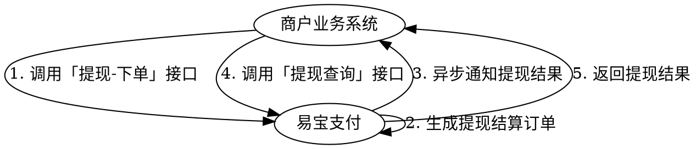

# 提现

将商户账户资金提现到提现卡/银行账户。

> 接口字段以在线文档为准：按下表 catalog id 在 `../api-index.yaml` 取其 `doc_md`，执行
> `curl -sS "<doc_md>"` 后再实现（单文件含字段/示例/错误码/示例代码）。

> **前置条件（必读）**：提现接口属 `account`（账户）分组（`/rest/v1.0/account/...`），为资金出款类接口，**必须使用 CFCA 证书**签名——仅配置普通 RSA 文本密钥时调用会被平台拒绝并报错；并按需配置 IP 白名单。
> 见 `../../平台文档/接入准备/密钥管理/CFCA证书介绍.md`、`../../平台文档/开始对接/配置IP白名单.md`。

## 场景 → 接口

| 用途 | catalog id | 方法 | 路径 |
|------|-----------|------|------|
| 提现卡添加 | `withdraw-card-bind` | POST | `/rest/v1.0/account/withdraw/card/bind` |
| 提现下单 | `withdraw-order` | POST | `/rest/v1.0/account/withdraw/order` |
| 提现查询 | `withdraw-query` | GET | `/rest/v1.0/account/withdraw/system/query` |
| 提现卡修改/注销 | `withdraw-card-modify` | POST | `/rest/v1.0/account/withdraw/card/modify` |

提现结果回调：下单传 `notifyUrl` 才通知；通知编码与报文字段以 `withdraw-order` 的 doc_md「结果通知」节为准（索引提示：`account.business.withdraw-result`）。

## 业务流程图

## 流程

1. 先调 `withdraw-card-bind` 添加提现卡（企业支持对公账户；个体支持对公或法人借记卡）。
2. 商户调 `withdraw-order` 申请提现（传 `notifyUrl` 以接收结果）。
3. 易宝生成提现订单并异步通知结果；也可调 `withdraw-query` 主动查询。

## 提现下单关键参数

| 参数 | 说明 |
|------|------|
| `requestNo` | 商户请求号，商户自定义（必填） |
| `merchantNo` | 商户编号（必填） |
| `receiveType` | 到账类型：`REAL_TIME`(实时)/`TWO_HOUR`(2小时)/`NEXT_DAY`(次日)（必填） |
| `orderAmount` | 提现金额，单位元（必填） |
| `bankCardId` / `bankAccountNo` | 提现卡 ID 与提现账号**至少填一个** |
| `feeDeductType` | 手续费方式：`INSIDE`(内扣，到账=提现-手续费) / `OUTSIDE`(外扣，扣账=提现+手续费) |
| `withdrawModel` | `INNER_ACCOUNT_WITHDRAW`(默认,易宝内部账户) / `BANK_ACCOUNT_WITHDRAW`(银行清分) |
| `accountType` | 资金账户 `FUND_ACCOUNT`/营销 `MARKET_ACCOUNT`/手续费 `FEE_ACCOUNT` 等 |
| `verifyType`/`verifyValue` | 核验方式 `PWD` 时，`verifyValue` 传密码密文 |
| `notifyUrl`/`remark`/`terminalType` | 选填 |

## 状态与查询

- 下单响应 `returnCode=UA00000` 为请求成功；`status`：`REQUEST_RECEIVE`/`REQUEST_ACCEPT`/`SUCCESS`/`FAIL`/`REMITING`。
- 查询 `withdraw-query`：必填 `merchantNo`；`requestNo` 与 `orderNo` 二选一。返回含 `receiveAmount`(到账)/`debitAmount`(扣账)/`fee`/`status`/`failReason`/`isReversed`(冲退) 等。

## 易错点（资金安全，重点）

- 遇到**新的/未知错误码或超时**：先用 `withdraw-query` 查询订单状态，**切勿直接更换 `requestNo` 重试**，否则可能重复出款造成资金损失。
- `returnMsg` 仅供人工参考，系统不要依赖其做自动化判断。
- 提现已到账后仍可能因银行原因冲退（`isReversed`），资金原路退回，需对账核对。
- 提现（账户余额→银行卡）与结算不同链路，见 `结算.md`。
- 禁止输出完整卡号/证件号/密码密文。

## 排障

- 业务错误码：见 doc_md「错误码」章节（与接口文档同文件）；平台码见 `../../平台文档/开始对接/平台错误码说明.md`、`../../troubleshooting.md`。
