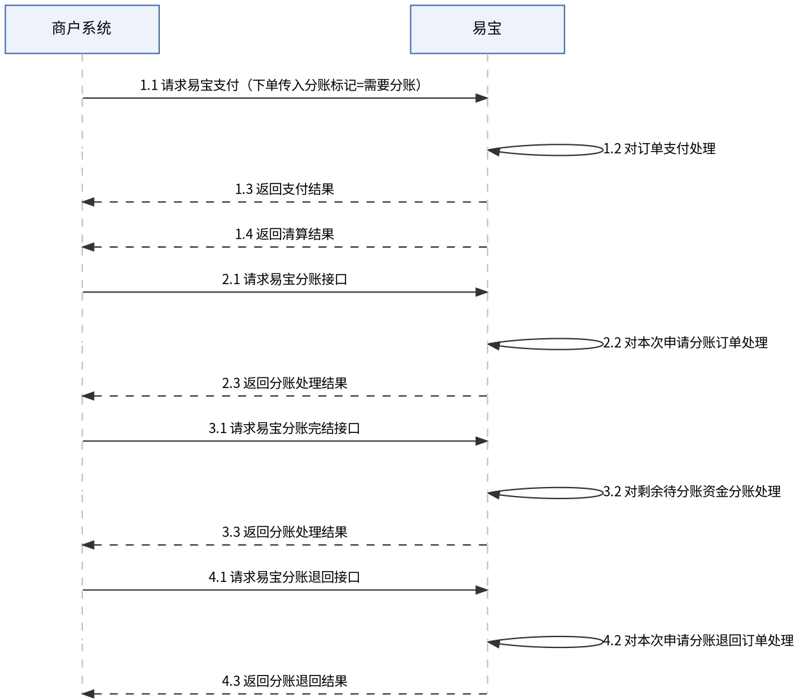

# 订单分账

基于原交易订单进行分账（依赖一笔已完成的收单交易）。

> 接口字段以在线文档为准：按下表 catalog id 在 `../api-index.yaml` 取其 `doc_md`，执行
> `curl -sS "<doc_md>"` 后再实现（单文件含字段/示例/错误码/示例代码）。

## 场景 → 接口

| 用途 | catalog id | 方法 | 路径 |
|------|-----------|------|------|
| 申请订单分账 | `divide-apply` | POST | `/rest/v1.0/divide/apply` |
| 完结分账 | `divide-complete` | POST | `/rest/v1.0/divide/complete` |
| 查询订单分账结果 | `divide-query` | GET | `/rest/v1.0/divide/query` |
| 申请资金归还 | `divide-back` | POST | `/rest/v1.0/divide/back` |
| 查询资金归还结果 | `divide-back-query` | GET | `/rest/v1.0/divide/back/query` |

## 业务说明

- 分账方=收款商户（将部分交易资金分出）；分账接收方=收资金的一方。
- 交易成功后，订单资金扣手续费后先存放在商户**待分账账户**，等待分账指令。
- 典型场景：分润给合作伙伴、平台抽佣、担保交易（先冻结后分账）。
- 订单分账是**服务**（非产品），需开通；开通需提供分账场景业务合同（`functionService=SHARE`）。

## 分账接收方准备

`divideDetail` 中 `ledgerNo` 的取值取决于 `ledgerType`：

| ledgerType | 接收方要求 | ledgerNo 来源 |
|------------|------------|---------------|
| `MERCHANT2MERCHANT` | 接收方为已入网易宝商户 | 接收方易宝商编 |
| `MERCHANT2MEMBER` | 接收方为会员/入账方 | 入账方编号（须先申请添加入账方） |

分账给**非入网商户**（如分润给个人/外部主体银行账户）时，须先走「申请入账方」流程，再在下述明细中使用入账方编号：

1. 调 `mer-receiver-apply` 申请添加入账方（catalog 见 `../api-index.yaml`）。
2. 调 `mer-receiver-apply-progress-query` 查询审核进度。
3. 入账方添加成功并完成签约后，`divideDetail` 中 `ledgerType=MERCHANT2MEMBER`，`ledgerNo` 传入账方编号。

完整入账方流程与产品码见 `余额分账.md`「申请入账方」节。

## 业务流程图



## 两种模式

### 延迟分账（推荐，灵活）

1. 下单（`../收单/`）时 `fundProcessType=DELAY_SETTLE`，并传清算回调地址 `csUrl`。
2. **等清算入账后**再分账：收到「清算结果通知」后，或支付成功 5s 后发起，避免报错。
   - 可分账金额：清算通知的 `ypSettleAmount`（最大可分账）或查单 `unSplitAmount`（实时剩余可分账）。
3. 调 `divide-apply` 发起分账，传 `divideDetail`（分账明细）。同步返回分账状态，若为 `PROCESSING` 用 `divide-query` 查最终结果。
4. 不再分账时，可调 `divide-complete` 把剩余可分账金额一次性给收款商户（非必须，也可由 `divide-apply` 指定剩余金额代替）。

### 实时分账

1. 下单时 `fundProcessType=REAL_TIME_DIVIDE`，并**必须**指定 `divideDetail` 和 `divideNotifyUrl`。
2. 用户支付、清算完成后系统自动触发分账，结果经「分账结果通知」下发。
3. 实时分账失败可再调 `divide-apply` 触发，`isUnfreezeResidualAmount=TRUE`。

## divideDetail 明细示例

```json
// 按固定金额
[{"amount":"100.00","ledgerNo":"10000466938","ledgerType":"MERCHANT2MERCHANT","divideDetailDesc":"供应商结算"},
 {"amount":"100.00","ledgerNo":"212345678912","ledgerNoFrom":"10000466938","ledgerType":"MERCHANT2MEMBER"}]
// 按分账比例
[{"proportion":"50.15","ledgerNo":"10000466938","ledgerType":"MERCHANT2MERCHANT"},
 {"proportion":"49.85","ledgerNo":"212345678912","ledgerNoFrom":"10000466938","ledgerType":"MERCHANT2MEMBER"}]
```

## 资金归还与回单

- 将已分账资金从接收方退回分账方：`divide-back` 申请，`divide-back-query` 查结果。
- 分账回单：调「分账回单」下载接口（`/yos/...divide/receipt/download`）获取。

## 易错点

- **必须清算完成后再分账**：延迟分账先等清算通知或 5s 后再发起，否则报错。
- `MERCHANT2MEMBER` 的 `ledgerNo` 须为已审核通过的入账方编号，未申请入账方会失败（见上文「分账接收方准备」）。
- 一次分账请求中任一接收方失败，则该请求全部明细失败。
- 实时分账下单时 `divideDetail` + `divideNotifyUrl` 必填。
- 分账单号业务唯一，重试用同一单号；结果以查询/通知为准。

## 排障

- 业务错误码：见 doc_md「错误码」章节（与接口文档同文件）；平台码见 `../../平台文档/开始对接/平台错误码说明.md`、`../../troubleshooting.md`。
