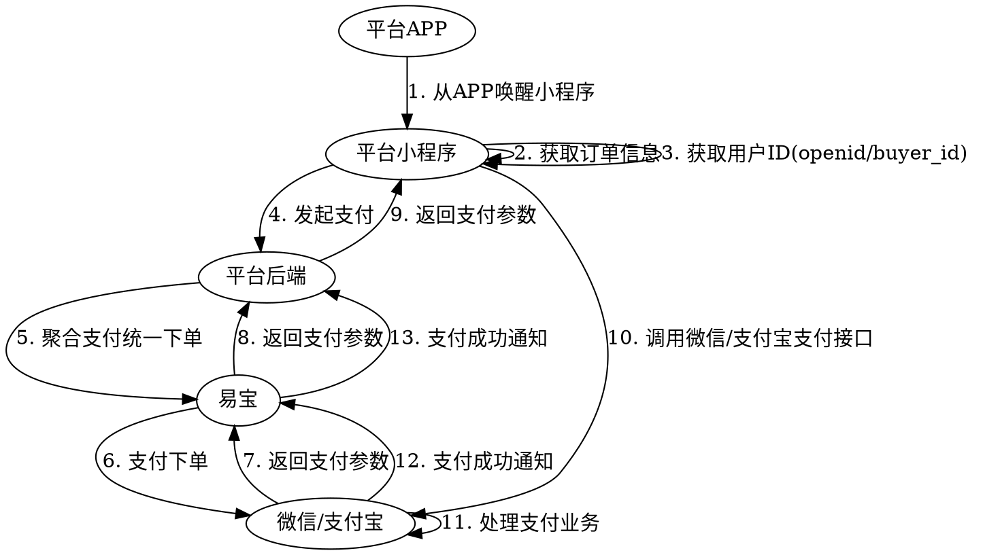

# APP 支付（使用客户小程序）

APP 内发起支付，**跳转商家自有小程序**完成支付（统一下单）。

> ⚠️ **生成参数或代码前，必须先完整阅读本文「易错点」章节。** 客户自有小程序与易宝托管小程序是**不同接口**（本场景用 `aggpay-pre-pay` 统一下单，非 `aggpay-tutelage-pre-pay` 托管下单）；选错方案会导致传参错误。

> 接口字段以在线文档为准：按下表 catalog id 在 `../api-index.yaml` 取其 `doc_md`，执行
> `curl -sS "<doc_md>"` 后再实现（单文件含字段/示例/错误码/示例代码）。

## 场景 → 接口

| 用途 | catalog id | 方法 | 路径 |
|------|-----------|------|------|
| 下单 | `aggpay-pre-pay` | POST | `/rest/v1.0/aggpay/pre-pay` |
| 查单 | `trade-order-query` | GET | `/rest/v1.0/trade/order/query` |
| 公众号/小程序配置（微信，绑定商家小程序 appid） | `aggpay-wechat-config-add` | POST | `/rest/v2.0/aggpay/wechat-config/add` |

支付结果回调：`aggpay-pre-pay` 的 `notify_spi: trade.pay-result`。

prePayTn 返回类型与前端唤起方式见 `prePayTn唤起方式速查.md`。

## 何时选本方案

- 商户**已有自有小程序**，支付承载在自有小程序内（会员/营销/复购）。无自有小程序见 `APP支付（使用易宝小程序）.md`。

## 业务流程图



## 对接步骤（指引文字版）

1. 用户在商户 APP 商城购买 → 商家 APP 生成订单。
2. 商家后台调易宝下单 → 易宝返回拉起微信/支付宝小程序信息。
3. 商家 APP 跳转到商家小程序。
4. 商家小程序用 `prePayTn` 调起微信/支付宝支付。
5. 用户确认支付 → 渠道通知易宝 → 易宝通知商户扣款成功。

> 以最终异步通知和查单结果为准。

## 一、App 跳商家微信小程序

前置：微信开放平台有通过的 APP 移动应用；微信公众平台有小程序并与移动应用关联；完成「APP 拉起小程序」配置；可引用易宝 demo（`pay-applet`）拉起支付页。

获取 openId：小程序 `wx.login` 取 code → 服务端 `code2Session` 换 `openId`；收款商户完成微信报备与实名认证。

appid 配置：调 `aggpay-wechat-config-add` 绑定需跳转的小程序 appid 与 appSecret。

下单（`aggpay-pre-pay`）关键参数：`payWay=MINI_PROGRAM`、`channel=WECHAT`、`appId`=跳转小程序 appid、`userId`=openId、`userIp` 必填、`scene` 一般 OFFLINE、`notifyUrl`/`csUrl`。

拉起：小程序用返参 `prePayTn` 发起微信支付（小程序内拉起密码框）。微信侧限制：支付完成后需用户点按钮才能回到商户 APP，可自行开发引导页。

## 二、App 跳商户支付宝小程序

前置：已上架 APP；准备好跳转用支付宝小程序；收款商户完成支付宝实名认证；APP 用 `alipays://platformapi/startapp?appId=...&page=...` 打开小程序；获取用户支付宝 `userId`。

下单关键参数：`payWay=MINI_PROGRAM`、`channel=ALIPAY`、`userId`=支付宝 userId、`appId`=小程序 appid、`userIp` 必填、`scene` 一般 OFFLINE。

拉起：用 `prePayTn` 按支付宝小程序 JSAPI 唤起收银台。

## 通知与查单

- 易宝异步通知到 `notifyUrl`。
- 查单 `trade-order-query` 必传 `merchantNo` + `orderId`。

## 易错点

- 使用统一下单 `aggpay-pre-pay`、`payWay=MINI_PROGRAM`，不要错用托管下单。
- 微信 `openId` 必须基于商家自有 `appId` 获取；支付宝需 `userId`。
- 微信支付后返回 APP 需用户点按钮（不能自动跳回），按需做引导页。
- 终态以后端为准。

## 排障

- 业务错误码：见 doc_md「错误码」章节（与接口文档同文件）。
- 平台错误码/验签：`../../troubleshooting.md`、`../../平台文档/开始对接/平台错误码说明.md`。

## 前端示例代码

### APP 唤起微信小程序（多端框架 wx.miniapp）

```javascript
wx.miniapp.launchMiniProgram({
    userName: '', // 微信小程序原始ID
    path: '',
    miniprogramType: 2, //0 release ，1 test, 2 preview
    success: (res) => {
        wx.showModal({
            content: res.data,
        })
        console.log('get wx phonenumber success:', res)
    }
})
```

### 微信支付（多端框架 wx.miniapp）

> 空白参数由服务端在易宝平台下单后，会返回 `prepayTn` 参数，这个参数为一个 JSON 串，通过 JSON.parse() 解析。

```javascript
wx.miniapp.requestPayment({
    timeStamp: '',
    mchId: '',
    prepayId: '',
    package: '',
    nonceStr: '',
    sign: '',
    success: (res) => {
      console.warn('wx.miniapp.requestPayment success:', res)
    },
    fail: (res) => {
      console.error('wx.miniapp.requestPayment res:', res)
    },
    complete: (res) => {
      console.error('wx.miniapp.requestPayment res:', res)
    }
  })
```

### APP 原生 SDK 拉起微信支付（OpenSDK）

iOS：

```objective-c
PayReq *request = [[[PayReq alloc] init] autorelease];
request.appId = "wxd930ea5d5a258f4f";
request.partnerId = "1900000109";
request.prepayId= "1101000000140415649af9fc314aa427",;
request.package = "Sign=WXPay";
request.nonceStr= "1101000000140429eb40476f8896f4c9";
request.timeStamp= "1398746574";
request.sign= "oR9d8PuhnIc+YZ8cBHFCwfgpaK9gd7vaRvkYD7rthRAZ\/X+QBhcCYL21N7cHCTUxbQ+EAt6Uy+lwSN22f5YZvI45MLko8Pfso0jm46v5hqcVwrk6uddkGuT+Cdvu4WBqDzaDjnNa5UK3GfE1Wfl2gHxIIY5lLdUgWFts17D4WuolLLkiFZV+JSHMvH7eaLdT9N5GBovBwu5yYKUR7skR8Fu+LozcSqQixnlEZUfyE55feLOQTUYzLmR9pNtPbPsu6WVhbNHMS3Ss2+AehHvz+n64GDmXxbX++IOBvm2olHu3PsOUGRwhudhVf7UcGcunXt8cqNjKNqZLhLw4jq\/xDg==";
[WXApi sendReq：request];
```

Android：

```java
IWXAPI api;
PayReq request = new PayReq();
request.appId = "wxd930ea5d5a258f4f";
request.partnerId = "1900000109";
request.prepayId= "1101000000140415649af9fc314aa427",;
request.packageValue = "Sign=WXPay";
request.nonceStr= "1101000000140429eb40476f8896f4c9";
request.timeStamp= "1398746574";
request.sign= "oR9d8PuhnIc+YZ8cBHFCwfgpaK9gd7vaRvkYD7rthRAZ\/X+QBhcCYL21N7cHCTUxbQ+EAt6Uy+lwSN22f5YZvI45MLko8Pfso0jm46v5hqcVwrk6uddkGuT+Cdvu4WBqDzaDjnNa5UK3GfE1Wfl2gHxIIY5lLdUgWFts17D4WuolLLkiFZV+JSHMvH7eaLdT9N5GBovBwu5yYKUR7skR8Fu+LozcSqQixnlEZUfyE55feLOQTUYzLmR9pNtPbPsu6WVhbNHMS3Ss2+AehHvz+n64GDmXxbX++IOBvm2olHu3PsOUGRwhudhVf7UcGcunXt8cqNjKNqZLhLw4jq\/xDg==";
api.sendReq(request);
```

鸿蒙：

```javascript
IWXAPI api;
let req = new wxopensdk.PayReq
req.appId = 'wxd930ea5d5a258f4f'
req.partnerId = '1900000109'
req.prepayId = '1101000000140415649af9fc314aa427'
req.packageValue = 'Sign=WXPay'
req.nonceStr = '1101000000140429eb40476f8896f4c9'
req.timeStamp = '1398746574'
req.sign = 'oR9d8PuhnIc+YZ8cBHFCwfgpaK9gd7vaRvkYD7rthRAZ\/X+QBhcCYL21N7cHCTUxbQ+EAt6Uy+lwSN22f5YZvI45MLko8Pfso0jm46v5hqcVwrk6uddkGuT+Cdvu4WBqDzaDjnNa5UK3GfE1Wfl2gHxIIY5lLdUgWFts17D4WuolLLkiFZV+JSHMvH7eaLdT9N5GBovBwu5yYKUR7skR8Fu+LozcSqQixnlEZUfyE55feLOQTUYzLmR9pNtPbPsu6WVhbNHMS3Ss2+AehHvz+n64GDmXxbX++IOBvm2olHu3PsOUGRwhudhVf7UcGcunXt8cqNjKNqZLhLw4jq\/xDg=='
api.sendReq(context: common.UIAbilityContext, req)
```

> APP 内嵌 H5 唤起小程序支付：H5 页面 `window.location.href = prePayTn` 重定向即可，见 `浏览器H5支付.md` 的「前端示例代码」。

## 后端代码（不使用 SDK 时）

- 加验签：`../../平台文档/平台规范/安全认证/请求签名协议.md`
- 回调解密验签：`../../平台文档/平台规范/安全认证/回调解密协议.md`
