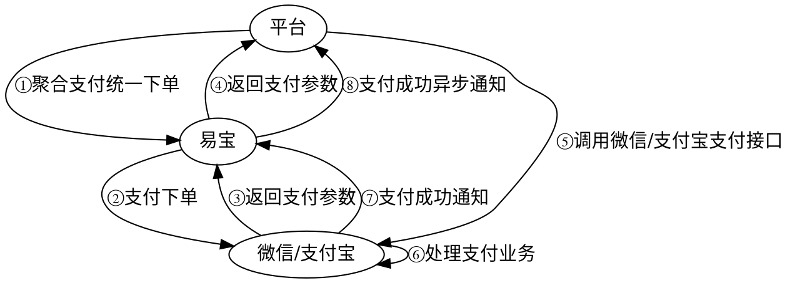

# 小程序支付

用户在**微信/支付宝小程序**内完成支付。

> 接口字段以在线文档为准：按下表 catalog id 在 `../api-index.yaml` 取其 `doc_md`，执行
> `curl -sS "<doc_md>"` 后再实现（单文件含字段/示例/错误码/示例代码）。

## 场景 → 接口

| 用途 | catalog id | 方法 | 路径 |
|------|-----------|------|------|
| 下单 | `aggpay-pre-pay` | POST | `/rest/v1.0/aggpay/pre-pay` |
| 查单 | `trade-order-query` | GET | `/rest/v1.0/trade/order/query` |
| 公众号/小程序 appid 配置（异步，条件必读） | `aggpay-wechat-config-add` | POST | `/rest/v2.0/aggpay/wechat-config/add` |

支付结果回调：`aggpay-pre-pay` 的 `notify_spi: trade.pay-result`。

prePayTn 返回类型与前端唤起方式见 `prePayTn唤起方式速查.md`。

## 业务流程图



## 交互流程（指引文字版）

1. 平台侧发起「聚合支付统一下单」接口调用。
2. 易宝向微信/支付宝发起支付下单。
3. 微信/支付宝返回支付参数给易宝。
4. 易宝将支付参数返回平台。
5. 平台调用微信/支付宝原生支付接口拉起支付。
6. 用户在微信/支付宝侧完成支付。
7. 微信/支付宝向易宝发送支付结果通知。
8. 易宝向平台发送支付成功异步通知。

> 结果判定：前端支付完成展示**不等于**最终入账成功，最终状态以异步通知与订单查询结果为准。

## 开通产品（产品码）

| 产品名称 | 产品码 | scene 枚举 |
|----------|--------|-----------|
| 小程序支付_微信_线上 | `MINI_PROGRAM_WECHAT_ONLINE` | `ONLINE` |
| 小程序支付_微信_线下 | `MINI_PROGRAM_WECHAT_OFFLINE` | `OFFLINE` |
| 小程序支付_支付宝_线上 | `MINI_PROGRAM_ALIPAY_ONLINE` | `ONLINE` |
| 小程序支付_支付宝_线下 | `MINI_PROGRAM_ALIPAY_OFFLINE` | `OFFLINE` |

## 接入步骤

1. **appid 配置**（微信）：调 `aggpay-wechat-config-add`，`appIdList` 中 `appId` 传商户收款小程序 appid、`appIdType` 传 `MINI_PROGRAM`；配置成功后可调用查询接口核对。
2. **获取用户标识**：
   - 微信：小程序 `wx.login` 拿 code → 商户服务端换取 `openId`。
   - 支付宝：小程序 `my.getAuthCode` 拿 `authCode` → 商户服务端换取用户 `userId`（参考[支付宝客户端获取 authcode](https://opendocs.alipay.com/mini/introduce/authcode)）。
3. **下单**：调 `aggpay-pre-pay`，关键参数：
   - `payWay=MINI_PROGRAM`
   - `channel=WECHAT`（或 `ALIPAY`）
   - `userId` = 上一步的 openId / 支付宝 userId
   - `appId` = 收款小程序 appid（微信必填）
   - `scene` = 按开通产品取 `ONLINE`/`OFFLINE`（一般 OFFLINE）
   - 其他：`notifyUrl`（支付结果回调）、`csUrl`（清算结果回调）
4. **拉起支付**：用响应 `prePayTn` 调微信原生小程序支付，或支付宝原生小程序支付（参考[支付宝唤起收银台支付](https://opendocs.alipay.com/mini/introduce/pay)）拉起收银台。
5. **接收通知 + 查单**：易宝异步通知到 `notifyUrl`；可调 `trade-order-query` 主动/补偿查询。

## 易错点

- `userId`/`openId` 必填：且 `openId` 必须基于下单传入的 `appId` 获取，否则报错。
- `MINI_PROGRAM` 与 `csUrl`（清算回调）区分：分账需在清算完成后发起（见 `../分账/订单分账.md`）。
- 需要分账时下单同时传 `fundProcessType` 与 `divideDetail`。
- 金额单位为元、两位小数；前端只负责唤起，终态以后端为准。

## 排障

- 业务错误码：见 doc_md「错误码」章节（与接口文档同文件）。
- 平台错误码/验签：`../../troubleshooting.md`、`../../平台文档/开始对接/平台错误码说明.md`。

## 前端示例代码

### 获取登录凭证（code）

```javascript
wx.login({
  success (res) {
    if (res.code) {
      //发起网络请求
      wx.request({
        url: 'https://example.com/onLogin',
        data: {
          code: res.code
        }
      })
    } else {
      console.log('登录失败！' + res.errMsg)
    }
  }
})
```

### 唤起微信小程序支付

> 服务端在易宝平台下单后，会返回 `paySign` 参数，这个参数为一个 JSON 串，包含支付所需的所有签名信息(paySign)，通过 JSON.parse() 解析。

```javascript
wx.requestPayment({
  timeStamp: '',
  nonceStr: '',
  package: '',
  signType: 'MD5',
  paySign: '',
  success (res) { },
  fail (res) { }
})
```

### 获取支付宝授权码（authCode）

> 小程序端拿到 `authCode` 后传给商户服务端，由服务端换取用户 `userId` 用于下单。

```javascript
my.getAuthCode({
  scopes: ['auth_base'],
  success: (res) => {
    if (res.authCode) {
      // 将 authCode 发送到商户服务端换取 userId
      my.request({
        url: 'https://example.com/onLogin',
        data: { authCode: res.authCode }
      })
    }
  }
})
```

### 唤起支付宝小程序支付

> 服务端下单返回的 `prePayTn`（支付宝场景为订单号 tradeNO）传入 `my.tradePay` 唤起收银台。

```javascript
my.tradePay({
  tradeNO: '',
  success (res) { },
  fail (res) { }
})
```

## 后端代码（不使用 SDK 时）

- 加验签：`../../平台文档/平台规范/安全认证/请求签名协议.md`
- 回调解密验签：`../../平台文档/平台规范/安全认证/回调解密协议.md`
