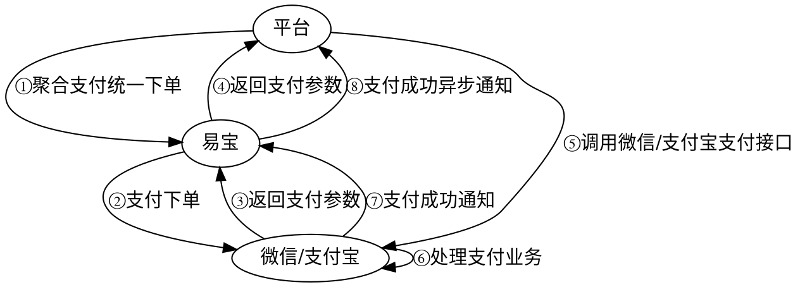

# 微信内 H5 + 公众号支付

用户在**微信内打开的 H5 页面**，通过微信公众号（JSAPI）完成支付。

> 接口字段以在线文档为准：按下表 catalog id 在 `../api-index.yaml` 取其 `doc_md`，执行
> `curl -sS "<doc_md>"` 后再实现（单文件含字段/示例/错误码/示例代码）。

## 场景 → 接口

| 用途 | catalog id | 方法 | 路径 |
|------|-----------|------|------|
| 下单 | `aggpay-pre-pay` | POST | `/rest/v1.0/aggpay/pre-pay` |
| 查单 | `trade-order-query` | GET | `/rest/v1.0/trade/order/query` |
| 公众号 appid+授权目录配置（异步，必读） | `aggpay-wechat-config-add` | POST | `/rest/v2.0/aggpay/wechat-config/add` |

支付结果回调：`aggpay-pre-pay` 的 `notify_spi: trade.pay-result`。

prePayTn 返回类型与前端唤起方式见 `prePayTn唤起方式速查.md`。

## 业务流程图



## 交互流程（指引文字版）

1. 平台侧发起「聚合支付统一下单」。
2. 易宝向微信发起支付下单并取回支付参数。
3. 易宝将支付参数返回平台。
4. 平台调用微信原生 JSAPI 拉起支付。
5. 用户完成支付。
6. 微信通知易宝 → 易宝异步通知平台。

> 结果判定：前端展示成功 ≠ 入账成功，终态以异步通知与查单为准。

## 开通产品（产品码）

| 产品名称 | 产品码 | scene |
|----------|--------|-------|
| 公众号支付_微信_线上 | `WECHAT_OFFIACCOUNT_WECHAT_ONLINE` | `ONLINE` |
| 公众号支付_微信_线下 | `WECHAT_OFFIACCOUNT_WECHAT_OFFLINE` | `OFFLINE` |

## 接入步骤

1. **公众号 appid + 授权目录配置**：调 `aggpay-wechat-config-add`，`appIdList` 中 `appId` 传商户收款公众号 appid、`appSecret` 传公众号 appSecret、`appIdType` 传 `OFFICIAL_ACCOUNT`；`tradeAuthDirList` 传拉起微信收银台页面的域名（支付授权目录）。
2. **获取 openId**：按微信网页授权（H5）流程换取用户 `openId`。
3. **下单**：调 `aggpay-pre-pay`：
   - `payWay=WECHAT_OFFIACCOUNT`
   - `channel=WECHAT`
   - `userId` = openId
   - `scene` 按开通产品（一般 OFFLINE）
   - `notifyUrl` / `csUrl`
4. **拉起支付**：用响应 `prePayTn` 调微信原生 JSAPI 支付。
5. **通知 + 查单**确认终态。

## 易错点

- `openId` 必须基于支付用的公众号 `appId` 获取。
- **授权目录**（`tradeAuthDirList`）必须与实际拉起收银台的页面域名一致，否则无法拉起。
- 与「浏览器 H5 支付」区别：本场景在微信内走公众号 JSAPI；浏览器 H5 在普通浏览器（微信走小程序中间页、支付宝走重定向）。
- 终态以后端为准。

## 排障

- 业务错误码：见 doc_md「错误码」章节（与接口文档同文件）。
- 平台错误码/验签：`../../troubleshooting.md`、`../../平台文档/开始对接/平台错误码说明.md`。

## 前端示例代码

### 唤起微信公众号支付（JSAPI / WeixinJSBridge）

> 服务端在易宝平台下单后，会返回 `paySign` 参数，这个参数为一个 JSON 串，包含支付所需的所有签名信息(paySign)，通过 JSON.parse() 解析。

```javascript
function onBridgeReady() {
    WeixinJSBridge.invoke('getBrandWCPayRequest', {
        "appId": "wxxxxxxx",     //公众号ID，由商户传入
        "timeStamp": "",     //时间戳，自1970年以来的秒数
        "nonceStr": "",      //随机串
        "package": "",
        "signType": "RSA",     //微信签名方式
        "paySign": "" //签名信息
    },
    function(res) {
        if (res.err_msg == "get_brand_wcpay_request:ok") {
            // 使用以上方式判断前端返回,微信团队郑重提示：
            //res.err_msg将在用户支付成功后返回ok，但并不保证它绝对可靠，商户需进一步调用后端查单确认支付结果。
        }
    });
}
if (typeof WeixinJSBridge == "undefined") {
    if (document.addEventListener) {
        document.addEventListener('WeixinJSBridgeReady', onBridgeReady, false);
    } else if (document.attachEvent) {
        document.attachEvent('WeixinJSBridgeReady', onBridgeReady);
        document.attachEvent('onWeixinJSBridgeReady', onBridgeReady);
    }
} else {
    onBridgeReady();
}
```

## 后端代码（不使用 SDK 时）

- 加验签：`../../平台文档/平台规范/安全认证/请求签名协议.md`
- 回调解密验签：`../../平台文档/平台规范/安全认证/回调解密协议.md`
