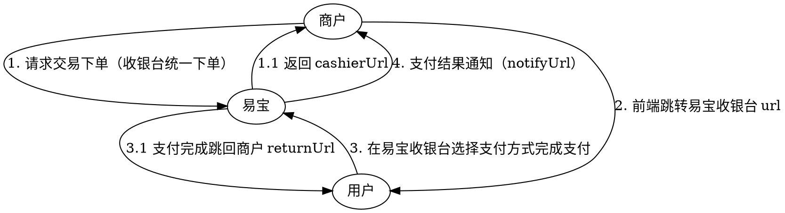

# 收银台（PC / H5 托管收银台）

商户下单后**前端页面跳转**到易宝收银台页面，用户在易宝页面上**自行选择支付方式**完成支付，支付完成后跳回商户指定页面。商户无需自行开发支付方式选择、收银等前端页面。

> 接口字段以在线文档为准：按下表 catalog id 在 `../api-index.yaml` 取其 `doc_md`，执行
> `curl -sS "<doc_md>"` 后再实现（单文件含字段/示例/错误码/示例代码）。

## 适用场景

- 想**省去支付相关页面开发**（支付方式选择、收银页、结果页）的商户。
- 一个页面内需要同时提供多种支付方式（微信/支付宝主扫、易宝一键支付、账户支付、网银 B2B/B2C、银行转账支付、钱包支付等）。
- PC 端与 H5 端均支持。

> 与聚合支付（`aggpay-pre-pay` 等）的区别：收银台由**易宝托管支付页面**，用户在易宝页面选支付方式；聚合支付由**商户自行控制**支付方式与前端唤起，易宝不提供页面。

## 场景 → 接口

| 用途 | catalog id | 方法 | 路径 |
|------|-----------|------|------|
| 下单（推荐，返回收银台链接） | `cashier-unified-order` | POST | `/rest/v1.0/cashier/unified/order` |
| 查单 | `trade-order-query` | GET | `/rest/v1.0/trade/order/query` |
| 公众号 appid+授权目录配置（收银台展示微信码时条件必读） | `aggpay-wechat-config-add` | POST | `/rest/v2.0/aggpay/wechat-config/add` |

支付结果回调：`cashier-unified-order` 的 `notify_spi: trade.pay-result`（下单时通过 `notifyUrl` 指定接收地址）。

## 业务流程

## 前置条件

1. 商户开通收银台产品，以及收银台内需要展示的各支付方式对应产品（具体产品码以商户实际签约/开通为准）。
2. 收银台内**展示微信/支付宝二维码**时，前期接入流程与主扫支付一致：完成微信、支付宝子商户号认证，完成微信公众号 `appId`、`appSecret`、支付授权目录配置（调 `aggpay-wechat-config-add`）。详见 `主扫支付（独立码-线上PC）.md`「前提条件」。
3. 准备好接收支付结果通知的 `notifyUrl`（外网可达），以及支付完成后跳回的商户页面地址 `returnUrl`。

## 接入步骤

1. **服务端下单**：调 `cashier-unified-order`，必填 `parentMerchantNo`、`merchantNo`、`orderId`、`orderAmount`、`goodsName`、`notifyUrl`；按需传 `returnUrl`（支付完成跳回的商户页面）、`expiredTime`、`limitPayType`、`fundProcessType`+`divideDetail`（分账）、`aggParam`（微信/支付宝渠道参数，含报备费率 `scene`）。
2. **拿到收银台链接**：响应中的 `cashierUrl` 即收银台地址，**直接使用，无需自行拼接**；`uniqueOrderNo` 为易宝收款订单号，留存用于查单与对账。
3. **前端跳转**：PC 端整页跳转或新开窗口打开 `cashierUrl`；H5 端 `window.location.href = cashierUrl`。
4. **用户支付**：用户在易宝收银台选择支付方式完成支付，完成后跳转到下单时指定的 `returnUrl`。
5. **接收通知 + 查单**：易宝异步通知到 `notifyUrl`；调 `trade-order-query` 主动/补偿查询确认终态。

## 限定收银台展示的支付方式（`limitPayType`）

不传则展示该商户已开通的全部支付方式；传值时页面只展示指定支付方式，可传一种或多种。

| 取值 | 含义 |
|------|------|
| `WECHAT` | 微信主扫 |
| `ALIPAY` | 支付宝主扫 |
| `YJZF` | 易宝一键支付 |
| `ZHZF` | 账户支付 |
| `BANK_TRANSFER_PAY` | 银行转账支付（产品说明见 `银行转账支付.md`；`checkType` 等经 `otherTypeParam` 传入） |
| `BANK_TRANSFER_TO_BANK` | 银行转账 7*24h |
| `WALLET_PAY` | 钱包支付 |
| `EBANK` / `EBANK_B2B` / `EBANK_B2C` | 只展示网银支付模块 / 只展示 B2B / 只展示 B2C |

取值与约束以 doc_md 中该参数 `description` 为准；网银直连银行与钱包支付时**只能传一个值**。

## 易错点

- `returnUrl` **仅为页面跳转展示**，不可据此判定支付成功；终态以「支付结果通知 + 查单」为准。该地址只对走标准收银台的订单生效，最长 200 字符。
- 收银台链接**直接取响应 `cashierUrl`**，不要自行拼接收银台 URL。
- PC 收银台要展示微信/支付宝二维码时，**子商户号认证与公众号 appId/支付授权目录配置不可省略**（同主扫支付），否则下单或展码失败；`aggParam.scene`（报备费率）按渠道必填。
- `limitPayType` 传入的支付方式必须是商户**已开通**的产品，否则页面不展示或下单报「产品未开通」。
- 分账场景：`fundProcessType=REAL_TIME_DIVIDE` 时 `divideDetail` 必传；需要清算通知时传 `csNotifyUrl`。
- **清算结果通知地址的参数名与其他下单接口不同**：本接口叫 `csNotifyUrl`，而聚合统一下单、托管下单、聚合码、被扫、银行转账支付等接口叫 `csUrl`（已实测比对）。从其他场景迁移或复用封装代码时不要照搬 `csUrl`，传错字段名不会报错但收不到清算通知。
- 金额单位为元、两位小数；`orderId` 需保证商户端唯一，重复下单会命中「订单已经成功/处理中」。
- 订单默认在下单 120 分钟后失效，`expiredTime` 最长支持 30 天。
- 请求为 `application/x-www-form-urlencoded`；含非 ASCII 特殊字符的参数值需按平台规范做**两次 URL 编码**，空格统一转 `%20`。

## 排障

- 业务错误码：见 doc_md「错误码」章节（与接口文档同文件），如 `00012 产品未开通`、`00102 订单已经成功`、`00105 订单处理中`。
- 平台错误码/验签：`../../troubleshooting.md`、`../../平台文档/开始对接/平台错误码说明.md`。

## 代码示例

- 加验签（不使用 SDK 时）：`../../平台文档/平台规范/安全认证/请求签名协议.md`
- 回调解密验签：`../../平台文档/平台规范/安全认证/回调解密协议.md`
