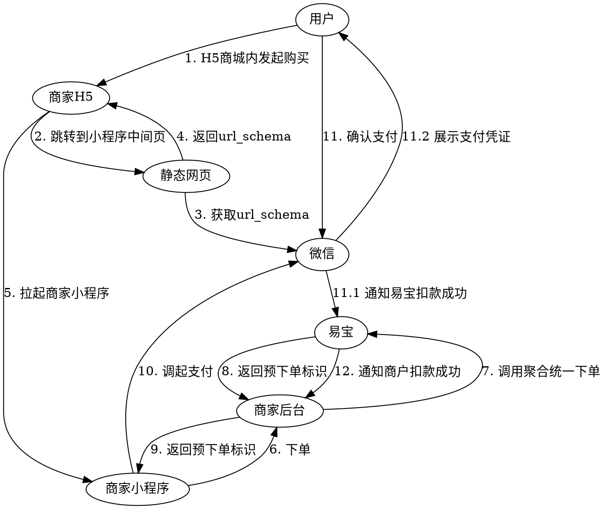

# 浏览器 H5 支付

用户在**手机普通浏览器**打开的 H5 页面内完成支付（区别于微信内 H5）。

> 接口字段以在线文档为准：按下表 catalog id 在 `../api-index.yaml` 取其 `doc_md`，执行
> `curl -sS "<doc_md>"` 后再实现（单文件含字段/示例/错误码/示例代码）。

## 场景 → 接口

| 用途 | catalog id | 方法 | 路径 |
|------|-----------|------|------|
| 下单 | `aggpay-pre-pay` | POST | `/rest/v1.0/aggpay/pre-pay` |
| 查单 | `trade-order-query` | GET | `/rest/v1.0/trade/order/query` |
| 公众号/小程序 appid 配置（微信 H5 条件必读） | `aggpay-wechat-config-add` | POST | `/rest/v2.0/aggpay/wechat-config/add` |
| appid 配置结果查询 | —（不在 api-index，见在线文档） | GET | `/rest/v2.0/aggpay/wechat-config/query` |
| prePayTn 唤起速查 | — | — | `prePayTn唤起方式速查.md`（catalog `prepay-tn-usage`） |

支付结果回调：`aggpay-pre-pay` 的 `notify_spi: trade.pay-result`。

prePayTn 返回类型与前端唤起方式见 `prePayTn唤起方式速查.md`。

## 一、微信支付（浏览器 H5 → 商家小程序）

微信浏览器 H5 受微信限制，需经小程序中间页拉起商家小程序内完成支付。

业务流程图：



交互流程（指引文字版）：

1. 用户在商家 H5 页面发起购买。
2. 页面跳转到小程序中间页，获取 `url_schema` 并返回 H5。
3. H5 拉起商家小程序。
4. 商家小程序请求商家后台 → 后台调易宝「聚合统一下单」。
5. 易宝返回预下单标识（`prePayTn`），经后台返回小程序。
6. 小程序调起微信支付，用户确认支付。
7. 微信通知易宝支付成功 → 易宝向商家后台发扣款成功通知。

开通产品：

| 产品名称 | 产品码 | scene 枚举 |
|----------|--------|-----------|
| 小程序支付_微信_线上 | `MINI_PROGRAM_WECHAT_ONLINE` | `ONLINE` |
| 小程序支付_微信_线下 | `MINI_PROGRAM_WECHAT_OFFLINE` | `OFFLINE` |

### 接入步骤（微信）

1. **H5 拉起商家小程序**：H5 页面跳转到小程序中间页，向微信获取 `url_schema` 并返回 H5，H5 用该 `url_schema` 拉起商家小程序（需提前完成 H5 域名与小程序的关联配置）。
2. **微信小程序 appid 配置**（一次性）：调 `aggpay-wechat-config-add`（`POST /rest/v2.0/aggpay/wechat-config/add`），`appIdList` 中 `appId` 传商户收款小程序 appid、`appIdType` 传 `MINI_PROGRAM`。该接口为异步处理，配置成功后可调查询接口 `GET /rest/v2.0/aggpay/wechat-config/query` 核对配置结果。
3. **获取用户 openId**：
   - 小程序端调 [`wx.login`](https://developers.weixin.qq.com/miniprogram/dev/api/open-api/login/wx.login.html) 获取登录凭证 `code`；
   - 商户服务端用 `code` 调微信[登录凭证校验接口](https://developers.weixin.qq.com/miniprogram/dev/server/API/user-login/)换取用户 `openId`。
4. **下单**：商家后台调 `aggpay-pre-pay`，关键参数：
   - `payWay=MINI_PROGRAM`
   - `channel=WECHAT`
   - `userId` = 上一步获取的 openId（必须基于步骤 2 配置的 `appId` 获取）
   - `appId` = 收款小程序 appid
   - `scene` = 按开通产品取 `ONLINE`/`OFFLINE`（一般 OFFLINE）
   - `notifyUrl` = 支付结果回调地址；`csUrl` = 清算结果回调地址（需分账时必传）
5. **拉起支付**：将响应中的 `prePayTn` 经商家后台返回小程序，调用[微信原生小程序支付方法](https://pay.weixin.qq.com/doc/v2/merchant/4011939566)拉起微信收银台完成支付。
6. **接收通知 + 查单**：支付成功后易宝异步通知到 `notifyUrl`；可调 `trade-order-query` 主动/补偿查询订单状态确认终态。

## 二、支付宝支付（H5 直接重定向）

开通产品：用户扫码_支付宝_线下 `USER_SCAN_ALIPAY_OFFLINE`。

1. 调 `aggpay-pre-pay`：`payWay=USER_SCAN`、`channel=ALIPAY`、`scene=OFFLINE`。
2. 用响应 `prePayTn`（URL 链接）在 H5 页面 `window.location.href` 重定向，拉起支付宝收银台。
   - 已安装支付宝：`alipays://platformapi/startapp?...&qrcode=https://qr.alipay.com/...`
   - 未安装支付宝兜底：直接重定向到 `payinfo` 中的 `https://qr.alipay.com/...` 链接。

## 通知与查单

- 易宝异步通知到下单 `notifyUrl`。
- 可调 `trade-order-query` 主动/补偿查询订单状态。

## 易错点

- 微信浏览器 H5 不能直接 JSAPI，必须走「小程序中间页」拉起商家小程序，注意 `url_schema` 获取与小程序关联配置。
- 支付宝走 `USER_SCAN` + `prePayTn` URL 重定向，并处理「未安装支付宝」兜底链接。
- `redirectUrl` 仅页面跳转展示，**不可**据此判定成功；终态以后端为准。
- 金额单位为元、两位小数。

## 排障

- 业务错误码：见 doc_md「错误码」章节（与接口文档同文件）。
- 平台错误码/验签：`../../troubleshooting.md`、`../../平台文档/开始对接/平台错误码说明.md`。

## 前端示例代码

### H5 唤起微信小程序支付

> 前提是服务端已经在易宝完成聚合下单，并且拿到了 `prePayTn` 给到前端，`prePayTn` 即易宝唤起微信小程序的中转页。APP 内嵌 H5 唤起小程序支付同此方式。

```javascript
window.location.href = prePayTn;
```

> 小程序内调起微信支付的代码见 `小程序支付.md` 的「前端示例代码」。

## 后端代码（不使用 SDK 时）

- 加验签：`../../平台文档/平台规范/安全认证/请求签名协议.md`
- 回调解密验签：`../../平台文档/平台规范/安全认证/回调解密协议.md`
