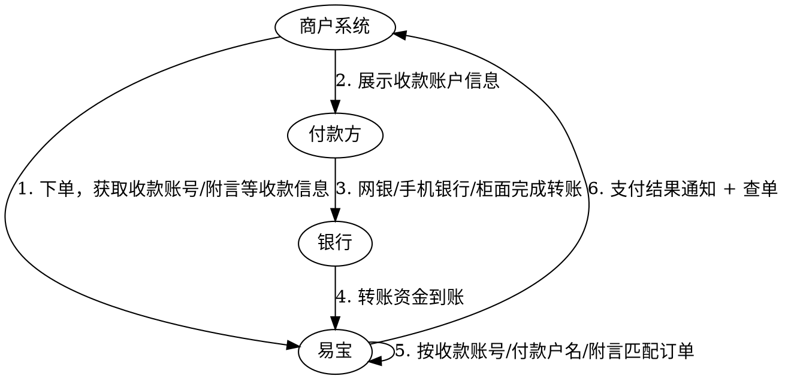

# 银行转账支付

面向**大额或传统银行转账**收款场景：付款方通过企业网银、个人网银、手机银行或银行柜面把钱转入指定收款账户，易宝按**收款账号、付款户名或附言**识别订单并完成资金入账。适用于快捷/扫码/常规网银支付受限、付款方仍习惯银行转账的场景（供应链大额采购货款、汽车/能源等行业企业收款、超出其他支付方式限额的交易等）。

> 接口字段以在线文档为准：按下表 catalog id 在 `../api-index.yaml` 取其 `doc_md`，执行
> `curl -sS "<doc_md>"` 后再实现（单文件含字段/示例/错误码/示例代码）。

## 名词定义

| 名词 | 说明 |
|------|------|
| 动态收款账号 | 针对付款方或订单生成的专属收款账号，用于识别入账来源 |
| 动态附言 | 使用固定收款账号时生成的唯一附言/备注码，用于识别订单 |

## 场景 → 接口

| 用途 | catalog id | 方法 | 路径 |
|------|-----------|------|------|
| 下单（返回收款账号/附言等转账收款信息） | `bank-transfer-pay` | POST | `/rest/v1.1/frontcashier/bank-transfer/pay` |
| 按商户订单号查询收款方信息 | `bank-transfer-query` | GET | `/rest/v1.0/frontcashier/bank-transfer/query` |
| 查单 | `trade-order-query` | GET | `/rest/v1.0/trade/order/query` |
| 经收银台接入（备选） | `cashier-unified-order` | POST | `/rest/v1.0/cashier/unified/order` |

支付结果回调：`bank-transfer-pay` 的「结果通知」节列有 `trade.pay-result`（支付结果通知）与 `trade.liquidation-result`（清算结果通知）。

## 两种接入方式

1. **开放平台接口直连**：调 `bank-transfer-pay` 下单，商户自行向付款方展示收款账户信息（本文档主线）。
2. **PC/H5 收银台**：调 `cashier-unified-order` 下单，`limitPayType` 传 `BANK_TRANSFER_PAY`，由易宝收银台页面向付款方展示收款信息，见 `收银台.md`（银行转账相关的 `checkType` 等经 `otherTypeParam` 传入）。

台牌等其他入口是否开放，以实际产品配置和最新接入资料为准。

## 业务流程

> 到账及订单匹配**并非实时同步**，部分银行链路可能需要数分钟，实际时效以银行处理结果和当前渠道能力为准。

## 校验模式（`checkType`）

| checkType | 模式 | 订单识别依据 | 条件必填参数 |
|-----------|------|--------------|--------------|
| `ACCOUNTNO`（默认） | 动态账户号 | 每笔订单专属收款账号 | — |
| `REMARKCODE` | 固定账户号 + 动态附言 | 附言码（10 位小写英文字母+数字，响应 `remitRemarkCode`） | — |
| `ACCOUNTNO_PAYERACCOUNTNAME` | 动态账户号 + 付款方名称 | 收款账号 + 付款方名称校验（限制付款方场景） | `payerAccountName` |

另有易汇通-江苏苏商银行三种模式（`ACCOUNTNO_SUNINGBANK` / `REMARKCODE_SUNINGBANK` / `PAYERACCOUNT_SUNINGBANK`），属易汇通能力，需上送 `bankAccountNo`（来源开立银行账户接口通知返回）、`customerId` 等条件必填参数，开通与适用性先与易宝确认；条件必填规则以 doc_md 各参数【必填条件】为准。

## 接入步骤（接口直连）

1. **下单**：调 `bank-transfer-pay`，必填 `parentMerchantNo`、`merchantNo`、`orderId`、`orderAmount`（单位元、两位小数、最低 0.01）、`goodsName`、`businessInfo`（JSON，`userIp` 必传）；按需传 `checkType`（默认 `ACCOUNTNO`）、`notifyUrl`、`expiredTime`、`fundProcessType`+`csUrl`（分账）。
2. **展示收款信息**：响应 `payStatus=WAIT_CHECK`（等待付款方转账）时，向付款方展示 `receiveName`（收款方名称）、`receiveAccountNo`（收款方账号）、`accountName`（收款方开户行）、`areaInfo`（省市/地区）、`amount`（转账金额）；`REMARKCODE` 模式还须展示 `remitRemarkCode` 并**明确要求付款方转账时在附言/备注栏原样填写**。
3. **付款方转账**：付款方通过企业/个人网银、手机银行或柜面按展示信息完成转账。
4. **确认终态**：以 `notifyUrl` 收到的支付结果通知 + `trade-order-query` 查单为准；需要回看收款方信息时可调 `bank-transfer-query`（按商户订单号查询）。

## 易错点

- **到账与订单匹配存在时间差**：银行到账、订单匹配、状态更新非实时，不要因短时间未到账就换单号重试；终态以「支付结果通知 + 查单」为准。
- **附言是 `REMARKCODE` 模式的订单识别依据**：付款方漏填或错填附言会导致无法自动匹配，须按人工核对流程处理；下单展示环节就要向付款方强调。
- **`ACCOUNTNO_PAYERACCOUNTNAME` 模式校验付款方名称**：实际付款户名与下单传入的 `payerAccountName` 不一致会匹配失败，转账人须与下单指定一致。
- **`businessInfo` 必填且 `userIp` 必传**（JSON 字符串），漏传会下单失败。
- **合理设置 `expiredTime`**：默认下单 120 分钟后失效、最长 30 天；银行转账（尤其柜面/对公审批流）付款周期长，按业务留足时间。
- **支持银行以易宝提供的《银行转账支付支持的银行（持续更新中）》清单为准**，不要用历史截图或口头说明判断；到账时效不承诺固定分钟数。
- **与氢钱包（记账簿）区分**：银行转账支付是**按订单逐笔**收款（一单对应一个动态账号/附言）；先把钱汇入买家专属记账簿、后续核销扣款的预收模式走 `../氢钱包/氢钱包（记账簿）.md`。
- 收款方核对：商户应结合订单、通知及对账文件核对订单号、支付状态、交易金额和入账结果；通知处理须验签 + 幂等。
- 请求为 `application/x-www-form-urlencoded`；非 ASCII 特殊字符需两次 URL 编码，空格统一转 `%20`。

## 常见问题

1. **转账后订单未更新？** 先确认银行是否已完成到账，再核对付款账号、付款户名、转账金额、收款账号和附言是否与订单要求一致；信息无误仍未匹配时，结合订单查询、到账流水及通知记录进一步排查。
2. **付款方未填或错填附言？** 固定账号+动态附言模式下附言是订单识别的重要依据，填写错误可能无法自动匹配，按人工核对流程处理。
3. **如何确认某银行是否支持？** 以《银行转账支付支持的银行（持续更新中）》为准。
4. **到账时效是多少？** 受付款银行、清算链路及订单匹配处理影响，不承诺固定分钟数，以实际订单状态和查询结果为准。

## 排障

- 业务错误码：见 doc_md「错误码」章节（如 `00012 产品未开通`、`00102 订单已完成`、`00202 风控拦截`、`00214 订单参数有变，下单失败`）。
- 平台错误码/验签：`../../troubleshooting.md`、`../../平台文档/开始对接/平台错误码说明.md`。

## 代码示例

- 加验签（不使用 SDK 时）：`../../平台文档/平台规范/安全认证/请求签名协议.md`
- 回调解密验签：`../../平台文档/平台规范/安全认证/回调解密协议.md`
