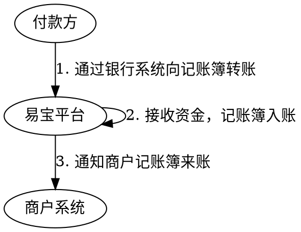
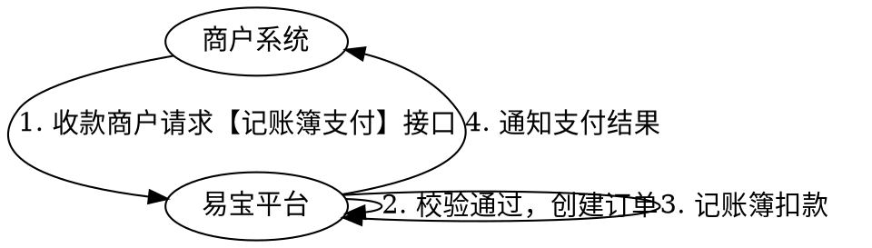

# 氢钱包（记账簿）

基于**银行转账支付 + 易宝账户体系 + 灵活的资金处理**，为 B2B 平台提供一站式资金管理解决方案：平台为买家开立记账簿，买家通过银行转账把钱汇入记账簿，平台核对后从记账簿扣款完成收款。

整体三步：**记账簿开立 → 记账簿收款 → 记账簿支付**。

> 接口字段以在线文档为准：按下表 catalog id 在 `../api-index.yaml` 取其 `doc_md`，执行
> `curl -sS "<doc_md>"` 后再实现（单文件含字段/示例/错误码/示例代码）。

## 服务能力一览

| 服务 | catalog id | 方法 | 路径 | 说明 |
|------|-----------|------|------|------|
| 记账簿开立 | `accountbook-open` | POST | `/rest/v2.0/account/account-manage/account/open` | 走银行汇款预收时**必须**传 `merchantAccountBookName` |
| 记账簿余额查询 | `accountbook-query` | GET | `/rest/v1.0/account/account-manage/account/query` | 返回 `balance` / `freezeBalance` |
| 记账簿收款 | 无接口 | — | — | 付款方银行转账汇入，见下方「二、记账簿收款」 |
| 记账簿来账通知 | `accountbook-inbound-notify` | — | — | **需联系易宝配置回调地址**，商户不能自助传入 |
| 记账簿来账流水查询 | `accountbook-recharge-query` | GET | `/rest/v1.0/account/recharge/account-book/query` | 批量查询，时间跨度 ≤31 天 |
| 记账簿支付 | `accountbook-pay` | POST | `/rest/v1.0/account/enterprise/account-book-pay/order` | 记账簿扣款划至商户收单账户 |
| 支付结果通知 | — | — | — | 见 `accountbook-pay` 的 `notify_spi: trade.pay-result` |
| 查询订单 | `trade-order-query` | GET | `/rest/v1.0/trade/order/query` | 确认记账簿支付终态 |

附加能力（退款、冻结/解冻、记账簿信息变更）见下方「五、附加能力」。

## 对接流程

## 一、记账簿开立

商户调 `accountbook-open` 申请开立记账簿，易宝返回记账簿编号，该编号用于后续付款人转账至该记账簿。关键参数：

- `parentMerchantNo` / `merchantNo`：按签约方案填（见 `../产品决策.md` 第一节）。
- `merchantAccountBookNo`：商户侧记账簿编号，数字、字母、下划线组合。
- `merchantAccountBookName`：记账簿名称，走银行汇款预收时**必传**（用于匹配付款方名称）。
- 需要绑卡时 `bindCardList` 不为空，则 `accountBookType`、`certificateType`、`certificateNo` 变为必填。
- 响应 `ypAccountBookNo` 即**易宝记账簿编号，也是付款方汇款时填写的收款账号**；`status=PROCESSING` 表示处理中，须用**原参数重试**，不要换编号。

## 二、记账簿收款（银行转账汇入，无接口）

**步骤 1：付款方使用银行转账向记账簿转账。** 收款账户信息如下：

| 项 | 填写内容 |
|----|----------|
| 收款人户名 | 商户签约名 |
| 收款账号 | 记账簿编号（`ypAccountBookNo`，16-22 位），样例：8888 0000 0000 0000 0000 88 |
| 开户银行 | 支付机构备付金集中存款账户 |
| 分支行/网点 | 选择「易宝支付-备付金账户」 |
| 开户地/省市 | 北京市 |

> 使用「记账簿预收_银行汇款_标准版」做预收时，开立记账簿务必填写名称：系统会匹配**付款方名称与开立时传入的记账簿名称是否一致**，匹配失败资金将自动退回银行账户。

**步骤 2：来账后接收通知。** 记账簿来账后商户可通过「记账簿来账通知」接收结果，该通知**需联系易宝配置回调地址**；也可用 `accountbook-recharge-query` 批量查询来账流水补偿核对。

来账通知要点（以 `accountbook-inbound-notify` 的 `doc_md` 为准）：POST + FORM，参数 `response`（密文）+ `customerIdentification`，解密后取明文；`status` 为 `SUCCESS` / `FAIL` / `ACCOUNTING_EXCEPTION`（处理中-入账异常）；收到后须回写大写 `SUCCESS`，否则最多重试 9 次；同一笔可能多次送达，**必须幂等**。

### 汇款时效说明（非 7×24 小时汇款银行适用）

| 日期 | 时段 | 状态 |
|------|------|------|
| 工作日 | 00:00-17:15 | 可使用 |
| 工作日 | 17:15-20:30 | 不可使用 |
| 工作日非最后一天 | 20:30-24:00 | 可使用 |
| 工作日最后一天 | 20:30-24:00 | 不可使用 |
| 节假日 | 00:00-20:30 | 不可使用 |
| 节假日非最后一天 | 00:00-20:30 | 不可使用 |
| 节假日最后一天 | 20:30-24:00 | 可使用 |

支持转账至记账簿的银行以易宝提供的《汇款支持银行》清单为准（易宝实测后提供），清单外的银行是否支持须先咨询银行。

### 汇款 Q&A

1. **汇款时收款方信息未按分配账户填写？** 先检查资金是否已退回；若未收到退回资金，联系易宝销售或运营。
2. **是否全天都能汇款成功？** 不能。收款账户受央行大额系统限制，见上方「汇款时效说明」，不可用时段汇款无法入账。
3. **汇款完成后资金被退回？** 按订单回调结果处理：

| 失败原因 | 解决方案 |
|----------|----------|
| 收款方账号或收款方账户名输入错误或不匹配 | 检查资金是否退回，核对收款信息后重新汇款 |
| 产品未开通 | 检查资金是否退回，联系销售或运营开通记账簿预收款产品 |
| 风控拦截 | 检查资金是否退回，咨询易宝客服 |
| 记账簿不存在 | 检查资金是否退回，核对付款方银行账户名是否开通记账簿 |

## 三、记账簿支付

1. 商户调 `accountbook-pay` 发起记账簿支付（`parentMerchantNo`、`merchantNo`、`ypAccountBookNo`、`orderInfo` 均必填），将记账簿资金划拨至商户收单账户，用于预收款核账后的确认收款。
2. 同步响应中 `code=UA00000` 仅代表受理，须结合 `orderStatus` 判断：`SUCCESS` 成功、`FAIL` 失败、`ACCEPT` 已受理（**延迟约 10 秒后调查询接口确认**）。
3. 已受理时以**支付结果通知**为准，也可主动调 `trade-order-query` 获取支付结果。

## 四、余额与流水核对

- `accountbook-query`：查记账簿余额，`merchantAccountBookNo` 与 `ypAccountBookNo` **至少传一个**；返回 `balance`（可用余额）与 `freezeBalance`（冻结金额），单位元、两位小数。
- `accountbook-recharge-query`：批量查来账流水，`ypAccountBookNo`、`queryStartDate`、`queryEndDate`、`merchantNo`、`parentMerchantNo` 必填，起止时间间隔**不能超过 31 天**，分页 `pageNo` 从 1 开始、`pageSize` 默认 30。

## 五、附加能力

| 能力 | catalog id | 方法 | 路径 | 说明 |
|------|-----------|------|------|------|
| 记账簿退款 | `accountbook-refund` | POST | `/rest/v1.0/account/account-book/refund` | 原收款订单 `SUCCESS` 才能退；支持多次退款，每次换退款请求号，累计不超原金额；回调 `account.accountbook-refund-notify` |
| 记账簿退款查询 | `accountbook-refund-query` | GET | `/rest/v1.0/account/account-book/query-refund` | 退款终态以查询/通知的 `status` 为准 |
| 冻结记账簿金额 | `accountbook-balance-freeze` | POST | `/rest/v1.0/account/account-manage/balance/freeze` | |
| 解冻记账簿金额 | `accountbook-balance-unfreeze` | POST | `/rest/v1.0/account/account-manage/balance/unfreeze` | 一笔冻结订单支持多次解冻，解冻总额不超原冻结金额 |
| 冻结记录查询 | `accountbook-freeze-query` | GET | `/rest/v1.0/account/account-manage/balance/freeze-query` | |
| 解冻记录查询 | `accountbook-unfreeze-query` | GET | `/rest/v1.0/account/account-manage/balance/un-freeze-query` | |
| 更新记账簿 | `accountbook-modify` | POST | `/rest/v1.0/account/account-manage/account/modify` | 变更记账簿信息 |

## 易错点

- **记账簿收款没有接口**：钱是付款方从银行汇进来的，商户侧不要找「收款下单」接口；商户能做的只有开立、接通知、查流水、发起支付。
- **与银行转账支付区分**：买家按订单逐笔转账、一次汇款对应一笔订单（先下单、按动态账号/附言匹配）走 `../收单/银行转账支付.md`；记账簿是先汇入攒余额、平台核销后再扣款的预收模式，两者不要混。
- **收款账号就是 `ypAccountBookNo`**：原样填写开立接口返回值，不要自行补位或截断（产品页写 16-22 位、开立接口描述写 22 位，以实际返回值为准）。
- **记账簿名称与付款方名称必须匹配**：走银行汇款预收（官方文档对该产品有「标准版 / 推荐版」两种表述，以商户实际签约产品名为准）时开立必须传 `merchantAccountBookName`，匹配失败资金**自动原路退回**。
- **来账通知要联系易宝配置回调地址**，不是下单参数传入；不要让商户在接口里找 `notifyUrl`。
- **汇款有时间窗**：非 7×24 小时汇款银行在不可用时段汇款无法入账（工作日 17:15-20:30、工作日最后一天 20:30 后、节假日大部分时段），大额汇款前先看时效表。
- **开立返回 `PROCESSING` 用原参数重试**，换 `merchantAccountBookNo` 重发会造成重复开立；`AM20011 请求号重复`、`AM20026 记账簿名称重复` 属参数问题，不要盲目重试。
- **记账簿支付 `ACCEPT` 不是终态**：延迟约 10 秒后查单，或等支付结果通知；`UA00012 账户余额不足` 先查余额再决定是否重发，**不要换单号重试**，避免重复扣款。
- **`orderInfo` 为对象**，doc_md 请求参数表未展开其子字段；实现前须以 doc_md/技术支持确认的字段为准，**不得凭其他接口推断**。
- **这批接口不需要 CFCA 证书**：`accountbook-*` 虽在 `account` 分组，但 doc_md「安全需求」为 `YOP-RSA2048-SHA256` / `YOP-SM2-SM3`；需要 CFCA 的是提现、转账、企业账户支付等出款类接口（见 `../../平台文档/接入准备/密钥管理/CFCA证书介绍.md`）。
- **产品需单独开通**：`AM20002 开立失败，请先创建账户` 表示未开通记账簿预收款/记账簿支付产品，需联系销售开通。
- 金额单位为元、两位小数；来账通知与支付结果通知都必须做**幂等**处理并回写大写 `SUCCESS`。

## 排障

- 业务错误码：见各接口 doc_md「错误码」章节。记账簿管理类为 `AM*`（如 `AM00001 记账薄不存在`、`AM20002 请先创建账户`、`AM20004 商户状态有误`）；记账簿支付类为 `UA*` / `UAP*`（如 `UA00010 账户不存在`、`UA00012 余额不足`、`UAP40001 记账薄编号不存在`、`UAP40002 收款关系不存在`）。
- 平台错误码/验签：`../../troubleshooting.md`、`../../平台文档/开始对接/平台错误码说明.md`。
- 回调收不到：来账通知需易宝侧配置回调地址，先确认是否已配置，再按 `../../平台文档/平台规范/结果通知机制说明.md` 排查。

## 代码示例

- 加验签（不使用 SDK 时）：`../../平台文档/平台规范/安全认证/请求签名协议.md`
- 回调解密验签：`../../平台文档/平台规范/安全认证/回调解密协议.md`
