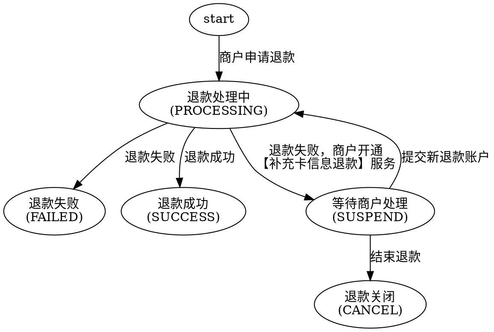

# 退款

对已支付成功的交易发起全额/部分退款，并查询退款结果。

> 接口字段以在线文档为准：按下表 catalog id 在 `../api-index.yaml` 取其 `doc_md`，执行
> `curl -sS "<doc_md>"` 后再实现（单文件含字段/示例/错误码/示例代码）。

## 场景 → 接口

| 用途 | catalog id | 方法 | 路径 |
|------|-----------|------|------|
| 发起退款 | `trade-refund` | POST | `/rest/v1.0/trade/refund` |
| 查询退款 | `trade-refund-query` | GET | `/rest/v1.0/trade/refund/query` |

退款结果回调：申请退款传 `notifyUrl` 才通知；通知编码与报文字段以 `trade-refund` 的 doc_md「结果通知」节为准（索引提示：`trade.refund-result`）。

## 退款状态转化图

## 流程

1. 用业务唯一退款单号调 `trade-refund`。
2. 同步成功 ≠ 退款完成；以 `trade-refund-query` 或回调确认终态。
3. 超时/未知结果先查询，不要直接用新单号重试。

## 必读规则

1. `../../平台文档/平台规范/安全认证/鉴权认证机制(RSA).md`（请求签名）。
2. `../../平台文档/平台规范/安全认证/结果通知(RSA).md`（回调验签）。

## 易错点

- 退款单号需业务唯一；重试用**同一单号**避免重复退款。
- 「发起成功」≠「退款完成」：状态以查询/回调确认。
- 部分退款金额与原订单金额、累计退款额的校验以在线文档为准。

## 排障

- 状态长期不变：先 `curl` 退款查询接口 doc_md 核对状态机；再查回调是否到达（`../../troubleshooting.md`）。
- 业务错误码：见 doc_md「错误码」章节（与接口文档同文件）；平台码见 `../../平台文档/开始对接/平台错误码说明.md`。

## 工具与示例

- 本地联调退款：`../../../scripts/rsa/refund.py`。
- 加验签（不使用 SDK 时）：`../../平台文档/平台规范/安全认证/请求签名协议.md`
- 回调解密验签：`../../平台文档/平台规范/安全认证/回调解密协议.md`
