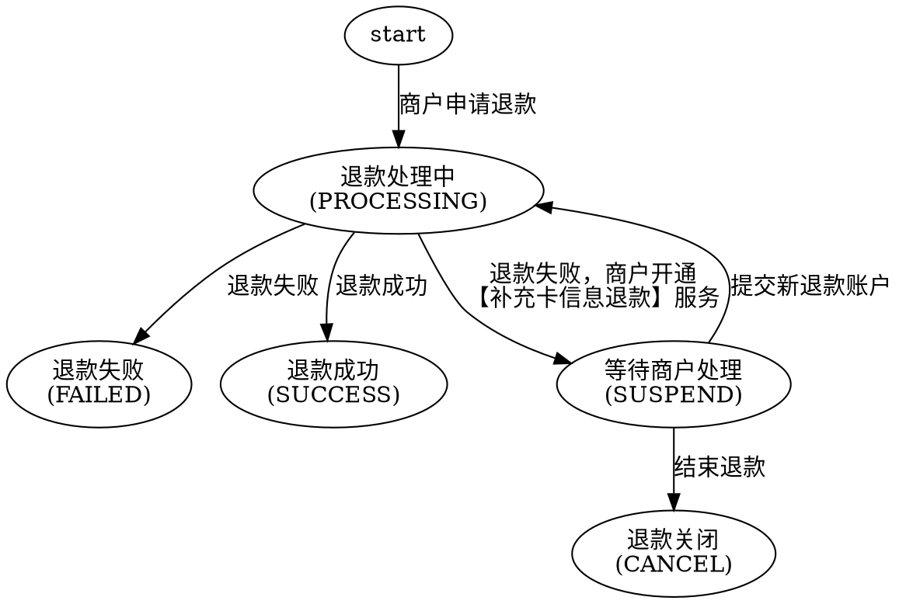

# 退款

对已支付成功的交易发起全额/部分退款，并查询退款结果。

> 接口字段以在线文档为准：按下表 catalog id 在 `../api-index.yaml` 取其 `doc_md`，执行
> `curl -sS "<doc_md>"` 后再实现（单文件含字段/示例/错误码/示例代码）。

## 场景 → 接口

| 用途 | catalog id | 方法 | 路径 |
|------|-----------|------|------|
| 发起退款（原路退款） | `trade-refund` | POST | `/rest/v1.0/trade/refund` |
| 查询退款 | `trade-refund-query` | GET | `/rest/v1.0/trade/refund/query` |
| 申请极速退款 | `trade-refund-fast` | POST | `/rest/v1.0/trade/refund/fast` |
| 上送卡信息退款 | `trade-refund-supply` | POST | `/rest/v1.0/trade/refund/supply` |
| 结束退款 | `trade-refund-end` | POST | `/rest/v1.0/trade/refund/end` |
| 申请合单退款 | `trade-refund-combine` | POST | `/rest/v1.0/trade/refund/combine` |
| 查询合单退款 | `trade-refund-combine-query` | GET | `/rest/v1.0/trade/refund/combine-query` |

退款结果回调：申请退款传 `notifyUrl` 才通知；通知编码与报文字段以 `trade-refund` 的 doc_md「结果通知」节为准（索引提示：`trade.refund-result`）。

## 退款服务选型

| 退款服务 | 产品特性 | 接口 |
| --- | --- | --- |
| 原路退款 | 走通道原路退款接口；退款失败且可取到支付卡信息时自动转打款退款；仍失败则资金退回商户易宝账户 | `trade-refund` / `trade-refund-query` |
| 极速退款 | 不尝试原路退，直接按上送的银行卡信息打款退款，支持同名/非同名校验；失败则资金退回商户易宝账户 | `trade-refund-fast` |
| 补充卡信息退款 | 需开通该服务；原路退款失败后**不退回商户账户**，等商户上送卡信息继续打款退款，或商户主动结束退款 | `trade-refund-supply` / `trade-refund-end` |
| 合单退款 | 针对合并支付订单，一次接口同时扣除两笔子单收单商户资金，给用户一笔退款；任一子单扣款失败则整笔失败 | `trade-refund-combine` / `trade-refund-combine-query` |

极速退款、补充卡信息退款、合单退款均需**单独开通服务**，未开通时调用会被拒绝；金融行业协议支付场景的退款选型见 `../金融/协议支付.md`「退款」。

## 退款状态转化图

```dot
digraph 退款状态转化图 {
    PROCESSING [label="退款处理中\n(PROCESSING)"];
    FAILED     [label="退款失败\n(FAILED)"];
    SUCCESS    [label="退款成功\n(SUCCESS)"];
    SUSPEND    [label="等待商户处理\n(SUSPEND)"];
    CANCEL     [label="退款关闭\n(CANCEL)"];

    start      -> PROCESSING [label="商户申请退款"];
    PROCESSING -> FAILED     [label="退款失败"];
    PROCESSING -> SUCCESS    [label="退款成功"];
    PROCESSING -> SUSPEND    [label="退款失败，商户开通\n【补充卡信息退款】服务"];
    SUSPEND    -> PROCESSING [label="提交新退款账户"];
    SUSPEND    -> CANCEL     [label="结束退款"];
}
```

## 流程

1. 用业务唯一退款单号调 `trade-refund`。
2. 同步成功 ≠ 退款完成；以 `trade-refund-query` 或回调确认终态。
3. 超时/未知结果先查询，不要直接用新单号重试。

## 必读规则

1. `../../平台文档/平台规范/安全认证/鉴权认证机制(RSA).md`（请求签名）。
2. `../../平台文档/平台规范/安全认证/结果通知(RSA).md`（回调验签）。

## 易错点

- 退款单号需业务唯一；重试用**同一单号**避免重复退款。
- 「发起成功」≠「退款完成」：状态以查询/回调确认。
- 部分退款金额与原订单金额、累计退款额的校验以在线文档为准。
- **退款失败的资金去向要提前设计**：未开通「补充卡信息退款」时，原路/极速退款失败资金**自动退回商户易宝账户**，商户侧需有对应账务处理；已开通时退款会停在 `SUSPEND`（等待商户处理），须调 `trade-refund-supply` 补卡或 `trade-refund-end` 结束退款，否则订单长期挂起。
- 合单退款是**整笔成败**：任一子单扣款失败则整笔退款失败，不会部分成功。

## 排障

- 状态长期不变：先 `curl` 退款查询接口 doc_md 核对状态机；再查回调是否到达（`../../troubleshooting.md`）。
- 业务错误码：见 doc_md「错误码」章节（与接口文档同文件）；平台码见 `../../平台文档/开始对接/平台错误码说明.md`。

## 工具与示例

- 本地联调退款：`../../../scripts/rsa/refund.py`。
- 加验签（不使用 SDK 时）：`../../平台文档/平台规范/安全认证/请求签名协议.md`
- 回调解密验签：`../../平台文档/平台规范/安全认证/回调解密协议.md`
