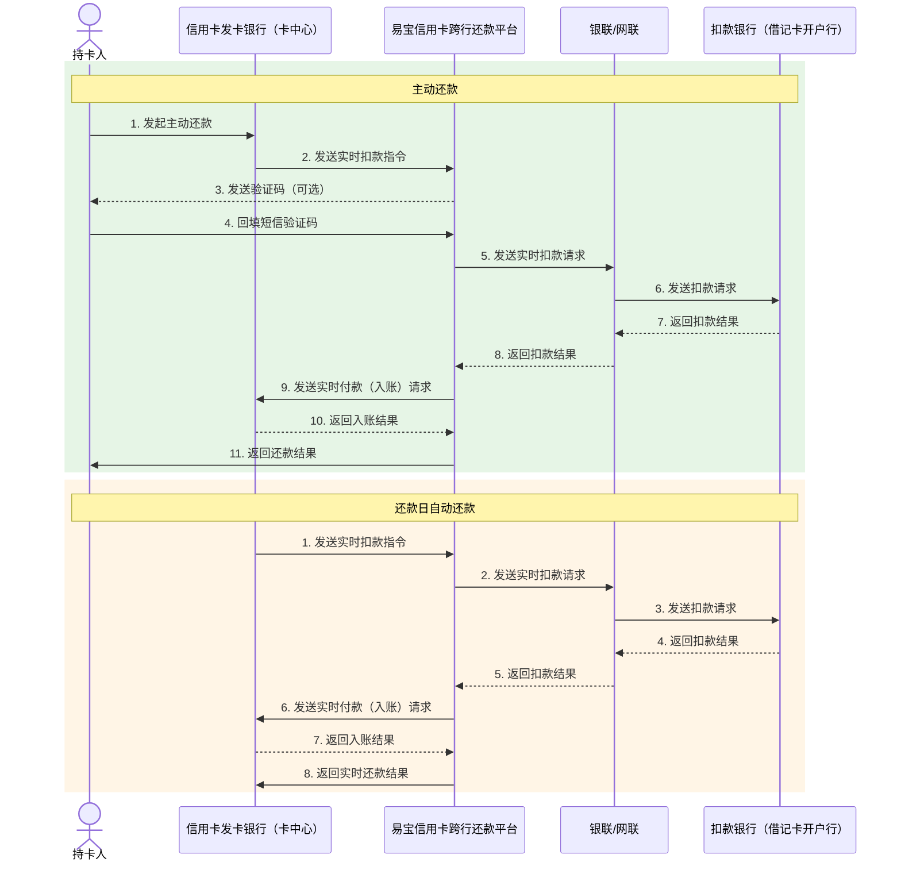
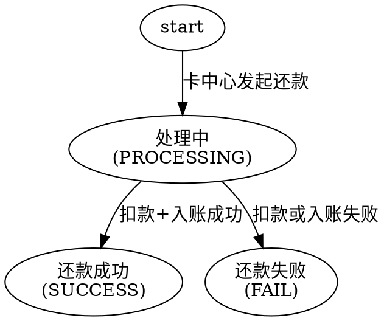

# 信用卡还款（跨行还款）

面向**信用卡发卡机构（卡中心）**的跨行还款通道：持卡人在卡中心自有渠道（APP、网银等）发起对他行信用卡的还款，易宝从持卡人的他行借记卡实时扣款，成功后实时到账至持卡人的贷记卡账户。

能力构成三段：**签约（绑借记卡）→ 跨行扣款 + 到账 → 对账**。

- **签约**：单笔签约（姓名、身份证、银行卡号、手机号、短信验证码五要素校验，用于网银/手机银行实时签约）；一键绑卡（通过姓名、身份证号、手机号验证获取持卡人卡号并完成签约）。
- **扣款到账**：付款验证为**同名验证 + 信用卡号信息**；扣款成功后实时结算至持卡人贷记卡账户。支持**主动还款**与**还款日自动还款**两种触发方式。
- **对账**：D+1 日提供扣款交易清算文件，卡中心据此对账。

> 签约链路与协议支付共用同一组签约接口，详见 `协议支付.md`「签约绑卡」与「一键绑卡」。
> 接口字段以在线文档为准：按下表 catalog id 在 `../api-index.yaml` 取其 `doc_md`，执行
> `curl -sS "<doc_md>"` 后再实现（单文件含字段/示例/错误码/示例代码）。

## 场景 → 接口

### 一、签约绑卡（与协议支付共用）

| 用途 | catalog id | 方法 | 路径 |
|------|-----------|------|------|
| 签约请求 | `frontcashier-agreement-sign-request` | POST | `/rest/v1.0/frontcashier/agreement/sign/request` |
| 签约确认 | `frontcashier-agreement-sign-confirm` | POST | `/rest/v1.0/frontcashier/agreement/sign/confirm` |
| 签约短验重发 | `frontcashier-agreement-sign-sms` | POST | `/rest/v1.0/frontcashier/agreement/sign/sms` |

一键绑卡（姓名 + 身份证号 + 手机号查卡并签约）走 `frontcashier-bindcard-netsunion-request` 及配套短验接口，见 `协议支付.md`「一键绑卡」；目标银行的支持形态与卡种查 `网联一键绑卡支持银行.md`。

### 二、还款

| 用途 | catalog id | 方法 | 路径 |
|------|-----------|------|------|
| 信用卡还款封装版-请求 | `cnppay-ccr-pay-request` | POST | `/rest/v1.0/cnppay/ccr/pay/request` |
| 信用卡还款订单查询 | `cnppay-ccr-query` | GET | `/rest/v1.0/cnppay/ccr/query` |

还款结果回调：下单传 `notifyUrl` 才通知，且**仅异步结果终态（成功/失败）会回调，同步响应已是终态时不回调**。该接口 doc_md 当前未列出「结果通知」章节，通知编码与报文字段须以接口 doc_md 实际内容或技术支持确认为准，**不得臆造 SPI 编码**。

### 三、对账

D+1 日提供扣款交易清算文件，卡中心据此对账，三种获取方式：

1. 易宝生成并发送扣款交易清算文件；
2. 通过接口获取（交易账单类接口，见 `../对账/交易对账.md`）；
3. 通过 SFTP 推送（推送账号与目录联系易宝运营开通）。

## 业务流程

## 订单状态机

还款订单状态（`status`，以 doc_md 响应参数为准）：

`SUCCESS` 后仍可能冲退：响应/查询中的 `repaymentReverseTime`（还款冲退时间）有值表示该笔已冲退，账务需支持回滚。

## 开通产品（产品码）

| 产品名称 | 开通产品名称 |
| --- | --- |
| 信用卡还款 | **信用卡还款_封装版**；三级产品按银行区分，举例：信用卡还款_封装版_中信银行、信用卡还款_封装版_邮储银行 |

三级产品按卡中心所属银行开通，具体以客户经理确认结果为准。

## 接入步骤

1. 确认易宝商编与卡中心所属银行，按银行开通「信用卡还款_封装版」三级产品。
2. 补充挂网协议（签约绑卡所需，联系销售）。
3. 完成密钥与应用配置：`../../平台文档/接入准备/快速接入.md`、`../../平台文档/接入准备/应用管理.md`。
4. 实现签约链路：签约请求 → 短验（必要时重发）→ 签约确认 → 保存 `bindId` 与用户标识对应关系（细节见 `协议支付.md`）。
5. 实现还款链路：还款请求（带还款信用卡信息 + 扣款要素 + 风控字段）→ 结果通知 → 还款订单查询。
6. 约定对账方式（接口 / SFTP / 文件），实现 D+1 对账与差异处理（`../对账/交易对账.md`）。
7. 沙箱联调（`../../平台文档/开始对接/沙箱环境联调测试.md`）后上线；生产环境真实还款须经商户显式二次确认。

## 必读规则

1. `../../平台文档/平台规范/安全认证/鉴权认证机制(RSA).md`（请求签名）。
2. `../../平台文档/平台规范/结果通知机制说明.md`、`../../平台文档/平台规范/安全认证/结果通知(RSA).md`（回调机制与验签）。
3. 签约相关约束见 `协议支付.md`「易错点」（用户标识一致性、挂网协议、跳页签约、卡信息加密）。

## 易错点

接入实现时必须遵守的约束（生成参数/代码前必读）：

- **两张卡不要搞反**：`repaymentCreditCardNo` / `repaymentCreditCardName` 是**被还款的贷记卡（信用卡）**信息；扣款用的**借记卡**通过 `bindId`（或 `userNo`+`userType`+`bankCardNo`）指定。把信用卡号填到扣款要素里会直接失败。
- **扣款要素条件必填**：`bindId` 为空时 `userNo`、`userType`、`bankCardNo` 三者必填；反之用户标识、标识类型、借记卡卡号任一为空时 `bindId` 必填。
- **风控字段必须上送**：信用卡还款需上送 `riskInfo`，其中 `resRepaymentAmount` 为剩余待还金额（单位元，保留 2 位小数）。漏传会被风控拦截。
- **回调只在异步终态发生**：`notifyUrl` **仅异步结果终态（成功/失败）会回调；同步响应已是终态时不回调**。只依赖回调入账会漏单，必须同时实现查单兜底。
- **通知编码不得臆造**：该接口 doc_md 未列「结果通知」章节；实现回调解析前须先按 `SKILL.md`「文档加载协议」重新 `curl` doc_md 确认，或向技术支持确认通知编码，不能套用协议支付/收单的 SPI 编码。
- **同名与信用卡号校验**：付款验证为同名验证 + 信用卡号信息，借记卡持卡人与信用卡持卡人须同名，非同名场景需与易宝确认是否支持。
- **签约要素是五要素**：单笔签约需姓名、身份证、银行卡号、手机号、短信验证码；一键绑卡只需姓名、身份证号、手机号（由网联查卡）。
- **`orderId` 业务唯一**：重试用同一单号避免重复还款；超时/未知结果先查单再决定。
- **订单有效期**：`expireTime` 格式 `yyyy-MM-dd HH:mm:ss`，默认有效期一天（与协议支付默认 15 分钟不同，不要混记）。
- **冲退要处理**：`repaymentReverseTime` 有值即已冲退，对账与账务需支持回滚。
- **对账口径**：D+1 清算文件为对账基准；若同时用接口取账单，注意账单生成时延与 `yos` 网关差异（`../对账/交易对账.md`）。
- **敏感信息**：不要在对话中提供完整信用卡号、借记卡号、身份证号、短信验证码；日志脱敏，示例一律用占位符。

## 排障

- 业务错误码：见 `cnppay-ccr-pay-request` / `cnppay-ccr-query` 的 doc_md「错误码」章节；平台码见 `../../平台文档/开始对接/平台错误码说明.md`。
- 还款失败：核对信用卡号与持卡人姓名是否与发卡行一致；借记卡是否已成功签约且 `bindId` 与用户标识匹配；是否漏传 `riskInfo`。
- 收不到还款结果通知：先确认该笔是否为**同步终态**（同步终态不回调）；再按 `../../troubleshooting.md`「回调问题排查」定位网络与验签。
- 状态长期处于 `PROCESSING`：调 `cnppay-ccr-query` 核实，不要换单号重发。
- 签约类问题：见 `协议支付.md`「排障」。
- 对账差异：按 `../对账/交易对账.md` 与 `../../troubleshooting.md`「对账差异处理」处理，单笔差异回到查询接口核实终态。
