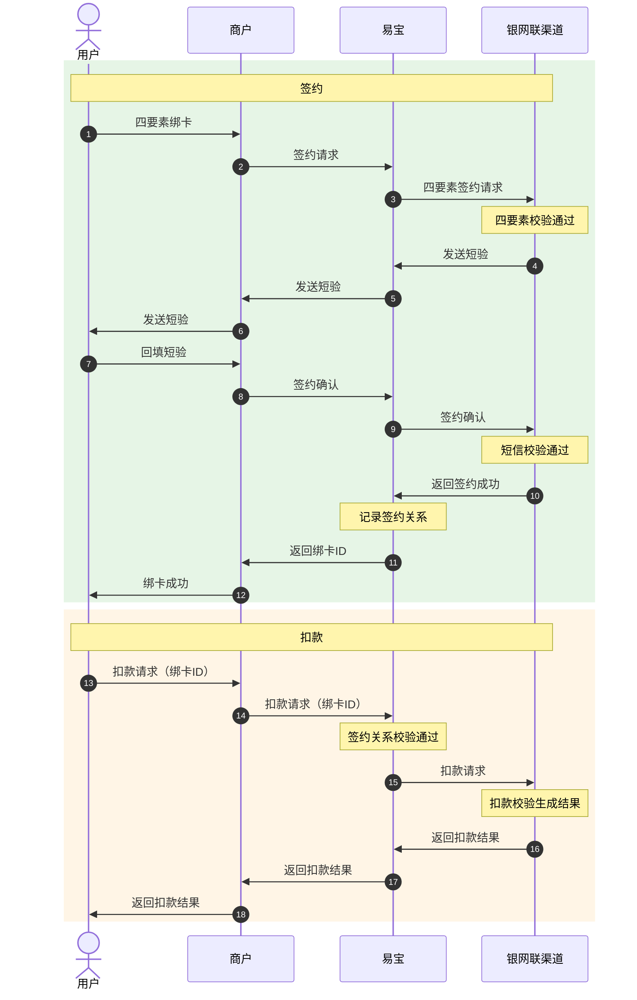

# 协议支付（签约绑卡 + 代扣）

面向持牌金融机构的**签约绑卡 + 主动扣款**能力，实现「一次签约、多次扣款」的合规资金代扣。

- **签约绑卡**：用户通过**身份要素核验 + 授权确认**，把个人银行卡与支付机构、商户建立长期绑定关系。流程为「输入卡号/身份证号/姓名/预留手机 → 四要素鉴权 → 短信核验 → 签署授权协议 → 生成唯一签约协议号（`bindId`）」，是后续扣款的前提。
- **协议支付**：用户完成签约授权后，商户按约定场景**主动发起扣款**，无需用户重复输入卡信息，支持定期、批量、自动划扣。
- **适用主体**：银行、消费金融、汽车金融、融资租赁、保险、基金、信托、小贷、保理等持牌金融机构。
- **典型场景**：消费信贷/车贷/融资租赁还款、信用卡跨行还款、保险保费代扣、基金定投代扣、会员订阅自动续费、公用事业及政务类资金代收。

> 接口字段以在线文档为准：按下表 catalog id 在 `../api-index.yaml` 取其 `doc_md`，执行
> `curl -sS "<doc_md>"` 后再实现（单文件含字段/示例/错误码/示例代码）。

## 场景 → 接口

### 一、签约绑卡

| 用途 | catalog id | 方法 | 路径 |
|------|-----------|------|------|
| 签约请求（四要素） | `frontcashier-agreement-sign-request` | POST | `/rest/v1.0/frontcashier/agreement/sign/request` |
| 签约确认（回填短验） | `frontcashier-agreement-sign-confirm` | POST | `/rest/v1.0/frontcashier/agreement/sign/confirm` |
| 签约短验重发 | `frontcashier-agreement-sign-sms` | POST | `/rest/v1.0/frontcashier/agreement/sign/sms` |
| 存量签约（存量卡导入绑卡） | `frontcashier-sign-import-card` | POST | `/rest/v1.0/frontcashier/sign/import-card` |

### 二、一键绑卡（网联查卡并签约）

用户只提供姓名、身份证号、手机号，由网联查询其本人在指定银行开立的银行卡，商户选择一张在银行侧签约开通快捷支付并完成易宝侧绑卡。

| 用途 | catalog id | 方法 | 路径 |
|------|-----------|------|------|
| 【金融版】查询本人银行卡并签约绑卡 | `frontcashier-bindcard-netsunion-request` | POST | `/rest/v1.0/frontcashier/bindcard/netsunion/request` |
| 中台绑卡-短验重发 | `frontcashier-bindcard-resendsms` | POST | `/rest/v2.0/frontcashier/bindcard/resendsms` |
| 中台绑卡-短验确认 | `frontcashier-bindcard-confirm` | POST | `/rest/v2.0/frontcashier/bindcard/confirm` |

**支持的银行、前端形态（APP/H5）与卡种（借记卡/贷记卡）逐家不同**，接入前查 `网联一键绑卡支持银行.md`（按需加载，不要凭记忆列举银行）。

### 三、扣款（协议支付 1.0 / 2.0）

**1.0 与 2.0 是两套独立接口，下单与查询必须配对使用，不可交叉。**

| 用途 | catalog id | 方法 | 路径 |
|------|-----------|------|------|
| 协议支付 1.0-支付 | `cnppay-agreement-pay-request` | POST | `/rest/v1.0/cnppay/agreement/pay/request` |
| 协议支付 1.0-订单查询 | `cnppay-query` | GET | `/rest/v1.0/cnppay/query` |
| 协议支付 2.0-支付 | `financial-order-pay-request` | POST | `/rest/v1.0/financial/order/pay/request` |
| 协议支付 2.0-支付订单查询 | `financial-order-pay-query` | GET | `/rest/v1.0/financial/order/pay/query` |

扣款结果回调：以下单接口 doc_md「结果通知」节为准（索引提示：1.0 `cnppay.agreementpay.pay-result`，2.0 `financial.order-pay-result`；涉及分账另有分账结果通知）。

### 四、批量支付（定时批次还款、保费定时缴纳等）

| 用途 | catalog id | 方法 | 路径 |
|------|-----------|------|------|
| 批量支付单笔签约-请求 | `frontcashier-batch-sign-request` | POST | `/rest/v1.0/frontcashier/batch/sign/request` |
| 批量支付单笔签约-确认 | `frontcashier-batch-sign-confirm` | POST | `/rest/v1.0/frontcashier/batch/sign/confirm` |
| 批量支付下单 | `cnppay-batch-pay-request` | POST | `/rest/v1.0/cnppay/batch/pay/request` |
| 批量支付查询（含子单列表） | `trade-batch-order-query` | GET | `/rest/v1.0/trade/batch/order/query` |

### 五、退款

四种退款服务，按商户开通情况选择；详见 `../退款/退款.md`。

| 退款服务 | 产品特性 | catalog id |
| --- | --- | --- |
| 原路退款 | 走通道原路退款接口；若退款失败且可取到支付卡信息，系统自动转打款退款；仍失败则资金退回商户易宝账户 | `trade-refund` / `trade-refund-query` |
| 极速退款 | 不尝试原路退，直接按上送的银行卡信息打款退款，支持同名/非同名校验；失败则资金退回商户易宝账户 | `trade-refund-fast` |
| 补充卡信息退款 | 开通该服务后，原路退款失败**不直接退回商户账户**，而是等商户上送卡信息继续打款退款，或商户主动结束退款 | `trade-refund-supply` / `trade-refund-end` |
| 合单退款 | 针对合并支付订单，一次接口同时扣除两笔子单收单商户资金，给用户一笔退款；任一子单扣款失败则整笔退款失败 | `trade-refund-combine` / `trade-refund-combine-query` |

### 六、账单与回单

| 用途 | catalog id | 方法 | 路径 |
|------|-----------|------|------|
| 交易日账单下载 | `bill-trade-day-download` | GET | `/yos/v1.0/std/bill/tradedaydownload` |
| 交易回单下载 | `trade-receipt-download` | GET | `/yos/v1.0/trade/receipt/download` |

## 业务流程

### 支付要素三选一

签约绑卡成功后返回签约协议号 `bindId`。扣款时以下三组要素**三选一必填**：

1. `bindId`（绑卡 id）——推荐；
2. `bankCardNoFirst6` + `bankCardNoLast4` + `userType` + `userNo`（卡号前 6 位 + 后 4 位 + 用户标识类型 + 用户标识）——前 6 后 4 必须同时传；
3. `payerInfo`（持卡人信息 JSON：卡号、姓名、证件号、证件类型、银行卡绑定手机号）。

### 一键绑卡的通知对接逻辑

一键绑卡的前端通知与后端通知分银行处理，**工商银行与非工商银行不同**：

**工商银行**（需先后接收两种通知）：

1. 银行签约**成功**时，前端通知形如 `https://<商户前端地址>/signResult?merchantFlowId=<签约请求号>&phone=185****5379&bankCardNo=621226***********3335`。通知里带 `phone` 与 `bankCardNo`，说明商户上送的卡信息四要素正确，可进入第 2 步。
   银行签约**失败**时，前端通知形如 `https://<商户前端地址>/signResult?code=1011&message=<失败原因>`，需解析 `code` 与 `message` 定位原因。
2. 调用**中台绑卡-短验重发**（发送绑卡短验），成功后进入第 3 步。
3. 调用**中台绑卡-短验确认**，成功后等待第 4 步后端回调。
4. 接收**绑卡结果异步通知**（后端通知）确认最终绑卡结果。

**非工商银行**：

- 签约**成功**时前端通知直接带 `bindId`，形如 `https://<商户前端地址>/signResult?bindId=12345`，有 `bindId` 即绑卡成功。
- 签约**失败**时形如 `https://<商户前端地址>/signResult?code=1011&message=<失败原因>`，解析 `code`/`message` 定位原因。

### 短验确认返回码语义（中台绑卡-短验确认）

| 返回码 | 含义与处理 |
| --- | --- |
| `NOP00000` | 本次绑卡成功 |
| `NOP04005` | 该订单状态已绑卡成功；最终结果以查询订单接口返回为准 |
| `NOP01010` / `NOP01005` | 绑卡失败，订单已终态 |
| `NOP04001` | 验证码已达验证次数上限，需调短验发送接口重新发送 |
| `NOP01001` / `NOP01008` | 订单已终态；最终结果以查询订单接口返回为准 |
| `NOP99999` | 系统异常，可重试或通过查询订单确认结果 |
| 其他错误码 | 本次验证失败，可继续调用确认接口 |

## 开通产品（产品码）

| 场景 | 产品名称 | 开通产品名称 |
| --- | --- | --- |
| 还款场景 | 签约绑卡 | **协议支付_绑卡**、协议支付_一键绑卡 |
| 还款场景 | 存量签约 | 协议支付_存量签约、协议支付_存量签约加密版 |
| 还款场景 | 协议支付 | **协议支付_快捷还款_银行**（三级产品按银行区分，举例：协议支付_快捷还款_邮储银行） |
| 定时批次还款、保费定时缴纳等批量支付 | 签约 | 批量支付_签约 |
| 定时批次还款、保费定时缴纳等批量支付 | 支付 | 批量支付_借记卡 |
| 退款场景 | 退款 | 原路退款、极速退款 |

具体产品码与可用银行以客户经理确认结果为准。

## 接入步骤

> 下方顺序即为接入顺序。

1. 确认易宝商编与收款主体方案（标准/平台商/服务商，见 `../产品决策.md` 第一节）。
2. 补充**挂网协议**：一键绑卡与四要素签约绑卡均须挂网协议，联系销售补充。
3. 按场景开通产品（见上表），协议支付三级产品按银行开通。
4. 完成密钥与应用配置：`../../平台文档/接入准备/快速接入.md`、`../../平台文档/接入准备/应用管理.md`。
5. 实现签约链路：签约请求 → 短验（必要时重发）→ 签约确认 → 保存 `bindId` 与用户标识的对应关系。存量卡走存量签约；只掌握姓名/证件号/手机号时走一键绑卡。
6. 实现扣款链路：选定协议支付 1.0 或 2.0 → 下单 → 结果通知 → **配对的**订单查询。
7. 按需实现退款、批量支付、账单与回单。
8. 沙箱联调（`../../平台文档/开始对接/沙箱环境联调测试.md`）后上线；生产环境真实扣款须经商户显式二次确认。

## 必读规则

1. `../../平台文档/平台规范/安全认证/鉴权认证机制(RSA).md`（请求签名）。
2. `../../平台文档/平台规范/结果通知机制说明.md`、`../../平台文档/平台规范/安全认证/结果通知(RSA).md`（回调机制与验签）。
3. 使用卡信息加密（`cardInfoEncryptType`）或存量签约加密版时读 `../../平台文档/平台规范/安全认证/报文加密机制(RSA).md` / `报文加密机制(SM).md`。
4. 本场景账单与回单均为 `yos` 网关文件流下载（`bill-trade-day-download`、`trade-receipt-download`），读 `../../平台文档/工具与支持/最佳实践/文件下载.md`（放款域电子回单 `financial-receipt-get` 为 rest 返回 Base64，见 `放款.md`）。

## 易错点

接入实现时必须遵守的约束（生成参数/代码前必读）：

- **用户标识必须与绑卡时一致**：用 `bindId` 发起扣款时若上送 `userType`/`userNo`，必须与绑卡接口上送的完全一致；**如果不上送用户标识，需要与易宝单独沟通配置**，否则扣款会因签约关系校验失败。
- **挂网协议不可漏**：一键绑卡、四要素签约绑卡均需添加挂网协议，可联系销售补充；缺协议会导致签约被拒。
- **一键绑卡按银行逐家接入**：目标银行的支持形态（APP/H5）与卡种（借记卡/贷记卡）须先查 `网联一键绑卡支持银行.md` 确认——贷记卡覆盖明显窄于借记卡，招商银行仅支持 APP 形态。不支持时改走四要素签约绑卡。
- **1.0 与 2.0 不可交叉**：协议支付 1.0 下单（`cnppay-agreement-pay-request`）只能用 `cnppay-query` 查询；2.0 下单（`financial-order-pay-request`）只能用 `financial-order-pay-query` 查询。混用会查不到订单（返回订单不存在）。
- **支付要素三选一**：`bindId` / 前 6 后 4 + 用户标识 / `payerInfo` 三组择一；前 6 后 4 必须**同时**传，缺一即视为未传该组要素。
- **信用卡签约需补两个字段**：签约卡为信用卡时 `cvv2` 与 `validthru`（格式月月年年，如 `0722`）必填；可用 `cardType` 限制卡类型（`OC` 仅贷记卡 / `OD` 仅借记卡 / `DC` 均支持，默认 `DC`）。
- **跳页签约要解析跳转参数**：允许跳页签约（`pageVerify`）且响应 `signMode=PAGE` 时，须按 `submitMethod`、`submitUrl`、`submitParams`、`encoding` 组装并提交表单，并处理 `pageNotifyUrl` 前端回调与 `pageVerifyStatus`；不能只按 API 签约模式实现。
- **卡信息加密要与配置匹配**：`cardInfoEncryptType=AES` 时，卡号、身份证号、姓名、手机号按易宝侧配置加解密，**响应中的这些字段也会加密返回**；加密方式/密钥须先与易宝确认，不要自选算法。
- **协议支付 2.0 的必填与条件必填**：`payScene`（如 `FAST` 快速还款）必填；商户使用多种指令类型时 `commandType` 必填；`fundProcessType=REAL_TIME_DIVIDE`（实时分账）时 `fundDetail` 必填；`isSync=true` 仅在 `commandType=AGREEMENTPAY_INITIAL` 时有效，其余情况按异步结果处理。
- **同步响应不是终态**：以「结果通知 + 订单查询」双通道确认。查询返回 `00201`（订单不存在）时按 doc_md 建议重试查询核实，不要直接判失败或换单号重发。
- **单号业务唯一**：`merchantFlowId`（签约请求号）、`orderId`（扣款请求号）、`refundRequestId`（退款请求号）均须业务唯一；重试用同一单号。
- **退款失败资金去向要提前设计**：未开通「补充卡信息退款」时，原路/极速退款失败资金会**自动退回商户易宝账户**，商户侧需有对应账务处理；合单退款任一子单失败则整笔失败。
- **批量支付是两段式**：批量支付有独立的签约接口（`frontcashier-batch-sign-*`）与产品（批量支付_签约 / 批量支付_借记卡），不能复用协议支付的签约关系；批次结果须用 `trade-batch-order-query` 查子单明细。
- **证件类型枚举以 doc_md 为准**：签约支持身份证、护照、军官证、港澳台证件等多种类型，实际支持范围随渠道变化，按 `doc_md` 的 `idCardType` 描述取值。
- **敏感信息**：不要在对话中提供完整卡号、证件号、短信验证码；日志需脱敏，示例一律用占位符。

## 排障

- 业务错误码：见对应接口 doc_md「错误码」章节；平台码见 `../../平台文档/开始对接/平台错误码说明.md`。
- 签约失败：核对四要素（卡号/姓名/证件号/预留手机）是否与银行侧一致；信用卡是否漏传 `cvv2`/`validthru`；是否缺挂网协议或产品未开通。
- 短验相关：验证次数超限（`NOP04001`）需重新发送短验；确认接口返回码语义见上表，终态一律以查询订单为准。
- 一键绑卡拿不到 `bindId`：确认银行是工行还是非工行——工行前端通知不返回 `bindId`，须继续走短验重发/短验确认，再等后端异步通知。
- 扣款报签约关系不存在/校验失败：核对 `bindId` 与 `userType`/`userNo` 是否与绑卡时一致，是否属于同一 `merchantNo`。
- 查不到订单：确认是否 1.0/2.0 查询接口用错（见易错点）。
- 回调收不到或验签失败：`../../troubleshooting.md`「回调问题排查」+ `../../平台文档/平台规范/回调网络配置.md`。
- 退款卡在中间态：确认是否开通「补充卡信息退款」——已开通时退款会停在等待商户补卡状态，需调 `trade-refund-supply` 或 `trade-refund-end`。

## 工具与示例

- 本地联调退款：`../../../scripts/rsa/refund.py`；查单：`../../../scripts/rsa/query_order.py`。
- 加验签（不使用 SDK 时）：`../../平台文档/平台规范/安全认证/请求签名协议.md`。
- 回调解密验签：`../../平台文档/平台规范/安全认证/回调解密协议.md`。
