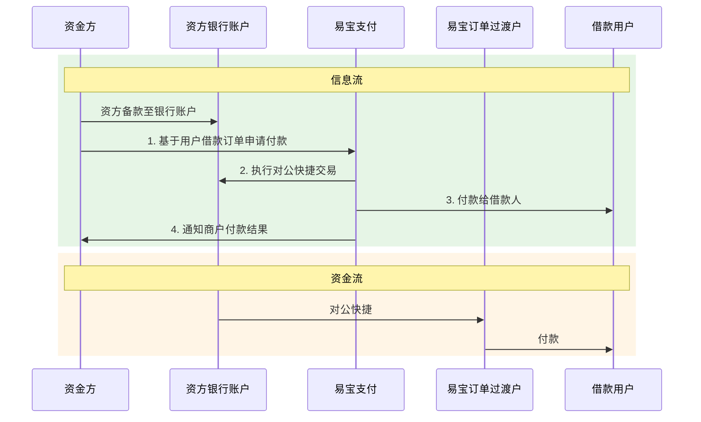
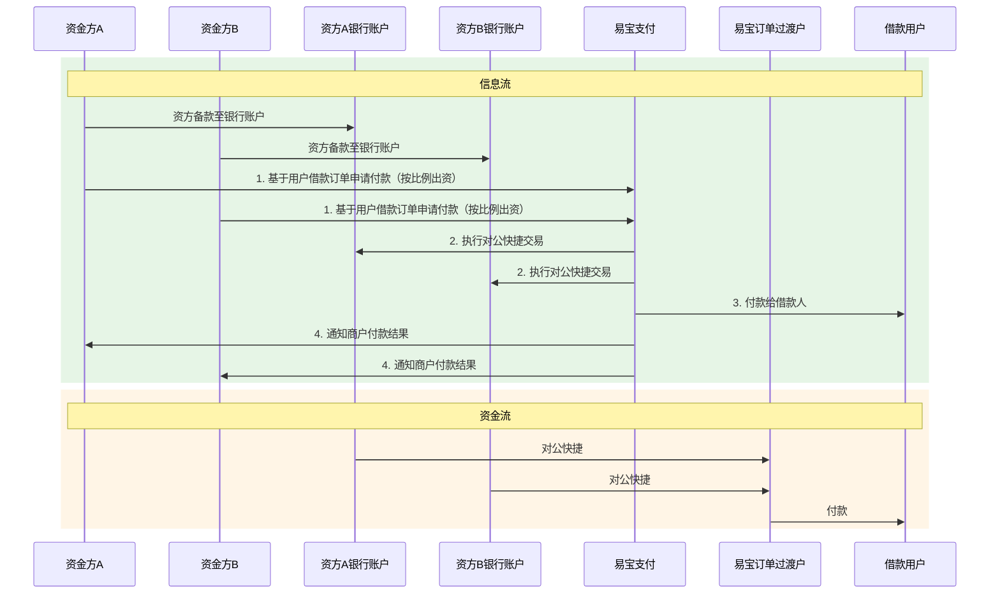
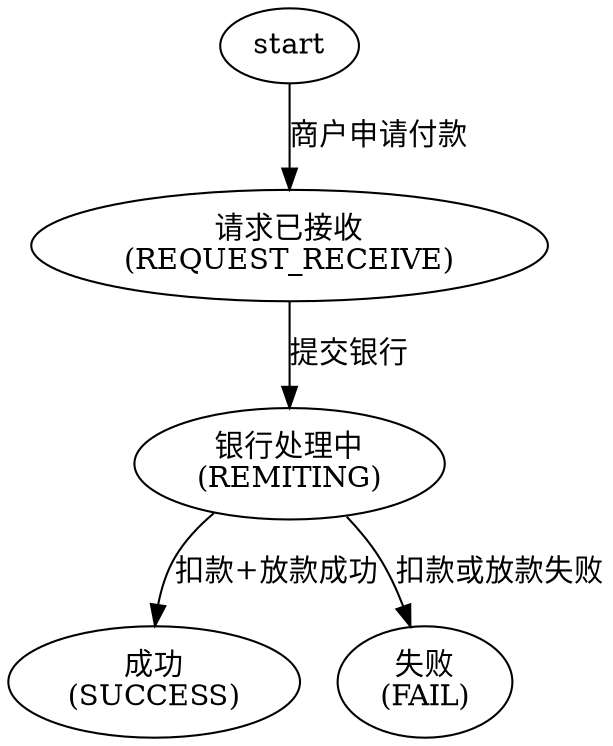

# 放款（对公快捷）

面向持牌金融机构的**放款出款**能力。资金方在银行开立一般户，放款时易宝基于资金方的放款订单，通过银联/网联的**对公快捷**能力从资金方银行账户扣款至易宝备付金的**订单临时过渡户**，再付款给借款人。核心是**逐笔扣款、笔笔穿透**，使资金流符合监管要求。

对客产品形态两种：

| 形态 | 适用 | 对应接口组 |
| --- | --- | --- |
| 订单付款（对公快捷） | 单一资金方放款 | `financial-order-remit-*` |
| 联合贷放款（对公快捷） | 多资金方联合放款，各资方同时发放指令，易宝分别扣款后一笔放款 | `financial-jointloan-*` |

> 接口字段以在线文档为准：按下表 catalog id 在 `../api-index.yaml` 取其 `doc_md`，执行
> `curl -sS "<doc_md>"` 后再实现（单文件含字段/示例/错误码/示例代码）。

## 场景 → 接口

| 用途 | catalog id | 方法 | 路径 |
|------|-----------|------|------|
| 订单付款-付款（单一资方） | `financial-order-remit-request` | POST | `/rest/v1.0/financial/order/remit/request` |
| 订单付款-订单查询 | `financial-order-remit-query` | GET | `/rest/v1.0/financial/order/remit/query` |
| 联合贷放款-下单（多资方） | `financial-jointloan-request` | POST | `/rest/v1.0/financial/jointloan/request` |
| 联合贷放款-查询 | `financial-jointloan-query` | POST | `/rest/v1.0/financial/jointloan/query` |
| 金融交易账单下载 | `financial-trade-bill-download` | GET | `/yos/v1.0/financial/trade-bill/download` |
| 获取电子回单 | `financial-receipt-get` | POST | `/rest/v1.0/financial/receipt/get` |

放款结果回调：下单传 `notifyUrl` 才通知（联合贷 `notifyUrl` 为**必填**）；通知编码与报文字段以对应下单接口 doc_md「结果通知」节为准（索引提示：订单付款 `financial.order-remit-result`、联合贷 `financial.join.loan.result.notify`）。

## 账单与回单对接方式

放款域「取文件」有两种实现，**不可混用**：

| 能力 | catalog id | 路径类型 | 响应形态 | 对接要点 |
| --- | --- | --- | --- | --- |
| 金融交易账单下载 | `financial-trade-bill-download` | **yos**（`/yos/...`） | 二进制文件流（`application/octet-stream`） | 读 `../../平台文档/工具与支持/最佳实践/文件下载.md`，用 SDK download / 处理文件流 |
| 获取电子回单 | `financial-receipt-get` | **rest**（`/rest/v1.0/...`） | JSON，含 `data`（Base64）与 `fileTypeSuffix`（如 `pdf`） | 普通 REST 调用；对 `data` Base64 解码后按后缀落盘，**不走 yos download** |

> 协议支付等场景另有 `trade-receipt-download`（`/yos/v1.0/trade/receipt/download`）为 yos 直下载，与放款 `financial-receipt-get` **不是同一接口**。

## 业务流程

### 一、订单付款（单一资方放款）

资金流：资金方备款至其银行一般户 → 易宝通过对公快捷把资金扣收到该笔订单的临时过渡户（瞬时过渡，几乎无停留）→ 易宝从过渡户放款至借款人指定银行账户。

### 二、联合贷放款（多资方联合放款）

资金流：易宝分别从各资金方的对公快捷银行账户扣款 → 扣收资金均进入易宝备付金的**同一订单过渡户** → 合并后通过一笔代付放款给借款人。

## 订单状态机

放款订单状态（`status`，以 doc_md 响应参数为准）：

`SUCCESS` 后仍可能发生**冲退**：响应/查询中的 `reversed=true` 与 `reverseTime` 表示该笔已冲退，须以查询结果为准更新账务，不能只依据首次终态。

## 开通产品（产品码）

产品按**银行**区分到三级产品，须明确银行后开通。

| 产品名称 | 开通产品名称（举例，按银行区分） |
| --- | --- |
| 订单付款 | 订单付款_对公快捷_招商银行、订单付款_对公快捷_重庆富民银行、订单付款_对公快捷_苏商银行、订单付款_对公快捷_工商银行、订单付款_对公快捷_四川新网银行、订单付款_对公快捷_江苏银行、订单付款_对公快捷_南京银行、订单付款_对公快捷_百信银行 |
| 联合贷放款 | 联合贷放款_对公快捷_重庆富民银行、联合贷放款_对公快捷_招商银行、联合贷放款_对公快捷_工商银行、联合贷放款_对公快捷_百信银行、联合贷放款_对公快捷_南京银行、联合贷放款_对公快捷_四川新网银行、联合贷放款_对公快捷_江苏苏商银行、联合贷放款_易宝账户 |

具体可开通的银行与产品码以客户经理确认结果为准；上表仅为举例，不要据此臆造银行清单。

## 接入步骤

1. 确认本次对接的易宝商编与放款形态（单一资方 / 联合贷），不清楚时找客户经理确认。
2. **明确银行并完成对公户报备**（放款前置条件，未报备无法发起交易）。
3. 按银行开通对应三级产品（见上表）。
4. 完成密钥与应用配置：`../../平台文档/接入准备/快速接入.md`、`../../平台文档/接入准备/应用管理.md`；生产环境按平台要求配置 IP 白名单（`../../平台文档/开始对接/配置IP白名单.md`）。
5. 按顺序实现：下单 → 结果通知 → 订单查询 → 账单/回单。字段级实现前 `curl` 对应 `doc_md`。
6. 先在沙箱联调（`../../平台文档/开始对接/沙箱环境联调测试.md`），生产环境实际放款须经商户显式二次确认。

## 必读规则

1. `../../平台文档/平台规范/安全认证/鉴权认证机制(RSA).md`（请求签名）。
2. `../../平台文档/平台规范/结果通知机制说明.md`（回调机制）与 `../../平台文档/平台规范/安全认证/结果通知(RSA).md`（回调验签）。
3. 取文件类能力须区分对接方式：**账单**（`financial-trade-bill-download`）为 yos 网关文件流下载，读 `../../平台文档/工具与支持/最佳实践/文件下载.md`；**电子回单**（`financial-receipt-get`）为 rest 接口返回 Base64，按 doc_md 解码落盘，不走 yos download。

## 易错点

接入实现时必须遵守的约束（生成参数/代码前必读）：

- **付款卡与收款卡极易搞反**：`remitCardInfo` 是**付款方（资金方）**账户，订单付款业务下 `bankAccountType` **只支持 `CORPORATE`（对公银行账户）**；`receiverCardInfo` 是**收款方（借款人）**账户，支持 `DEBIT`、`CORPORATE`。传错会直接被拒或扣错账户。
- **对公户报备是硬前置**：未完成报备直接调用会报商户配置/协议类错误（如 `00605 协议关系不存在`、`00608 商户配置信息错误`、`UA00014 商户未开通付款产品`）。
- **`commandType` 条件必填**：商户有多个业务时必填（订单付款 `ORDER_REMIT`；联合贷 `JOIN_LOAN` 联合贷 / `SINGLE_LOAN` 全额放款）。联合贷接口该参数为**必填**，与订单付款的条件必填不同，按 doc_md 为准。
- **联合贷出资方是数组**：`remitCardInfoList` 每个元素需带出资方 `merchantNo` 与 `totalAmount`（出资金额）；各出资金额之和须与订单 `totalAmount` 一致。`bankAccountType` 支持 `CORPORATE`（对公账户）与 `FUND_ACCOUNT`（易宝资金账户）；为对公账户时 `cardNo` 条件必填；`bankCode=ICBC`（工商银行）时 `merchantSubLedgerId`（工行内部户号）必填。
- **联合贷 `notifyUrl` 与 `clientIp` 必填**：与订单付款不同，漏传直接参数错误。
- **`receiveType` 到账类型**：`REAL_TIME`（实时）/ `TWO_HOUR`（两小时）/ `NEXT_DAY`（隔日），须与商户和银行约定的到账时效一致，不要默认实时。
- **`requestNo` 业务唯一**：重试用**同一单号**，避免重复放款；`00015 请求重复` 表示单号已用过，`00112 订单已冲退` 需更换单号。
- **同步响应不是终态**：`00105 订单处理中`、`UA30001 系统繁忙` 时**先查单**再决定，禁止直接换号重发。终态以「结果通知 + 订单查询」双通道确认。
- **冲退要单独处理账务**：`SUCCESS` 之后仍可能冲退（`reversed`/`reverseTime`），对账与账务需支持冲退回滚。
- **账单 `bizType` 区分业务**：金融交易账单下载（yos 文件流）的 `bizType` 取 `ORDER_REMIT`（订单付款）/ `JOIN_LOAN`（联合放款），不要与收单的交易账单接口混用。
- **电子回单不是 yos 下载**：`financial-receipt-get` 走 openapi/rest，响应 JSON 内 `data` 为 Base64 文件内容、`fileTypeSuffix` 为后缀（如 `pdf`）；须解码落盘，SDK 用普通 `request` 而非 `download`。与 `financial-trade-bill-download` 对接方式不同，勿混用。
- **金额与账号长度限制**：金额单位为元；收款方银行账号与账号名均不超过 32 位。
- **敏感信息**：不要在对话中提供借款人完整卡号、证件号；示例一律用占位符。

## 排障

- 业务错误码：见对应接口 doc_md「错误码」章节；平台码见 `../../平台文档/开始对接/平台错误码说明.md`。
- 常见码定位：

| 错误码 | 处理 |
| --- | --- |
| `00105` 订单处理中 / `UA30001` 系统繁忙 | 等异步通知或调订单查询核实，**不要换单号重发** |
| `00012` 产品未开通 / `UA00014` 未开通付款产品 | 按银行开通对应三级产品，联系销售/客户经理 |
| `00605` 协议关系不存在 / `00608` 商户配置信息错误 | 对公户报备或商户配置未完成，联系技术支持/运营 |
| `UA00035` 余额不足 | 资金方一般户备款不足，先备款 |
| `UA30011` 账户冻结 / `UA30045` 风控拦截 | 联系易宝运营确认原因 |
| `UA31008`/`UA31009`/`UA31016`/`UA31018` 等收款卡类 | 收款卡状态/限额问题，核实借款人卡信息后重试 |
| `UA60014` 出款失败 | 该码有多重含义，按返回信息核实收款人卡信息后重试 |

- 状态长期不变：先 `curl` 订单查询接口 doc_md 核对状态机，再查回调是否到达（`../../troubleshooting.md`）。
- **账单**下载失败：确认走 **yos** 网关与 `../../平台文档/工具与支持/最佳实践/文件下载.md` 的 download 处理方式；核对 `bizType` 与 `billDate`（如 `WLB30008` 账单未创建可稍后重试）。
- **电子回单**获取失败：确认交易已成功（如 `UA40012` 交易未成功不支持下载）；按 doc_md 对响应 `data` 做 Base64 解码落盘，**不要**按 yos 文件下载接口对接。
