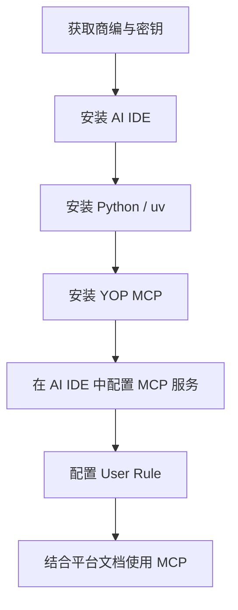

# YOP MCP 开发者快速入门指南

YOP MCP 是面向 AI IDE 的易宝开放平台知识工具，用于查询产品能力、接口说明并辅助生成对接代码。**本文仅说明 MCP 的安装与使用**；SDK 配置、回调解密、密钥与面客纪律等见 skill 内其他平台文档。

## 概览



## 准备工作

### 易宝入网

获取正式或沙箱商编与密钥，流程见 `接入准备/快速接入.md`、`接入准备/密钥管理/密钥介绍.md`。

### 安装 AI IDE

- **Cursor**: [https://www.cursor.com/cn](https://www.cursor.com/cn)
- **Trea**: [https://www.trae.com.cn](https://www.trae.com.cn/)
- **Cline**: [https://cline.bot/](https://cline.bot/)
- **RooCode**: [https://roocode.com](https://roocode.com/)

### 安装 Python 开发环境

#### Mac 系统

使用 Homebrew 安装：

```bash
# 安装 Homebrew
/bin/bash -c "$(curl -fsSL https://raw.githubusercontent.com/Homebrew/install/HEAD/install.sh)"

# 安装 uv
brew install uv
```

#### Win 系统

1. 安装 Python（推荐 3.12 及以上），安装时勾选「Add Python to PATH」。
2. 在 cmd 或 PowerShell 中执行 `pip install uv`（权限不足可加 `--user`）。
3. 执行 `uv --version` 验证安装。

如遇到网络问题，可配置国内 PyPI 镜像源。

### 安装 YOP MCP

后续有新版本发布需再次运行该命令：

```bash
uvx yop-mcp
```

### 配置 YOP MCP

在 AI IDE 中配置 mcp server：

```json
{
  "mcpServers": {
    "yop-mcp": {
      "command": "uvx",
      "args": [
        "yop-mcp"
      ]
    }
  }
}
```

### 配置 User Rule

在 AI IDE 中配置用户规则。以下规则**仅约束 MCP 使用方式**；对接纪律、SDK 写法、回调实现等以 skill 根目录 `SKILL.md` 及下表平台文档为准。

```
1. yop-mcp 工具使用规范
- 接口字段、产品说明以 MCP 工具返回为准；获取不到时反馈用户，由用户手工提供，禁止从不可靠渠道臆造
- MCP 返回数据中包含链接时，继续使用 yeepay_yop_link_detail 展开补充上下文
- 单次对话建议不超过 5 个接口；任务过大时拆分会话，并生成新会话初始提示词

2. 任务拆分规范
结合本地项目代码与平台文档，梳理对接计划与任务清单；每项至少包含：任务名称、详细描述、输入依赖、预期输出、成功标准、失败/超时处理。

3. 生成代码时须同时遵守
- skill 根目录 SKILL.md（面客流程、技术纪律、写代码路由）
- 开始对接/SDK使用说明.md（Java SDK 依赖、配置、YopClient 单例）
- 开始对接/沙箱环境联调测试.md（沙箱网关与测试身份；勿在文档或聊天中硬编码私钥）
- 平台规范/安全认证/结果通知(RSA).md 或 结果通知(SM2).md（回调解密，按密钥类型选读）
- 开始对接/Java-SDK报错说明.md（依赖冲突与排障）

4. 结果通知实现路径（择一，详见对应文档）
- Java SDK：YopCallbackEngine（RSA/SM2）或 DigitalEnvelopeUtils（仅 RSA）
- 网关方案：工具与支持/开发工具/结果通知工具.md
- 非 SDK：平台规范/安全认证/回调解密协议.md，可用 `scripts/rsa/decrypt_notify.py` 本地验证
```

## 使用 YOP MCP

### 基础用法

| 步骤 | MCP 能力 | 平台文档补充 |
|------|----------|--------------|
| 了解产品与接口 | 查询产品、接口列表与详情 | `接入准备/快速接入.md` |
| 引入 SDK 与配置 | 辅助生成配置骨架 | `开始对接/SDK使用说明.md`、`工具与支持/开发工具/平台SDK.md` |
| 单接口代码生成 | 按接口 doc 生成调用代码 | 字段以 MCP 返回 + 在线 doc_md 为准 |
| 结果通知 | 辅助生成接收端骨架 | `平台规范/安全认证/结果通知(RSA).md` / `结果通知(SM2).md` |
| 联调验证 | 校对参数与错误码 | `开始对接/沙箱环境联调测试.md`、`开始对接/平台错误码说明.md` |

### 高级用法

- **任务规划与执行**：由 AI 结合 MCP 实时知识与本地 `references/平台文档/` 拆解、落地对接任务。

### 最佳实践

1. 单次对话不超过 5 个接口；当前会话无法完成时及时拆分，并让 AI 生成新会话初始提示词。
2. AI 完成编码后，除单元测试外，可借助 yop-mcp 校对参数、错误码等信息。
3. AI 可能出错，必要时人工介入纠正思路与方向。

### 常见问题

1. **生成的代码与官网描述不一致**：检查 yop-mcp 配置，确保网络正常且工具已启用。
2. **如何判断 MCP 可用**：会话中出现 `Called yeepay_yop_api_detail`（或同类 MCP 调用）并成功返回，即视为工具可用。

## 相关文档索引

| 主题 | 文档 |
|------|------|
| 入网与密钥 | `接入准备/快速接入.md`、`接入准备/密钥管理/密钥介绍.md` |
| Java SDK | `开始对接/SDK使用说明.md` |
| 其他语言 SDK | `工具与支持/开发工具/平台SDK.md` |
| 沙箱联调 | `开始对接/沙箱环境联调测试.md` |
| 回调解密 | `平台规范/安全认证/结果通知(RSA).md`、`结果通知(SM2).md` |
| 回调网关 | `工具与支持/开发工具/结果通知工具.md` |
| SDK 排障 | `开始对接/Java-SDK报错说明.md` |
| Agent 纪律 | skill 根目录 `SKILL.md` |
