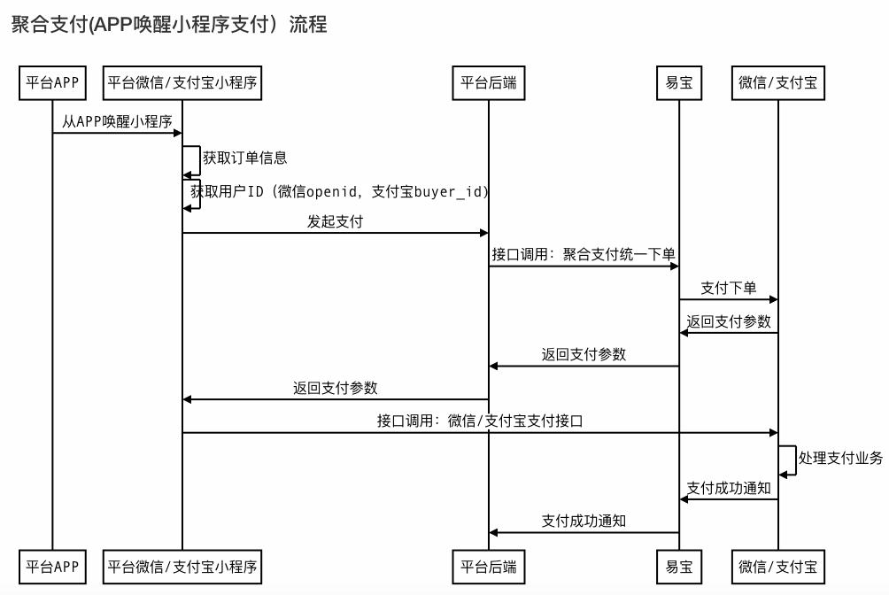
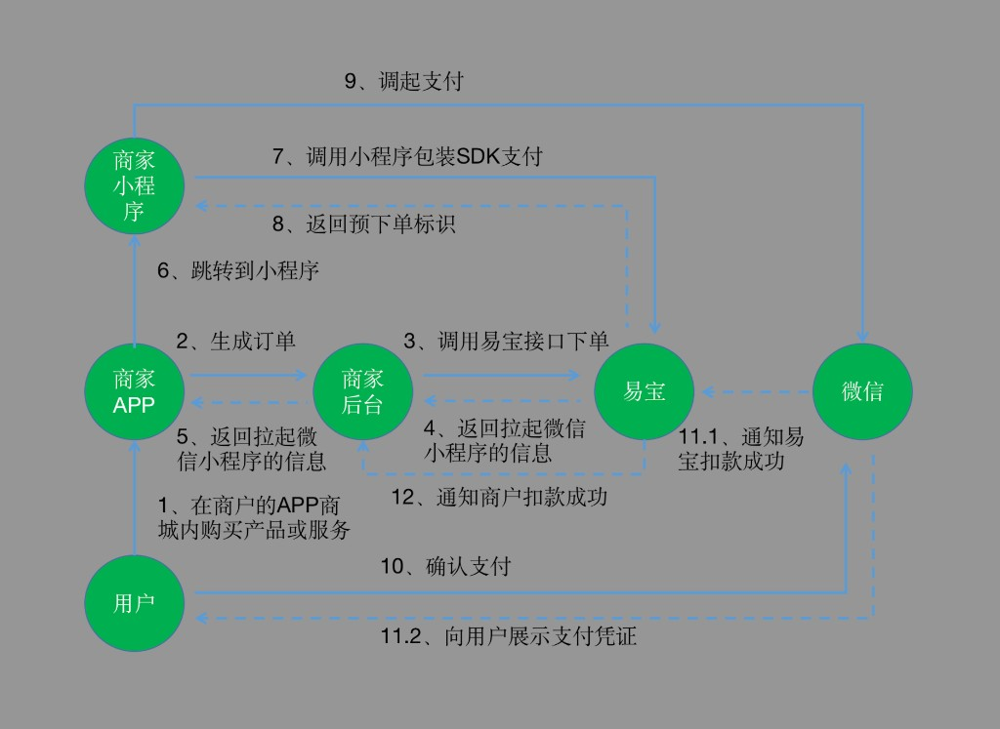

# 一、App跳商家微信小程序支付流程：

### 接口调用流程：



#### 接口调用流程（文字版，供 Skill 解析）

1. 用户在平台 APP 内发起支付，APP 拉起平台微信/支付宝小程序。
2. 小程序侧获取订单信息，并获取用户标识（微信 `openId` / 支付宝 `buyer_id`）。
3. 小程序将支付请求提交给平台后端。
4. 平台后端调用易宝“聚合支付统一下单”接口。
5. 易宝向微信/支付宝发起支付下单，并接收渠道返回的支付参数。
6. 易宝将支付参数返回平台后端，平台后端再返回给小程序。
7. 小程序调用微信/支付宝原生支付接口拉起收银台完成支付。
8. 微信/支付宝处理支付并向易宝发送支付成功通知。
9. 易宝向平台后端发送支付成功异步通知。

结果判定说明：前端支付完成展示不等于最终入账成功，最终状态以异步通知与订单查询结果为准。

### 对接步骤和示意图




#### 对接步骤说明（供 Skill 解析）

1. 用户在商户的 APP 商城内购买产品或服务。
2. 商家 APP 生成订单。
3. 商家后台调用易宝接口下单。
4. 易宝返回拉起微信小程序的信息给商家后台。
5. 商家后台将拉起微信小程序的信息返回给商家 APP。
6. 商家 APP 跳转到商家小程序。
7. 商家小程序调用小程序包装 SDK 支付。
8. 易宝返回预下单标识给商家小程序。
9. 商家小程序调起微信支付。
10. 用户在微信侧确认支付。
11.1 微信通知易宝扣款成功。  
11.2 微信向用户展示支付凭证。  
12. 易宝通知商户扣款成功。  

结果判定说明：以步骤 12 的异步通知和订单查询结果作为最终订单状态依据。

## 1、前置准备：

1）商家在微信开放平台上有账号而且有通过的APP移动应用；

2）在微信公众平台有账号而且有小程序，开发阶段可以使用体验版本，最终上线，小程序需上线审核通过在微信开放平台把对应的移动应用和小程序建立关联

3）完成APP拉起小程序功能配置

微信官方文档链接：++[https://developers.weixin.qq.com/doc/oplatform/MobileApp/LaunchingaMiniProgram/LaunchingaMiniProgram.html](https://developers.weixin.qq.com/doc/oplatform/Mobile_App/Launching_a_Mini_Program/Launching_a_Mini_Program.html)++

4）在商户小程序内引用易宝demo，拉起微信小程序的支付页面

易宝demo功能包括（对接步骤图中789在demo里，以下demo功能，若采用易宝demo则无需开发）

**易宝demo：**

下载地址：[`pay-applet.zip`](./attachments/pay-applet.zip)

5）通过授权获取用户 openId

A.小程序端调用 wx.login(Object object)接口获取登录凭证（code）

相关链接：

[https://developers.weixin.qq.com/miniprogram/dev/api/open-api/login/wx.login.html](https://developers.weixin.qq.com/miniprogram/dev/api/open-api/login/wx.login.html)

B.商户服务端使用第一步获取的 code 换取 openId，后台调用接口获取 openId

相关链接：

[https://developers.weixin.qq.com/miniprogram/dev/api-backend/open-api/login/auth.code2Session.html](https://developers.weixin.qq.com/miniprogram/dev/api-backend/open-api/login/auth.code2Session.html)

6）收款商户需完成微信侧报备，并进行实名认证；

## 2、appid配置流程

商户调用公众号配置接口绑定小程序appid

公众号配置接口：

API接口地址：/rest/v2.0/aggpay/wechat-config/add

按照接口传参数，绑定需跳转的小程序appid和APPsecret

原接口文档地址：

[https://open.yeepay.com/docs/apis/INDUSTRYSOLUTION/GENERAL/bzshsfk/juhezhifu/optionsrestv1.0aggpaytutelagepre-pay](https://open.yeepay.com/docs/apis/INDUSTRY_SOLUTION/GENERAL/bzshsfk/juhezhifu/options__rest__v1.0__aggpay__tutelage__pre-pay)

## 3、调用下单接口

商户服务端使用获取的 openId 和对应的小程序 appid 下单

商户服务端通过调用【聚合支付统一下单接口】下单获取 prePayTn 对象

其中接口参数中：

userId 为获取的 openId，payWay 为 MINIPROGRAM，channel 为 WECHAT

notifyUrl 为获取支付成功回调的地址

csUrl 为获取清算成功回调的地址

聚合支付下单接口：/rest/v1.0/aggpay/pre-pay

原接口文档地址：

[https://open.yeepay.com/docs/products/fwssfk/api/postrestv1.0aggpaypre-pay](https://open.yeepay.com/docs/products/fwssfk/api/post__rest__v1.0__aggpay__pre-pay)

**接口关键字段参数：**


|                      |           |          |                                                                                               |
| -------------------- | --------- | -------- | --------------------------------------------------------------------------------------------- |
| **字段参数**             | **参数名称**  | **是否必填** | **备注**                                                                                        |
| **payWay**           | **支付方式**  | 是        | 传：MINI_PROGRAM                                                                                |
| **parentMerchantNo** | 发起方商户编号   | 否        | 收款商户的父级商编                                                                                     |
| **channel**          | 渠道类型      | 是        | 传：WECHAT                                                                                      |
| **scene场景**         | **场景**    | 是        | 可选值：ONLINE/OFFLINE/BAOXIAN/GONGYI/DC_SEPARATION/DIGITAL/REGISTRATION/PRIVATE_EDUCATION/DIRECT |
| **appId**            | 小程序ID     | 是        | 传：跳转小程序的appid                                                                                 |
| **userId**           | 用户ID      | 是        | 传：通过code 获取的openId                                                                            |
| **userIp**           | 用户IP      | 是        | 用户真实IP地址                                                                                      |
| **merchantNo**       | 商户编号      | 是        | 收单主体商编                                                                                        |
| **orderId**          | 商户收款请求号   | 是        | 商户系统内部生成的订单号，需要保持在同一个商户下唯一                                                                    |
| **orderAmount**      | 订单金额      | 是        | 业务上是必须参数，单位： 元， 两位小数， 最低 0.01                                                                 |
| **goodsName**        | 商品名称      | 是        | 商品名称，简单描述订单信息或商品简介，用于展示在收银台页面或者支付明细中                                                          |
| **fundProcessType**  | 分账订单标记    | 否        | - 需要分账:DELAY_SETTLE - 不需要分账:REAL_TIME - 实时分账;需同时传入divideDetail:REAL_TIME_DIVIDE               |
| **expiredTime**      | 订单截止时间    | 否        | 订单截止时间string(date-time)(32)订单截止时间格式"yyyy-MM-dd HH:mm:ss"不传默认一天                             |
| **memo**             | 对账备注      | 否        | string(256)对账备注商户自定义参数，会展示在交易对账单中，支持85个字符（中文或者英文字母）                                        |
| **notifyUrl**        | 支付结果通知地址 | 否        | 接收支付结果的通知地址注：回调地址可正常接收通知                                                                    |
| **csUrl**            | 清算回调地址    |          | 清算成功服务器回调地址，不传则不通知。详见清算结果通知注：回调地址可正常接收通知                                                     |
| 其他字段                 |           |          | 其他字段非必填，按照商户需求传                                                                               |


**请求下单代码示例：**

```json
{
  "orderId": ["S202*****768540859"],
  "channel": ["WECHAT"],
  "payWay": ["MINI_PROGRAM"],
  "expiredTime": ["2026-04-21 20:02:43"],
  "scene": ["OFFLINE"],
  "userId": ["oelTq5yyy****Ld8w1eyyLyA"],
  "appId": ["wxca0f***987ff972"]
  "fundProcessType": ["REAL_TIME"],
  "orderAmount": ["19.9"],
  "csUrl": ["https://bac*****/yeePayCsNotify/YeePayWeChatApp/1/13796/S20260421195943768540859"],
  "userIp": ["118.73.7.182"],
  "notifyUrl": ["https://backend.******fy/yeePayWechatApp/1/13796/S20260421195943768540859"],
  "parentMerchantNo": ["100***1605"],
  "goodsName": ["0421WX【晨烨蜜源·手工蜜皂】"],
  "merchantNo": ["100****743"]
}
```

**拉起支付：**

- 小程序端发起支付

小程序端使用接口返回的 prePayTn 字段预支付标识发起支付

相关链接：

[https://pay.weixin.qq.com/wiki/doc/api/wxa/wxaapi.php?chapter=77&index=5](https://pay.weixin.qq.com/wiki/doc/api/wxa/wxa_api.php?chapter=7_7&index=5)

同步响应参数：

```json
{
  "code": "00000",
  "orderId": "S202*****768540859",
  "bankOrderId": "572****9260420",
  "prePayTn": "{\"appId\":\"wxca0f***987ff972\",\"timeStamp\":\"1776700800\",\"nonceStr\":\"6f69266888c749f692121fdfff11db17\",\"package\":\"prepay_id=wx2100000019***a772228656630001\",\"signType\":\"RSA\",\"paySign\":\"eXdvy0GlP3j94v6Vgq35oMdrpn3DkxK27Wcwk7xJnC1rvIGgPnyEPKOAjNs7aaK****QH7X1ds3fXpi2DuE40WtY7HRycDd6G9+e8y2Ep3hBAdon2yRpXov3Qm6B1lDdmYqdbh2jIp1xrHAy6KtcyTgLBVTa8jQpmw0GQIqfT63fgSSpb32O8aj1m3ZAbY1F9pJZUkIzGEfJgS0d0DkeNL71Hpmjm5tgywMWKzQMkaPKfQdHhl7Q2YGeA7WhJ31oiUurfAKrpZzBRGw96nUGrnsL1sSrRFxsRmJUIpcTyWH2blFj44QZKWCJZuyINMhnGwq6wW/dXHwZoKBug==\"}",
  "uniqueOrderNo": "301320****0000000135323281653",
  "message": "成功"
}
```

- 收到易宝返回的预下单标识，在小程序内拉起密码框
- 用户付款后微信向用户展示支付凭证，用户点击完成后，跳回小程序引导页，小程序向用户展示选择返回商家或留在微信，若用户选择返回商家，则跳转回APP。（微信侧限制必须用户点击按钮才能回到商户APP，无法实现自动跳转。商户可视业务需求自行开发此引导页，引导用户点击按钮返回APP。微信官方文档： ++[https://developers.weixin.qq.com/miniprogram/dev/framework/open-ability/launchApp.html](https://developers.weixin.qq.com/miniprogram/dev/framework/open-ability/launchApp.html)）++

【步骤4】：支付成功后，易宝异步通知商家支付成功信息。

# 二、App跳商户支付宝小程序支付流程：

## 1、前置准备：

原理：通过拉起支付宝 APP，然后跳转到对应支付宝小程序中，在小程序内处理业务逻辑下单，然后调用支付宝 js API 发起支付

1）客户有已上架的APP应用

2）客户有准备好用于跳转支付的支付宝小程序;

3）收款商户完成支付宝实名认证；

4）APP 端打开，第三方 APP 的方式打开如下 URL

alipays://platformapi/startapp?appId=app_id&page=page_path 

其中：

appid 为在支付宝侧申请的小程序 appid

pagepath 为跳转过去的小程序页面路径

5）获取用户支付宝的 userId

参考链接：

[https://opendocs.alipay.com/mini/introduce/authcode#%E7%AC%AC%E4%B8%80%E6%AD%A5%EF%BC%9A%E5%AE%A2%E6%88%B7%E7%AB%AF%E8%8E%B7%E5%8F%96%20authcode](https://opendocs.alipay.com/mini/introduce/authcode#%E7%AC%AC%E4%B8%80%E6%AD%A5%EF%BC%9A%E5%AE%A2%E6%88%B7%E7%AB%AF%E8%8E%B7%E5%8F%96%20authcode)

## 2、调用下单接口

商户服务端使用获取的 userId 和对应的小程序 appid 下单

商户服务端通过调用【聚合支付统一下单接口】下单获取 prePayTn 对象

其中接口参数中：

userId 为获取的 userId，payWay 为 MINIPROGRAM，channel 为 ALIPAY

notifyUrl 为获取支付成功回调的地址

csUrl 为获取清算成功回调的地址

聚合支付下单API接口：/rest/v1.0/aggpay/pre-pay

原接口文档地址：

[https://open.yeepay.com/docs/products/fwssfk/api/postrestv1.0aggpaypre-pay](https://open.yeepay.com/docs/products/fwssfk/api/post__rest__v1.0__aggpay__pre-pay)

**接口关键字段参数：**


|                      |           |          |                                                                                               |
| -------------------- | --------- | -------- | --------------------------------------------------------------------------------------------- |
| **字段参数**             | **参数名称**  | **是否必填** | **备注**                                                                                        |
| **payWay**           | **支付方式**  | 是        | 传：MINI_PROGRAM                                                                                |
| **parentMerchantNo** | 发起方商户编号   | 否        | 收款商户的父级商编                                                                                     |
| **channel**          | 渠道类型      | 是        | 传：ALIPAY                                                                                      |
| **scene场景**         | **场景**    | 是        | 可选值：ONLINE/OFFLINE/BAOXIAN/GONGYI/DC_SEPARATION/DIGITAL/REGISTRATION/PRIVATE_EDUCATION/DIRECT |
| **userId**           | 用户ID      | 是        | 传：获取的支付宝userId                                                                                |
| **userIp**           | 用户IP      | 是        | 用户真实IP地址                                                                                      |
| **merchantNo**       | 商户编号      | 是        | 收单主体商编                                                                                        |
| **orderId**          | 商户收款请求号   | 是        | 商户系统内部生成的订单号，需要保持在同一个商户下唯一                                                                    |
| **orderAmount**      | 订单金额      | 是        | 业务上是必须参数，单位： 元， 两位小数， 最低 0.01                                                                 |
| **goodsName**        | 商品名称      | 是        | 商品名称，简单描述订单信息或商品简介，用于展示在收银台页面或者支付明细中                                                          |
| **fundProcessType**  | 分账订单标记    | 否        | - 需要分账:DELAY_SETTLE - 不需要分账:REAL_TIME - 实时分账;需同时传入divideDetail:REAL_TIME_DIVIDE               |
| **expiredTime**      | 订单截止时间    | 否        | 订单截止时间string(date-time)(32)订单截止时间格式"yyyy-MM-dd HH:mm:ss"不传默认一天                             |
| **memo**             | 对账备注      | 否        | string(256)对账备注商户自定义参数，会展示在交易对账单中，支持85个字符（中文或者英文字母）                                         |
| **notifyUrl**        | 支付结果通知地址 | 否        | 接收支付结果的通知地址注：回调地址可正常接收通知                                                                     |
| **csUrl**            | 清算回调地址    |          | 清算成功服务器回调地址，不传则不通知。详见清算结果通知注：回调地址可正常接收通知                                                     |
| 其他字段                 |           |          | 其他字段非必填，按照商户需求传                                                                               |


**请求下单代码示例：**

```json
{
"orderId":["251124*****16932981554"],
"channel":["ALIPAY"],
"payWay":["MINI_PROGRAM"],
"userId": ["oelTq5yyy****Ld8w1eyyLyA"],
"locale":["zh_CN"],
"expiredTime":["2025-11-2419:19:51"],
"scene":["OFFLINE"],
"fundProcessType":["DELAY_SETTLE"],
"orderAmount":["0.2"],
"userIp":["10.0.49.136"],
"notifyUrl":["https://livepay-de******3702/19023**773"],
"parentMerchantNo":["100***505"],
"goodsName":["测试便宜的商品商品购买支付:0.20元"],
"ts":["1763982891875"]，
"merchantNo":["100***3702"]
}
```

**同步响应参数：**

```json
{
"miniProgramPath":"pages/fromAppPay/index"，
"code":"00000"，
"orderId":"25112419****6932981554"，
"appId":"202100****43335"，
"prePay Tn":"aLipays://pLatforma******s2FfromAppPay2Findex33Fstate3D5b8e5669-36cf-45c7-804f-27de662bfe03%26customerNo%3D10091053702%26orderAmount%3D0.2&thirdPartSchema=","unique0rderNo":"301320251124000000000673874613"，
  "message": "成功"
}
```

**拉起支付：**

使用 prePayTn 对象返回的参数唤起收银台支付

参考链接：

[https://opendocs.alipay.com/mini/introduce/pay#3.%E5%94%A4%E8%B5%B7%E6%94%B6%E9%93%B6%E5%8F%B0%E6%94%AF%E4%BB%98](https://opendocs.alipay.com/mini/introduce/pay#3.%E5%94%A4%E8%B5%B7%E6%94%B6%E9%93%B6%E5%8F%B0%E6%94%AF%E4%BB%98)

# 三、异步通知

下单时候传传了notifyUrl支付结果通知地址，支付完成后易宝会将通知参数推送给回调地址；

**异步通知参数通知示例：**

```json
{
    "sumDiscountPromotionAmount": "0",
    "orderId": "2046586302xxxx-10982-0-xt0001",
    "bankOrderId": "5752490844260421",
    "settleAmount": "1.00",
    "channel": "WECHAT",
    "yopMerchantNo": "100xxxx66",
    "payWay": "USER_SCAN",
    "uniqueOrderNo": "301320260421000000317386901672",
    "merchantName": "欣意无限",
    "orderAmount": "1.00",
    "payAmount": "1.00",
    "yopMerchantName": "郑州欣意无限信息技术有限公司",
    "realPayAmount": "1.00",
    "basicsProductFirst": "USER_SCAN",
    "tradeType": "REALTIME",
    "channelOrderId": "4500000128202604214762773531",
    "basicsProductThird": "OFFLINE",
    "paySuccessDate": "2026-04-21 21:46:31",
    "basicsProductSecond": "WECHAT",
    "outClearChannel": "UP",
    "payerInfo": "{\"appID\":\"wx8b836f558bec6fd4\",\"bankCardNo\":\"\",\"bankId\":\"CFT\",\"cardType\":\"DEBIT\",\"channelTrxId\":\"4500000128202604214762773531\",\"mobilePhoneNo\":\"\",\"userID\":\"oMDsp6EeeFVVd5fNKJeJIQUPwpss\",\"yeepayOpenID\":\"obwCas1vtv-czNuClYSLqegJ18Fw\"}",
    "appID": "wx8b836f558bec6fd4",
    "channelSettleAmount": "1.00",
    "parentMerchantNo": "100xxxx66",
    "channelTrxId": "4500000128202604214762773531",
    "businessType": "DIRECT_OPERATION",
    "merchantNo": "10088890966",
    "status": "SUCCESS",
    "channelMerchantInfo": "{\"channelMerchantNo\":\"560180424\"}"
}
```

# 四、订单查询

**API请求地址：**/rest/v1.0/trade/order/query

**必传参数：**

merchantNo= 收款商编

orderId = 交易下单传入的商户收款请求号(合单收款场景请传入子单的商户收款请求号)

**请求报文示例**

```json
{
  "orderId": ["KZBNAxxxxxxx0585216"],
  "parentMerchantNo": ["1009xxxx704"],
  "merchantNo": ["100xxxx2704"]
}
```

**返回报文示例**

```json
{
  "orderId": "KZBNAxxxxxxx0585216",
  "yopMerchantNo": "1009xxxxx37",
  "ypSettleAmount": 0,
  "fundProcessType": "REAL_TIME",
  "parentMerchantNo": "100xxxx2704",
  "status": "PROCESSING",
  "merchantNo": "100xxxx2704",
  "code": "OPR00000",
  "uniqueOrderNo": "301320260421000000222384439554",
  "orderAmount": 8.8,
  "yopMerchantName": "成都柏岁创新科技有限公司",
  "tradeType": "REALTIME",
  "bizSystemNo": "AGG_PAY",
  "message": "成功",
  "businessType": "DIRECT_OPERATION"
}
```