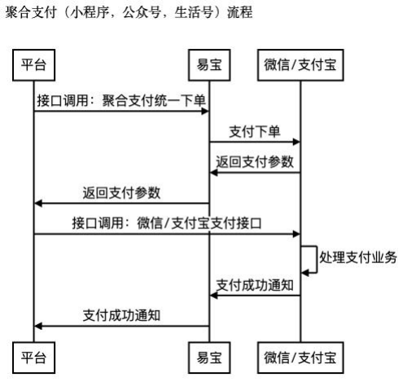

1. ### **交互流程**

#### 交互流程（文字版，供 Skill 解析）

1. 平台侧发起“聚合支付统一下单”接口调用。  
2. 易宝向微信/支付宝发起支付下单。  
3. 微信/支付宝返回支付参数给易宝。  
4. 易宝将支付参数返回平台。  
5. 平台调用微信/支付宝原生支付接口拉起支付。  
6. 微信/支付宝侧处理支付业务并完成用户支付。  
7. 微信/支付宝向易宝发送支付结果通知。  
8. 易宝向平台发送支付成功异步通知。  

结果判定说明：前端支付完成展示不等于最终入账成功，最终状态以异步通知与订单查询结果为准。

2. ### 订购产品

|             |                                   |
| ----------- | --------------------------------- |
| ##### 产品名称  | ##### 产品码                         |
| 公众号支付_微信_线上 | WECHAT_OFFIACCOUNT_WECHAT_ONLINE  |
| 公众号支付_微信_线下 | WECHAT_OFFIACCOUNT_WECHAT_OFFLINE |

1. ### 微信公众号appid和授权目录配置

调用 <https://open.yeepay.com/docs/products/fwssfk/api/post__rest__v2.0__aggpay__wechat-config__add> 接口，`appIdList` 字段中，`appId` 传商户收款公众号 appid，`appSecret` 传商户收款公众号的 `appSecret`，`appIdType` 传 `OFFICIAL_ACCOUNT` 枚举值。

tradeAuthDirList字段传商户支付拉起微信收银台页面域名；

配置接口调用成功后，可以调用 <https://open.yeepay.com/docs/products/fwssfk/api/get__rest__v2.0__aggpay__wechat-config__query> 查询接口进行结果查询。

1. ### **接口调用**
2. #### **获取用户小程序openid**

参考微信官方文档：[https://developers.weixin.qq.com/doc/service/guide/h5/](https://developers.weixin.qq.com/doc/service/guide/h5/)

1. #### **调用易宝下单接口**

调用易宝聚合支付统一下单接口：<https://open.yeepay.com/docs/products/fwssfk/api/options__rest__v1.0__aggpay__pre-pay>

- **payWay支付方式选择 WECHATOFFIACCOUNT**
- **channel渠道类型选择 WECHAT**
- **上述4.1步骤中获取到的用户openid传递到易宝聚合支付统一下单中的userId中**
- **scene根据订购的产品选择对应的枚举值，一般是OFFLINE**

|             |                                   |                |
| ----------- | --------------------------------- | -------------- |
| ##### 产品名称  | ##### 产品码                         | ##### scene枚举值 |
| 公众号支付_微信_线上 | WECHAT_OFFIACCOUNT_WECHAT_ONLINE  | ONLINE         |
| 公众号支付_微信_线下 | WECHAT_OFFIACCOUNT_WECHAT_OFFLINE | OFFLINE        |

其他接口参数：

notifyUrl 为获取支付成功回调的地址

csUrl 为获取清算成功回调的地址

1. #### **调用微信原生JSAPI支付方法**

使用调用易宝下单接口获取的“prePayTn”信息作为入参，调用微信原生 JSAPI 支付方法（参考：<https://pay.weixin.qq.com/doc/v2/merchant/4011935213>）拉起微信收银台完成支付。

1. #### **接收易宝支付结果通知**

支付成功后，易宝会下发异步通知到“聚合支付统一下单”接口指定的notifyUrl地址

1. #### 支付结果查询接口

可以通过查询 <https://open.yeepay.com/docs/products/fwssfk/api/get__rest__v1.0__trade__order__query> 接口主动或者补偿查询订单状态。