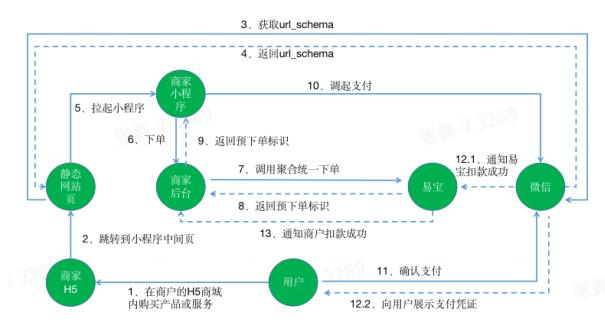

## 一、微信支付

### 交互流程



#### 交互流程（文字版，供 Skill 解析）

1. 用户在商家 H5 页面发起购买。  
2. 页面跳转到小程序中间页。  
3. 静态网页资源侧获取 `url_schema`。  
4. 将 `url_schema` 返回给 H5 页面。  
5. H5 页面拉起商家小程序。  
6. 商家小程序发起下单请求到商家后台。  
7. 商家后台调用易宝聚合统一下单接口。  
8. 易宝返回预下单标识给商家后台。  
9. 商家后台将预下单标识返回给商家小程序。  
10. 商家小程序调起微信支付。  
11. 用户在微信侧确认支付。  
12.1 微信向易宝通知本次交易支付成功。  
12.2 微信向用户展示支付凭证。  
13. 易宝向商家后台发送扣款成功通知。  

结果判定说明：前端展示成功不等于最终入账成功，最终状态以异步通知和订单查询结果为准。

### 订购产品


|             |                             |
| ----------- | --------------------------- |
| ##### 产品名称  | ##### 产品码                   |
| 小程序支付_微信_线上 | MINI_PROGRAM_WECHAT_ONLINE  |
| 小程序支付_微信_线下 | MINI_PROGRAM_WECHAT_OFFLINE |


### 微信小程序appid配置

调用接口：<https://open.yeepay.com/docs/products/fwssfk/api/post__rest__v2.0__aggpay__wechat-config__add>，`appIdList` 字段中，`appId` 传商户收款小程序 appid，`appIdType` 传 `MINI_PROGRAM` 枚举值。

配置接口调用成功后，可以调用查询接口：<https://open.yeepay.com/docs/products/fwssfk/api/get__rest__v2.0__aggpay__wechat-config__query> 进行结果查询。

### 微信支付流程
#### 获取用户小程序 openid

1、小程序端调用 wx.login(Object object) [https://developers.weixin.qq.com/miniprogram/dev/api/open-api/login/wx.login.html](https://developers.weixin.qq.com/miniprogram/dev/api/open-api/login/wx.login.html) 获取登录凭证（code）

2、商户服务端使用第一步获取的 code 换取 openId，后台调用 <https://developers.weixin.qq.com/miniprogram/dev/server/API/user-login/> 获取用户 openId。

#### 调用易宝下单接口

调用易宝聚合支付统一下单接口：<https://open.yeepay.com/docs/products/fwssfk/api/options__rest__v1.0__aggpay__pre-pay>

- **payWay支付方式选择 MINIPROGRAM**
- **channel渠道类型选择 WECHAT**
- **上述4.1步骤中获取到的用户openid传递到易宝聚合支付统一下单中的userId中**
- **scene根据订购的产品选择对应的枚举值，一般是OFFLINE**


|             |                             |                |
| ----------- | --------------------------- | -------------- |
| ##### 产品名称  | ##### 产品码                   | ##### scene枚举值 |
| 小程序支付_微信_线上 | MINI_PROGRAM_WECHAT_ONLINE  | ONLINE         |
| 小程序支付_微信_线下 | MINI_PROGRAM_WECHAT_OFFLINE | OFFLINE        |


其他接口参数：

notifyUrl 为获取支付成功回调的地址

csUrl 为获取清算成功回调的地址

#### 调用微信原生小程序支付方法

使用调用易宝下单接口响应返回的“prePayTn”信息作为入参，调用微信原生小程序支付方法（参考：<https://pay.weixin.qq.com/doc/v2/merchant/4011939566>）拉起微信收银台完成支付。

#### 接收易宝支付结果通知

支付成功后，易宝会下发异步通知到“聚合支付统一下单”接口指定的notifyUrl地址

#### 支付结果查询接口

可以通过查询接口：<https://open.yeepay.com/docs/products/fwssfk/api/get__rest__v1.0__trade__order__query> 主动或者补偿查询订单状态。

## 二、支付宝支付

### 交互流程
### 订购产品


|             |                          |
| ----------- | ------------------------ |
| ##### 产品名称  | ##### 产品码                |
| 用户扫码_支付宝_线下 | USER_SCAN_ALIPAY_OFFLINE |


### 支付宝支付流程
#### 调用易宝下单接口

调用易宝聚合支付统一下单接口：<https://open.yeepay.com/docs/products/fwssfk/api/options__rest__v1.0__aggpay__pre-pay>

- **payWay支付方式选择 USERSCAN**
- **channel渠道类型选择 ALIPAY**
- **scene场景选择 OFFLINE**

其他接口参数：

notifyUrl 为获取支付成功回调的地址

csUrl 为获取清算成功回调的地址

#### 跳转至支付宝完成支付

使用调用易宝下单接口获取的“prePayTn”信息，prePayTn字段返回 URL 链接，在 H5 页面内重定向到该链接，拉起支付宝收银台完成支付

```JSON
window.location.href='alipays://platformapi/startapp?saId=10000007&qrcode=https://qr.alipay.com/bax03999frlwiybdxmk20009' 
```

PS：上面的方式是不考虑支付宝未安装的情况。如果考虑支付宝未安装的情况，可直接重定向到 `payinfo` 中的链接，示例：`window.location.href='https://qr.alipay.com/bax02911brluc2xieoph6001'`

#### 接收易宝支付结果通知

支付成功后，易宝会下发异步通知到“聚合支付统一下单”接口指定的notifyUrl地址

#### 支付结果查询接口

可以通过查询接口：<https://open.yeepay.com/docs/products/fwssfk/api/get__rest__v1.0__trade__order__query> 主动或者补偿查询订单状态。