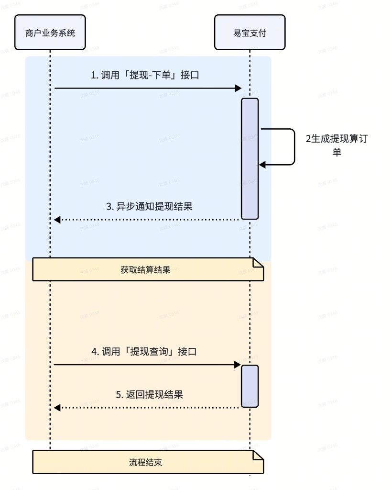

# **提现接入指引：**

  

  

1、商户业务系统请求【提现-下单】接口，商户申请提现；

接口地址：https://open.yeepay.com/docs/products/fwssfk/api/post\_\_rest\_\_v1.0\_\_account\_\_withdraw\_\_order

2、易宝测生产提现订单，异步通知商户提现结果（商户需要在调用【提现-下单】时传入结果通知地notifyUrl）;

3、商户也可主动调用【提现-查询】接口来获取提现结果。

接口地址：https://open.yeepay.com/docs/products/fwssfk/api/get\_\_rest\_\_v1.0\_\_account\_\_withdraw\_\_system\_\_query

# 【提现-下单】

接口地址：https://open.yeepay.com/docs/products/fwssfk/api/post\_\_rest\_\_v1.0\_\_account\_\_withdraw\_\_order

## 接口描述

提供商户将资金从易宝/银行清分合作银行账户提至商户关联的银行卡的能力。

## 使用说明

手续费收取方式：

1.  内扣：到账金额=提现金额-手续费，扣账金额=提现金额
2.  外扣：到账金额=提现金额，扣账金额=提现金额+手续费

1.  ## **请求字段校验逻辑：**
    

### 必填参数

<table><colgroup><col width="109"><col width="446"></colgroup><tbody><tr height="68"><td style="white-space-collapse: preserve; border-width: 0.5pt; border-color: rgb(222, 224, 227) rgb(232, 234, 236) rgb(232, 234, 236) rgb(222, 224, 227); font-size: 11pt; vertical-align: middle; word-break: break-word; overflow-wrap: break-word; background-color: rgb(255, 255, 255); color: rgba(0, 0, 0, 0.65);">requestNo</td><td data-sheet-value="[{&quot;type&quot;:&quot;text&quot;,&quot;text&quot;:&quot;商户请求号\n商户请求号\n由商户自定义生成&quot;},{&quot;type&quot;:&quot;text&quot;,&quot;style&quot;:{&quot;font&quot;:&quot;11pt/1.5 MonospacedNumber, LarkHackSafariFont, LarkEmojiFont, LarkChineseQuote, -apple-system, BlinkMacSystemFont, \&quot;Helvetica Neue\&quot;, Tahoma, \&quot;PingFang SC\&quot;, \&quot;Microsoft Yahei\&quot;, Arial, \&quot;Hiragino Sans GB\&quot;, sans-serif, \&quot;Apple Color Emoji\&quot;, \&quot;Segoe UI Emoji\&quot;, \&quot;Segoe UI Symbol\&quot;, \&quot;Noto Color Emoji\&quot;&quot;,&quot;foreColor&quot;:&quot;rgb(97, 175, 254)&quot;},&quot;text&quot;:&quot;示例值：WITHDRAW20200327103027&quot;}]" style="white-space-collapse: preserve; border-width: 0.5pt; border-color: rgb(222, 224, 227) rgb(232, 234, 236) rgb(232, 234, 236) rgb(222, 224, 227); font-size: 11pt; vertical-align: middle; word-break: break-word; overflow-wrap: break-word; background-color: rgb(255, 255, 255); color: rgba(0, 0, 0, 0.65);">商户请求号 商户请求号 由商户自定义生成示例值：WITHDRAW20200327103027</td></tr><tr height="68"><td style="white-space-collapse: preserve; border-width: 0.5pt; border-color: rgb(222, 224, 227) rgb(232, 234, 236) rgb(232, 234, 236) rgb(222, 224, 227); font-size: 11pt; vertical-align: middle; word-break: break-word; overflow-wrap: break-word; background-color: rgb(255, 255, 255); color: rgba(0, 0, 0, 0.65);">merchantNo</td><td data-sheet-value="[{&quot;type&quot;:&quot;text&quot;,&quot;text&quot;:&quot;商户编号\n商户编号\n易宝支付分配的的商户唯一标识&quot;},{&quot;type&quot;:&quot;text&quot;,&quot;style&quot;:{&quot;font&quot;:&quot;11pt/1.5 MonospacedNumber, LarkHackSafariFont, LarkEmojiFont, LarkChineseQuote, -apple-system, BlinkMacSystemFont, \&quot;Helvetica Neue\&quot;, Tahoma, \&quot;PingFang SC\&quot;, \&quot;Microsoft Yahei\&quot;, Arial, \&quot;Hiragino Sans GB\&quot;, sans-serif, \&quot;Apple Color Emoji\&quot;, \&quot;Segoe UI Emoji\&quot;, \&quot;Segoe UI Symbol\&quot;, \&quot;Noto Color Emoji\&quot;&quot;,&quot;foreColor&quot;:&quot;rgb(97, 175, 254)&quot;},&quot;text&quot;:&quot;示例值：100400612345&quot;}]" style="white-space-collapse: preserve; border-width: 0.5pt; border-color: rgb(222, 224, 227) rgb(232, 234, 236) rgb(232, 234, 236) rgb(222, 224, 227); font-size: 11pt; vertical-align: middle; word-break: break-word; overflow-wrap: break-word; background-color: rgb(255, 255, 255); color: rgba(0, 0, 0, 0.65);">商户编号 商户编号 易宝支付分配的的商户唯一标识示例值：100400612345</td></tr><tr height="88"><td style="white-space-collapse: preserve; border-width: 0.5pt; border-color: rgb(222, 224, 227) rgb(232, 234, 236) rgb(232, 234, 236) rgb(222, 224, 227); font-size: 11pt; vertical-align: middle; word-break: break-word; overflow-wrap: break-word; background-color: rgb(255, 255, 255); color: rgba(0, 0, 0, 0.65);">receiveType</td><td style="white-space-collapse: preserve; border-width: 0.5pt; border-color: rgb(222, 224, 227) rgb(232, 234, 236) rgb(232, 234, 236) rgb(222, 224, 227); font-size: 11pt; vertical-align: middle; word-break: break-word; overflow-wrap: break-word; background-color: rgb(255, 255, 255); color: rgba(0, 0, 0, 0.65);">到账类型 其中, 手续费账户提现仅支持次日到账实时到账(REAL_TIME)、2小时到账(TWO_HOUR)、次日到账（无特殊情况资金于次日上午7点左右到提现银行账户中）(NEXT_DAY)</td></tr><tr height="28"><td style="white-space-collapse: preserve; border-width: 0.5pt; border-color: rgb(222, 224, 227) rgb(232, 234, 236) rgb(232, 234, 236) rgb(222, 224, 227); font-size: 11pt; vertical-align: middle; word-break: break-word; overflow-wrap: break-word; background-color: rgba(0, 0, 0, 0.02); color: rgba(0, 0, 0, 0.65);">orderAmount</td><td data-sheet-value="[{&quot;type&quot;:&quot;text&quot;,&quot;text&quot;:&quot;提现金额，单位：元（RMB）&quot;},{&quot;type&quot;:&quot;text&quot;,&quot;style&quot;:{&quot;font&quot;:&quot;11pt/1.5 MonospacedNumber, LarkHackSafariFont, LarkEmojiFont, LarkChineseQuote, -apple-system, BlinkMacSystemFont, \&quot;Helvetica Neue\&quot;, Tahoma, \&quot;PingFang SC\&quot;, \&quot;Microsoft Yahei\&quot;, Arial, \&quot;Hiragino Sans GB\&quot;, sans-serif, \&quot;Apple Color Emoji\&quot;, \&quot;Segoe UI Emoji\&quot;, \&quot;Segoe UI Symbol\&quot;, \&quot;Noto Color Emoji\&quot;&quot;,&quot;foreColor&quot;:&quot;rgb(97, 175, 254)&quot;},&quot;text&quot;:&quot;示例值：1&quot;}]" style="white-space-collapse: preserve; border-width: 0.5pt; border-color: rgb(222, 224, 227) rgb(232, 234, 236) rgb(232, 234, 236) rgb(222, 224, 227); font-size: 11pt; vertical-align: middle; word-break: break-word; overflow-wrap: break-word; background-color: rgba(0, 0, 0, 0.02); color: rgba(0, 0, 0, 0.65);">提现金额，单位：元（RMB）示例值：1</td></tr></tbody></table>

### 条件必填参数

<table><colgroup><col width="125"><col width="426"></colgroup><tbody><tr height="88"><td style="white-space-collapse: preserve; border-width: 0.5pt; border-color: rgb(222, 224, 227) rgb(232, 234, 236) rgb(232, 234, 236) rgb(222, 224, 227); font-size: 11pt; vertical-align: middle; word-break: break-word; overflow-wrap: break-word; background-color: rgb(255, 255, 255); color: rgba(0, 0, 0, 0.65);">bankCardId</td><td data-sheet-value="[{&quot;type&quot;:&quot;text&quot;,&quot;text&quot;:&quot;提现卡ID\n提现卡ID\n添加提现账户时易宝生成的提现卡ID，与提现卡卡号至少填写一个&quot;},{&quot;type&quot;:&quot;text&quot;,&quot;style&quot;:{&quot;font&quot;:&quot;11pt/1.5 MonospacedNumber, LarkHackSafariFont, LarkEmojiFont, LarkChineseQuote, -apple-system, BlinkMacSystemFont, \&quot;Helvetica Neue\&quot;, Tahoma, \&quot;PingFang SC\&quot;, \&quot;Microsoft Yahei\&quot;, Arial, \&quot;Hiragino Sans GB\&quot;, sans-serif, \&quot;Apple Color Emoji\&quot;, \&quot;Segoe UI Emoji\&quot;, \&quot;Segoe UI Symbol\&quot;, \&quot;Noto Color Emoji\&quot;&quot;,&quot;foreColor&quot;:&quot;rgb(97, 175, 254)&quot;},&quot;text&quot;:&quot;示例值：11103&quot;}]" style="white-space-collapse: preserve; border-width: 0.5pt; border-color: rgb(222, 224, 227) rgb(232, 234, 236) rgb(232, 234, 236) rgb(222, 224, 227); font-size: 11pt; vertical-align: middle; word-break: break-word; overflow-wrap: break-word; background-color: rgb(255, 255, 255); color: rgba(0, 0, 0, 0.65);">提现卡ID 提现卡ID 添加提现账户时易宝生成的提现卡ID，与提现卡卡号至少填写一个示例值：11103</td></tr><tr height="68"><td style="white-space-collapse: preserve; border-width: 0.5pt; border-color: rgb(222, 224, 227) rgb(232, 234, 236) rgb(232, 234, 236) rgb(222, 224, 227); font-size: 11pt; vertical-align: middle; word-break: break-word; overflow-wrap: break-word; background-color: rgb(255, 255, 255); color: rgba(0, 0, 0, 0.65);">bankAccountNo</td><td data-sheet-value="[{&quot;type&quot;:&quot;text&quot;,&quot;text&quot;:&quot;提现账号\n提现账号\n与提现卡ID至少填写一个&quot;},{&quot;type&quot;:&quot;text&quot;,&quot;style&quot;:{&quot;font&quot;:&quot;11pt/1.5 MonospacedNumber, LarkHackSafariFont, LarkEmojiFont, LarkChineseQuote, -apple-system, BlinkMacSystemFont, \&quot;Helvetica Neue\&quot;, Tahoma, \&quot;PingFang SC\&quot;, \&quot;Microsoft Yahei\&quot;, Arial, \&quot;Hiragino Sans GB\&quot;, sans-serif, \&quot;Apple Color Emoji\&quot;, \&quot;Segoe UI Emoji\&quot;, \&quot;Segoe UI Symbol\&quot;, \&quot;Noto Color Emoji\&quot;&quot;,&quot;foreColor&quot;:&quot;rgb(97, 175, 254)&quot;},&quot;text&quot;:&quot;示例值：6212260200019388841&quot;}]" style="white-space-collapse: preserve; border-width: 0.5pt; border-color: rgb(222, 224, 227) rgb(232, 234, 236) rgb(232, 234, 236) rgb(222, 224, 227); font-size: 11pt; vertical-align: middle; word-break: break-word; overflow-wrap: break-word; background-color: rgb(255, 255, 255); color: rgba(0, 0, 0, 0.65);">提现账号 提现账号 与提现卡ID至少填写一个示例值：6212260200019388841</td></tr></tbody></table>

提现卡ID和提现账号至少填写一个

### 非必填参数

<table><colgroup><col width="115"><col width="426"></colgroup><tbody><tr height="128"><td style="white-space-collapse: preserve; border-width: 0.5pt; border-color: rgb(222, 224, 227) rgb(232, 234, 236) rgb(232, 234, 236) rgb(222, 224, 227); font-size: 11pt; vertical-align: middle; word-break: break-word; overflow-wrap: break-word; background-color: rgb(255, 255, 255); color: rgba(0, 0, 0, 0.65);">parentMerchantNo</td><td data-sheet-value="[{&quot;type&quot;:&quot;text&quot;,&quot;text&quot;:&quot;业务发起方商编\n*标准商户收付款方案中此参数与商户编号一致；*平台商户收付款方案中此参数为平台商商户编号；*服务商解决方案中，①商户编号属于标准商户时，该参数为服务商商编 ②商户编号属于平台商时，此参数填写服务商商户编号 ③商户编号属于平台商入驻商户时，该参数填写平台商商编&quot;},{&quot;type&quot;:&quot;text&quot;,&quot;style&quot;:{&quot;font&quot;:&quot;11pt/1.5 MonospacedNumber, LarkHackSafariFont, LarkEmojiFont, LarkChineseQuote, -apple-system, BlinkMacSystemFont, \&quot;Helvetica Neue\&quot;, Tahoma, \&quot;PingFang SC\&quot;, \&quot;Microsoft Yahei\&quot;, Arial, \&quot;Hiragino Sans GB\&quot;, sans-serif, \&quot;Apple Color Emoji\&quot;, \&quot;Segoe UI Emoji\&quot;, \&quot;Segoe UI Symbol\&quot;, \&quot;Noto Color Emoji\&quot;&quot;,&quot;foreColor&quot;:&quot;rgb(97, 175, 254)&quot;},&quot;text&quot;:&quot;示例值：100400612345&quot;}]" style="white-space-collapse: preserve; border-width: 0.5pt; border-color: rgb(222, 224, 227) rgb(232, 234, 236) rgb(232, 234, 236) rgb(222, 224, 227); font-size: 11pt; vertical-align: middle; word-break: break-word; overflow-wrap: break-word; background-color: rgb(255, 255, 255); color: rgba(0, 0, 0, 0.65);">业务发起方商编 *标准商户收付款方案中此参数与商户编号一致；*平台商户收付款方案中此参数为平台商商户编号；*服务商解决方案中，①商户编号属于标准商户时，该参数为服务商商编 ②商户编号属于平台商时，此参数填写服务商商户编号 ③商户编号属于平台商入驻商户时，该参数填写平台商商编示例值：100400612345</td></tr><tr height="88"><td style="white-space-collapse: preserve; border-width: 0.5pt; border-color: rgb(222, 224, 227) rgb(232, 234, 236) rgb(232, 234, 236) rgb(222, 224, 227); font-size: 11pt; vertical-align: middle; word-break: break-word; overflow-wrap: break-word; background-color: rgb(255, 255, 255); color: rgba(0, 0, 0, 0.65);">cardSelectModel</td><td data-sheet-value="[{&quot;type&quot;:&quot;text&quot;,&quot;text&quot;:&quot;提现卡选择模式\n当withdrawModel为BANK_ACCOUNT_WITHDRAW时，不支持 系统路由默认：&quot;},{&quot;type&quot;:&quot;text&quot;,&quot;style&quot;:{&quot;font&quot;:&quot;italic 11pt/1.5 MonospacedNumber, LarkHackSafariFont, LarkEmojiFont, LarkChineseQuote, -apple-system, BlinkMacSystemFont, \&quot;Helvetica Neue\&quot;, Tahoma, \&quot;PingFang SC\&quot;, \&quot;Microsoft Yahei\&quot;, Arial, \&quot;Hiragino Sans GB\&quot;, sans-serif, \&quot;Apple Color Emoji\&quot;, \&quot;Segoe UI Emoji\&quot;, \&quot;Segoe UI Symbol\&quot;, \&quot;Noto Color Emoji\&quot;&quot;,&quot;foreColor&quot;:&quot;rgba(0, 0, 0, 0.65)&quot;},&quot;text&quot;:&quot;MANUAL&quot;},{&quot;type&quot;:&quot;text&quot;,&quot;text&quot;:&quot;手动指定(MANUAL)、系统路由(SYS_ROUTE)&quot;}]" style="white-space-collapse: preserve; border-width: 0.5pt; border-color: rgb(222, 224, 227) rgb(232, 234, 236) rgb(232, 234, 236) rgb(222, 224, 227); font-size: 11pt; vertical-align: middle; word-break: break-word; overflow-wrap: break-word; background-color: rgb(255, 255, 255); color: rgba(0, 0, 0, 0.65);">提现卡选择模式 当withdrawModel为BANK_ACCOUNT_WITHDRAW时，不支持 系统路由默认：MANUAL手动指定(MANUAL)、系统路由(SYS_ROUTE)</td></tr><tr height="68"><td style="white-space-collapse: preserve; border-width: 0.5pt; border-color: rgb(222, 224, 227) rgb(232, 234, 236) rgb(232, 234, 236) rgb(222, 224, 227); font-size: 11pt; vertical-align: middle; word-break: break-word; overflow-wrap: break-word; background-color: rgb(255, 255, 255); color: rgba(0, 0, 0, 0.65);">cardRouteModel</td><td data-sheet-value="[{&quot;type&quot;:&quot;text&quot;,&quot;text&quot;:&quot;提现卡路由模式\n当cardSelectModel 为&quot;},{&quot;type&quot;:&quot;text&quot;,&quot;style&quot;:{&quot;font&quot;:&quot;italic 11pt/1.5 MonospacedNumber, LarkHackSafariFont, LarkEmojiFont, LarkChineseQuote, -apple-system, BlinkMacSystemFont, \&quot;Helvetica Neue\&quot;, Tahoma, \&quot;PingFang SC\&quot;, \&quot;Microsoft Yahei\&quot;, Arial, \&quot;Hiragino Sans GB\&quot;, sans-serif, \&quot;Apple Color Emoji\&quot;, \&quot;Segoe UI Emoji\&quot;, \&quot;Segoe UI Symbol\&quot;, \&quot;Noto Color Emoji\&quot;&quot;,&quot;foreColor&quot;:&quot;rgba(0, 0, 0, 0.65)&quot;},&quot;text&quot;:&quot;SYS_ROUTE时，该&quot;},{&quot;type&quot;:&quot;text&quot;,&quot;style&quot;:{&quot;font&quot;:&quot;italic 11pt/1.5 MonospacedNumber, LarkHackSafariFont, LarkEmojiFont, LarkChineseQuote, -apple-system, BlinkMacSystemFont, \&quot;Helvetica Neue\&quot;, Tahoma, \&quot;PingFang SC\&quot;, \&quot;Microsoft Yahei\&quot;, Arial, \&quot;Hiragino Sans GB\&quot;, sans-serif, \&quot;Apple Color Emoji\&quot;, \&quot;Segoe UI Emoji\&quot;, \&quot;Segoe UI Symbol\&quot;, \&quot;Noto Color Emoji\&quot;&quot;,&quot;foreColor&quot;:&quot;rgba(0, 0, 0, 0.65)&quot;},&quot;text&quot;:&quot;字段&quot;},{&quot;type&quot;:&quot;text&quot;,&quot;style&quot;:{&quot;font&quot;:&quot;italic 11pt/1.5 MonospacedNumber, LarkHackSafariFont, LarkEmojiFont, LarkChineseQuote, -apple-system, BlinkMacSystemFont, \&quot;Helvetica Neue\&quot;, Tahoma, \&quot;PingFang SC\&quot;, \&quot;Microsoft Yahei\&quot;, Arial, \&quot;Hiragino Sans GB\&quot;, sans-serif, \&quot;Apple Color Emoji\&quot;, \&quot;Segoe UI Emoji\&quot;, \&quot;Segoe UI Symbol\&quot;, \&quot;Noto Color Emoji\&quot;&quot;,&quot;foreColor&quot;:&quot;rgba(0, 0, 0, 0.65)&quot;},&quot;text&quot;:&quot;生效，默认：NEWEST&quot;},{&quot;type&quot;:&quot;text&quot;,&quot;text&quot;:&quot;最新绑定卡(NEWEST)&quot;}]" style="white-space-collapse: preserve; border-width: 0.5pt; border-color: rgb(222, 224, 227) rgb(232, 234, 236) rgb(232, 234, 236) rgb(222, 224, 227); font-size: 11pt; vertical-align: middle; word-break: break-word; overflow-wrap: break-word; background-color: rgb(255, 255, 255); color: rgba(0, 0, 0, 0.65);">提现卡路由模式 当cardSelectModel 为SYS_ROUTE时，该字段生效，默认：NEWEST最新绑定卡(NEWEST)</td></tr><tr height="88"><td style="white-space-collapse: preserve; border-width: 0.5pt; border-color: rgb(222, 224, 227) rgb(232, 234, 236) rgb(232, 234, 236) rgb(222, 224, 227); font-size: 11pt; vertical-align: middle; word-break: break-word; overflow-wrap: break-word; background-color: rgb(255, 255, 255); color: rgba(0, 0, 0, 0.65);">notifyUrl</td><td data-sheet-value="[{&quot;type&quot;:&quot;text&quot;,&quot;text&quot;:&quot;回调通知地址\n商户通知地址,不传则不通知\n回调内容请参看：\n&quot;},{&quot;type&quot;:&quot;url&quot;,&quot;text&quot;:&quot;结果通知&quot;,&quot;link&quot;:&quot;https://open.yeepay.com/legacy/docs/products/fwssfk/apis/post__rest__v1.0__account__withdraw__order?hideHeader=true&amp;hideLeft=true&amp;_t=1776787379108#anchor7&quot;,&quot;style&quot;:{&quot;font&quot;:&quot;11pt/1.5 MonospacedNumber, LarkHackSafariFont, LarkEmojiFont, LarkChineseQuote, -apple-system, BlinkMacSystemFont, \&quot;Helvetica Neue\&quot;, Tahoma, \&quot;PingFang SC\&quot;, \&quot;Microsoft Yahei\&quot;, Arial, \&quot;Hiragino Sans GB\&quot;, sans-serif, \&quot;Apple Color Emoji\&quot;, \&quot;Segoe UI Emoji\&quot;, \&quot;Segoe UI Symbol\&quot;, \&quot;Noto Color Emoji\&quot;&quot;,&quot;foreColor&quot;:&quot;rgb(97, 175, 254)&quot;}},{&quot;type&quot;:&quot;text&quot;,&quot;style&quot;:{&quot;font&quot;:&quot;11pt/1.5 MonospacedNumber, LarkHackSafariFont, LarkEmojiFont, LarkChineseQuote, -apple-system, BlinkMacSystemFont, \&quot;Helvetica Neue\&quot;, Tahoma, \&quot;PingFang SC\&quot;, \&quot;Microsoft Yahei\&quot;, Arial, \&quot;Hiragino Sans GB\&quot;, sans-serif, \&quot;Apple Color Emoji\&quot;, \&quot;Segoe UI Emoji\&quot;, \&quot;Segoe UI Symbol\&quot;, \&quot;Noto Color Emoji\&quot;&quot;,&quot;foreColor&quot;:&quot;rgb(97, 175, 254)&quot;},&quot;text&quot;:&quot;示例值：&quot;},{&quot;type&quot;:&quot;url&quot;,&quot;text&quot;:&quot;www.baidu.com&quot;,&quot;link&quot;:&quot;http://www.baidu.com&quot;,&quot;style&quot;:{&quot;font&quot;:&quot;11pt/1.5 MonospacedNumber, LarkHackSafariFont, LarkEmojiFont, LarkChineseQuote, -apple-system, BlinkMacSystemFont, \&quot;Helvetica Neue\&quot;, Tahoma, \&quot;PingFang SC\&quot;, \&quot;Microsoft Yahei\&quot;, Arial, \&quot;Hiragino Sans GB\&quot;, sans-serif, \&quot;Apple Color Emoji\&quot;, \&quot;Segoe UI Emoji\&quot;, \&quot;Segoe UI Symbol\&quot;, \&quot;Noto Color Emoji\&quot;&quot;,&quot;foreColor&quot;:&quot;rgb(97, 175, 254)&quot;}},{&quot;type&quot;:&quot;url&quot;,&quot;text&quot;:&quot;查看详情&quot;,&quot;link&quot;:&quot;https://open.yeepay.com/legacy/docs/products/fwssfk/apis/post__rest__v1.0__account__withdraw__order?hideHeader=true&amp;hideLeft=true&amp;_t=1776787379108#anchor7&quot;,&quot;style&quot;:{&quot;font&quot;:&quot;11pt/1.5 MonospacedNumber, LarkHackSafariFont, LarkEmojiFont, LarkChineseQuote, -apple-system, BlinkMacSystemFont, \&quot;Helvetica Neue\&quot;, Tahoma, \&quot;PingFang SC\&quot;, \&quot;Microsoft Yahei\&quot;, Arial, \&quot;Hiragino Sans GB\&quot;, sans-serif, \&quot;Apple Color Emoji\&quot;, \&quot;Segoe UI Emoji\&quot;, \&quot;Segoe UI Symbol\&quot;, \&quot;Noto Color Emoji\&quot;&quot;,&quot;foreColor&quot;:&quot;rgb(17, 98, 230)&quot;}}]" style="white-space-collapse: preserve; border-width: 0.5pt; border-color: rgb(222, 224, 227) rgb(232, 234, 236) rgb(232, 234, 236) rgb(222, 224, 227); font-size: 11pt; vertical-align: middle; word-break: break-word; overflow-wrap: break-word; background-color: rgb(255, 255, 255); color: rgba(0, 0, 0, 0.65);">回调通知地址 商户通知地址,不传则不通知 回调内容请参看： <a href="https://open.yeepay.com/legacy/docs/products/fwssfk/apis/post__rest__v1.0__account__withdraw__order?hideHeader=true&amp;hideLeft=true&amp;_t=1776787379108#anchor7">结果通知</a>示例值：<a href="http://www.baidu.com">www.baidu.com</a><a href="https://open.yeepay.com/legacy/docs/products/fwssfk/apis/post__rest__v1.0__account__withdraw__order?hideHeader=true&amp;hideLeft=true&amp;_t=1776787379108#anchor7">查看详情</a></td></tr><tr height="88"><td style="white-space-collapse: preserve; border-width: 0.5pt; border-color: rgb(222, 224, 227) rgb(232, 234, 236) rgb(232, 234, 236) rgb(222, 224, 227); font-size: 11pt; vertical-align: middle; word-break: break-word; overflow-wrap: break-word; background-color: rgb(255, 255, 255); color: rgba(0, 0, 0, 0.65);">remark</td><td data-sheet-value="[{&quot;type&quot;:&quot;text&quot;,&quot;text&quot;:&quot;银行附言\n银行附言\n展示在收款银行系统中的附言，由数字、字母、汉字组成（最终附言内容以银行实际账单为准）。&quot;},{&quot;type&quot;:&quot;text&quot;,&quot;style&quot;:{&quot;font&quot;:&quot;11pt/1.5 MonospacedNumber, LarkHackSafariFont, LarkEmojiFont, LarkChineseQuote, -apple-system, BlinkMacSystemFont, \&quot;Helvetica Neue\&quot;, Tahoma, \&quot;PingFang SC\&quot;, \&quot;Microsoft Yahei\&quot;, Arial, \&quot;Hiragino Sans GB\&quot;, sans-serif, \&quot;Apple Color Emoji\&quot;, \&quot;Segoe UI Emoji\&quot;, \&quot;Segoe UI Symbol\&quot;, \&quot;Noto Color Emoji\&quot;&quot;,&quot;foreColor&quot;:&quot;rgb(97, 175, 254)&quot;},&quot;text&quot;:&quot;示例值：XXX平台提现&quot;}]" style="white-space-collapse: preserve; border-width: 0.5pt; border-color: rgb(222, 224, 227) rgb(232, 234, 236) rgb(232, 234, 236) rgb(222, 224, 227); font-size: 11pt; vertical-align: middle; word-break: break-word; overflow-wrap: break-word; background-color: rgb(255, 255, 255); color: rgba(0, 0, 0, 0.65);">银行附言 银行附言 展示在收款银行系统中的附言，由数字、字母、汉字组成（最终附言内容以银行实际账单为准）。示例值：XXX平台提现</td></tr><tr height="68"><td style="white-space-collapse: preserve; border-width: 0.5pt; border-color: rgb(222, 224, 227) rgb(232, 234, 236) rgb(232, 234, 236) rgb(222, 224, 227); font-size: 11pt; vertical-align: middle; word-break: break-word; overflow-wrap: break-word; background-color: rgb(255, 255, 255); color: rgba(0, 0, 0, 0.65);">terminalType</td><td data-sheet-value="[{&quot;type&quot;:&quot;text&quot;,&quot;text&quot;:&quot;终端类型电脑(PC)、手机(PHONE)、平板(PAD)、可穿戴设备(NFC)、数字电视(DTV)、条码支付受理终端(MPOS)、其他(OTHER)&quot;},{&quot;type&quot;:&quot;text&quot;,&quot;style&quot;:{&quot;font&quot;:&quot;11pt/1.5 MonospacedNumber, LarkHackSafariFont, LarkEmojiFont, LarkChineseQuote, -apple-system, BlinkMacSystemFont, \&quot;Helvetica Neue\&quot;, Tahoma, \&quot;PingFang SC\&quot;, \&quot;Microsoft Yahei\&quot;, Arial, \&quot;Hiragino Sans GB\&quot;, sans-serif, \&quot;Apple Color Emoji\&quot;, \&quot;Segoe UI Emoji\&quot;, \&quot;Segoe UI Symbol\&quot;, \&quot;Noto Color Emoji\&quot;&quot;,&quot;foreColor&quot;:&quot;rgb(97, 175, 254)&quot;},&quot;text&quot;:&quot;示例值：PC&quot;}]" style="white-space-collapse: preserve; border-width: 0.5pt; border-color: rgb(222, 224, 227) rgb(232, 234, 236) rgb(232, 234, 236) rgb(222, 224, 227); font-size: 11pt; vertical-align: middle; word-break: break-word; overflow-wrap: break-word; background-color: rgb(255, 255, 255); color: rgba(0, 0, 0, 0.65);">终端类型电脑(PC)、手机(PHONE)、平板(PAD)、可穿戴设备(NFC)、数字电视(DTV)、条码支付受理终端(MPOS)、其他(OTHER)示例值：PC</td></tr><tr height="68"><td style="white-space-collapse: preserve; border-width: 0.5pt; border-color: rgb(222, 224, 227) rgb(232, 234, 236) rgb(232, 234, 236) rgb(222, 224, 227); font-size: 11pt; vertical-align: middle; word-break: break-word; overflow-wrap: break-word; background-color: rgb(255, 255, 255); color: rgba(0, 0, 0, 0.65);">feeDeductType</td><td data-sheet-value="[{&quot;type&quot;:&quot;text&quot;,&quot;text&quot;:&quot;手续费收取方式\n提现模式为银行清分银行账户模式时，仅支持内扣外扣(OUTSIDE)、内扣(INSIDE)&quot;},{&quot;type&quot;:&quot;text&quot;,&quot;style&quot;:{&quot;font&quot;:&quot;11pt/1.5 MonospacedNumber, LarkHackSafariFont, LarkEmojiFont, LarkChineseQuote, -apple-system, BlinkMacSystemFont, \&quot;Helvetica Neue\&quot;, Tahoma, \&quot;PingFang SC\&quot;, \&quot;Microsoft Yahei\&quot;, Arial, \&quot;Hiragino Sans GB\&quot;, sans-serif, \&quot;Apple Color Emoji\&quot;, \&quot;Segoe UI Emoji\&quot;, \&quot;Segoe UI Symbol\&quot;, \&quot;Noto Color Emoji\&quot;&quot;,&quot;foreColor&quot;:&quot;rgb(97, 175, 254)&quot;},&quot;text&quot;:&quot;默认值：OUTSIDE&quot;}]" style="white-space-collapse: preserve; border-width: 0.5pt; border-color: rgb(222, 224, 227) rgb(232, 234, 236) rgb(232, 234, 236) rgb(222, 224, 227); font-size: 11pt; vertical-align: middle; word-break: break-word; overflow-wrap: break-word; background-color: rgb(255, 255, 255); color: rgba(0, 0, 0, 0.65);">手续费收取方式 提现模式为银行清分银行账户模式时，仅支持内扣外扣(OUTSIDE)、内扣(INSIDE)默认值：OUTSIDE</td></tr><tr height="148"><td style="white-space-collapse: preserve; border-width: 0.5pt; border-color: rgb(222, 224, 227) rgb(232, 234, 236) rgb(232, 234, 236) rgb(222, 224, 227); font-size: 11pt; vertical-align: middle; word-break: break-word; overflow-wrap: break-word; background-color: rgb(255, 255, 255); color: rgba(0, 0, 0, 0.65);">accountType</td><td style="white-space-collapse: preserve; border-width: 0.5pt; border-color: rgb(222, 224, 227) rgb(232, 234, 236) rgb(232, 234, 236) rgb(222, 224, 227); font-size: 11pt; vertical-align: middle; word-break: break-word; overflow-wrap: break-word; background-color: rgb(255, 255, 255); color: rgba(0, 0, 0, 0.65);">账户类型 提现模式为INNER_ACCOUNT_WITHDRAW不传默认FUND_ACCOUNT其余提现模式 必填资金账户(FUND_ACCOUNT)、营销账户(MARKET_ACCOUNT)、手续费账户(FEE_ACCOUNT)、苏宁银行清分账户(V_BANK_SN_CLEARING_ACCOUNT)、中信银行清分账户(V_BANK_ECITIC_CLEARING_ACCOUNT)</td></tr><tr height="48"><td style="white-space-collapse: preserve; border-width: 0.5pt; border-color: rgb(222, 224, 227) rgb(232, 234, 236) rgb(232, 234, 236) rgb(222, 224, 227); font-size: 11pt; vertical-align: middle; word-break: break-word; overflow-wrap: break-word; background-color: rgb(255, 255, 255); color: rgba(0, 0, 0, 0.65);">macAddress</td><td style="white-space-collapse: preserve; border-width: 0.5pt; border-color: rgb(222, 224, 227) rgb(232, 234, 236) rgb(232, 234, 236) rgb(222, 224, 227); font-size: 11pt; vertical-align: middle; word-break: break-word; overflow-wrap: break-word; background-color: rgb(255, 255, 255); color: rgba(0, 0, 0, 0.65);">设备mac地址 设备mac地址</td></tr><tr height="108"><td style="white-space-collapse: preserve; border-width: 0.5pt; border-color: rgb(222, 224, 227) rgb(232, 234, 236) rgb(232, 234, 236) rgb(222, 224, 227); font-size: 11pt; vertical-align: middle; word-break: break-word; overflow-wrap: break-word; background-color: rgb(255, 255, 255); color: rgba(0, 0, 0, 0.65);">withdrawModel</td><td data-sheet-value="[{&quot;type&quot;:&quot;text&quot;,&quot;text&quot;:&quot;提现模式\n默认为易宝内部账户模式易宝内部账户模式(INNER_ACCOUNT_WITHDRAW)、银行清分银行账户模式(BANK_ACCOUNT_WITHDRAW)&quot;},{&quot;type&quot;:&quot;text&quot;,&quot;style&quot;:{&quot;font&quot;:&quot;11pt/1.5 MonospacedNumber, LarkHackSafariFont, LarkEmojiFont, LarkChineseQuote, -apple-system, BlinkMacSystemFont, \&quot;Helvetica Neue\&quot;, Tahoma, \&quot;PingFang SC\&quot;, \&quot;Microsoft Yahei\&quot;, Arial, \&quot;Hiragino Sans GB\&quot;, sans-serif, \&quot;Apple Color Emoji\&quot;, \&quot;Segoe UI Emoji\&quot;, \&quot;Segoe UI Symbol\&quot;, \&quot;Noto Color Emoji\&quot;&quot;,&quot;foreColor&quot;:&quot;rgb(97, 175, 254)&quot;},&quot;text&quot;:&quot;示例值：INNER_ACCOUNT_WITHDRAW&quot;}]" style="white-space-collapse: preserve; border-width: 0.5pt; border-color: rgb(222, 224, 227) rgb(232, 234, 236) rgb(232, 234, 236) rgb(222, 224, 227); font-size: 11pt; vertical-align: middle; word-break: break-word; overflow-wrap: break-word; background-color: rgb(255, 255, 255); color: rgba(0, 0, 0, 0.65);">提现模式 默认为易宝内部账户模式易宝内部账户模式(INNER_ACCOUNT_WITHDRAW)、银行清分银行账户模式(BANK_ACCOUNT_WITHDRAW)示例值：INNER_ACCOUNT_WITHDRAW</td></tr><tr height="48"><td style="white-space-collapse: preserve; border-width: 0.5pt; border-color: rgb(222, 224, 227) rgb(232, 234, 236) rgb(232, 234, 236) rgb(222, 224, 227); font-size: 11pt; vertical-align: middle; word-break: break-word; overflow-wrap: break-word; background-color: rgb(255, 255, 255); color: rgba(0, 0, 0, 0.65);">debitBankAccountBookNo</td><td style="white-space-collapse: preserve; border-width: 0.5pt; border-color: rgb(222, 224, 227) rgb(232, 234, 236) rgb(232, 234, 236) rgb(222, 224, 227); font-size: 11pt; vertical-align: middle; word-break: break-word; overflow-wrap: break-word; background-color: rgb(255, 255, 255); color: rgba(0, 0, 0, 0.65);">扣款银行账户号 银行清分模式提现 必填，扣款银行账户号</td></tr><tr height="28"><td style="white-space-collapse: preserve; border-width: 0.5pt; border-color: rgb(222, 224, 227) rgb(232, 234, 236) rgb(232, 234, 236) rgb(222, 224, 227); font-size: 11pt; vertical-align: middle; word-break: break-word; overflow-wrap: break-word; background-color: rgba(0, 0, 0, 0.02); color: rgba(0, 0, 0, 0.65);">verifyType</td><td data-sheet-value="[{&quot;type&quot;:&quot;text&quot;,&quot;text&quot;:&quot;核验方式密码校验(PWD)&quot;},{&quot;type&quot;:&quot;text&quot;,&quot;style&quot;:{&quot;font&quot;:&quot;11pt/1.5 MonospacedNumber, LarkHackSafariFont, LarkEmojiFont, LarkChineseQuote, -apple-system, BlinkMacSystemFont, \&quot;Helvetica Neue\&quot;, Tahoma, \&quot;PingFang SC\&quot;, \&quot;Microsoft Yahei\&quot;, Arial, \&quot;Hiragino Sans GB\&quot;, sans-serif, \&quot;Apple Color Emoji\&quot;, \&quot;Segoe UI Emoji\&quot;, \&quot;Segoe UI Symbol\&quot;, \&quot;Noto Color Emoji\&quot;&quot;,&quot;foreColor&quot;:&quot;rgb(97, 175, 254)&quot;},&quot;text&quot;:&quot;示例值：PWD&quot;}]" style="white-space-collapse: preserve; border-width: 0.5pt; border-color: rgb(222, 224, 227) rgb(232, 234, 236) rgb(232, 234, 236) rgb(222, 224, 227); font-size: 11pt; vertical-align: middle; word-break: break-word; overflow-wrap: break-word; background-color: rgba(0, 0, 0, 0.02); color: rgba(0, 0, 0, 0.65);">核验方式密码校验(PWD)示例值：PWD</td></tr><tr height="66"><td style="white-space-collapse: preserve; border-width: 0.5pt; border-color: rgb(222, 224, 227) rgb(232, 234, 236) rgb(232, 234, 236) rgb(222, 224, 227); font-size: 11pt; font-weight: bold; vertical-align: middle; word-break: break-word; overflow-wrap: break-word; background-color: rgba(0, 0, 0, 0.02); color: rgba(0, 0, 0, 0.65);">verifyValue</td><td style="white-space-collapse: preserve; border-width: 0.5pt; border-color: rgb(222, 224, 227) rgb(232, 234, 236) rgb(232, 234, 236) rgb(222, 224, 227); font-size: 11pt; vertical-align: middle; word-break: break-word; overflow-wrap: break-word; background-color: rgba(0, 0, 0, 0.02); color: rgba(0, 0, 0, 0.65);">核验值 当核验方式为PWD时，该参数为密码密文，字段必填 当verifyType=PWD时, 请填写此参数</td></tr></tbody></table>

2.  ## 响应参数说明
    

<table><colgroup><col width="122"><col width="411"></colgroup><tbody><tr height="88"><td style="white-space-collapse: preserve; border-width: 0.5pt; border-color: rgb(222, 224, 227) rgb(232, 234, 236) rgb(232, 234, 236) rgb(222, 224, 227); font-size: 11pt; vertical-align: middle; word-break: break-word; overflow-wrap: break-word; background-color: rgb(255, 255, 255); color: rgba(0, 0, 0, 0.65);">returnCode</td><td data-sheet-value="[{&quot;type&quot;:&quot;text&quot;,&quot;text&quot;:&quot;返回码\n返回码\n该参数代表本次请求的处理结果，UA00000为请求成功 若请求失败参看对应错误码和错误信息&quot;},{&quot;type&quot;:&quot;text&quot;,&quot;style&quot;:{&quot;font&quot;:&quot;11pt/1.5 MonospacedNumber, LarkHackSafariFont, LarkEmojiFont, LarkChineseQuote, -apple-system, BlinkMacSystemFont, \&quot;Helvetica Neue\&quot;, Tahoma, \&quot;PingFang SC\&quot;, \&quot;Microsoft Yahei\&quot;, Arial, \&quot;Hiragino Sans GB\&quot;, sans-serif, \&quot;Apple Color Emoji\&quot;, \&quot;Segoe UI Emoji\&quot;, \&quot;Segoe UI Symbol\&quot;, \&quot;Noto Color Emoji\&quot;&quot;,&quot;foreColor&quot;:&quot;rgb(97, 175, 254)&quot;},&quot;text&quot;:&quot;示例值：UA00000&quot;}]" style="white-space-collapse: preserve; border-width: 0.5pt; border-color: rgb(222, 224, 227) rgb(232, 234, 236) rgb(232, 234, 236) rgb(222, 224, 227); font-size: 11pt; vertical-align: middle; word-break: break-word; overflow-wrap: break-word; background-color: rgb(255, 255, 255); color: rgba(0, 0, 0, 0.65);">返回码 返回码 该参数代表本次请求的处理结果，UA00000为请求成功 若请求失败参看对应错误码和错误信息示例值：UA00000</td></tr><tr height="48"><td style="white-space-collapse: preserve; border-width: 0.5pt; border-color: rgb(222, 224, 227) rgb(232, 234, 236) rgb(232, 234, 236) rgb(222, 224, 227); font-size: 11pt; vertical-align: middle; word-break: break-word; overflow-wrap: break-word; background-color: rgb(255, 255, 255); color: rgba(0, 0, 0, 0.65);">returnMsg</td><td style="white-space-collapse: preserve; border-width: 0.5pt; border-color: rgb(222, 224, 227) rgb(232, 234, 236) rgb(232, 234, 236) rgb(222, 224, 227); font-size: 11pt; vertical-align: middle; word-break: break-word; overflow-wrap: break-word; background-color: rgb(255, 255, 255); color: rgba(0, 0, 0, 0.65);">返回信息 返回信息</td></tr><tr height="108"><td style="white-space-collapse: preserve; border-width: 0.5pt; border-color: rgb(222, 224, 227) rgb(232, 234, 236) rgb(232, 234, 236) rgb(222, 224, 227); font-size: 11pt; vertical-align: middle; word-break: break-word; overflow-wrap: break-word; background-color: rgb(255, 255, 255); color: rgba(0, 0, 0, 0.65);">status</td><td style="white-space-collapse: preserve; border-width: 0.5pt; border-color: rgb(222, 224, 227) rgb(232, 234, 236) rgb(232, 234, 236) rgb(222, 224, 227); font-size: 11pt; vertical-align: middle; word-break: break-word; overflow-wrap: break-word; background-color: rgb(255, 255, 255); color: rgba(0, 0, 0, 0.65);">订单状态请求已接收（易宝正在处理中，收到最终结果前请勿重复下单）(REQUEST_RECEIVE)、请求已受理（易宝正在处理中，收到最终结果前请勿重复下单）(REQUEST_ACCEPT)、失败(FAIL)、（银行正在处理中，收到最终结果前请勿重复下单）(REMITING)</td></tr><tr height="68"><td style="white-space-collapse: preserve; border-width: 0.5pt; border-color: rgb(222, 224, 227) rgb(232, 234, 236) rgb(232, 234, 236) rgb(222, 224, 227); font-size: 11pt; vertical-align: middle; word-break: break-word; overflow-wrap: break-word; background-color: rgba(0, 0, 0, 0.02); color: rgba(0, 0, 0, 0.65);">orderNo</td><td style="white-space-collapse: preserve; border-width: 0.5pt; border-color: rgb(222, 224, 227) rgb(232, 234, 236) rgb(232, 234, 236) rgb(222, 224, 227); font-size: 11pt; vertical-align: middle; word-break: break-word; overflow-wrap: break-word; background-color: rgba(0, 0, 0, 0.02); color: rgba(0, 0, 0, 0.65);">易宝提现订单号 易宝提现订单号 易宝支付系统生成的提现订单号</td></tr></tbody></table>

-   错误码字段 returnCode 的值可能会增加，当遇到接口返回新的错误码时，请先通过查询接口查询订单的状态后再根据状态的操作指引进行下一步处理，切勿直接更换请求号进行重试，以免发生资金损失。
-   错误码描述字段 returnMsg 只供人工定位问题时做参考，系统实现时不要依赖这个字段来做自动化处理。

3.  ## 传参demo
    

public void withdrawOrderTest() throws YopClientException { WithdrawOrderRequest request = new WithdrawOrderRequest(); request.setParentMerchantNo("100400612345"); request.setRequestNo("WITHDRAW20200327103027"); request.setMerchantNo("100400612345"); request.setBankCardId("11103"); request.setBankAccountNo("6212260200019388841"); request.setReceiveType("REAL\_TIME"); request.setOrderAmount(new BigDecimal("0")); request.setNotifyUrl("https://www.example.com"); request.setRemark("XXX平台提现"); request.setTerminalType("PC"); request.setFeeDeductType("feeDeductType\_example"); request.setAccountType("accountType\_example"); request.setMacAddress("macAddress\_example"); request.setWithdrawModel("INNER\_ACCOUNT\_WITHDRAW"); request.setDebitBankAccountBookNo("debitBankAccountBookNo"); request.setVerifyType("PWD"); request.setVerifyValue("verifyValue\_example"); WithdrawOrderResponse response = api.withdrawOrder(request); _LOGGER_.info("result:{}", response.getResult()); // 示例：补充测试校验逻辑 }

2.  # 【提现-查询】
    

接口地址：https://open.yeepay.com/docs/products/fwssfk/api/get\_\_rest\_\_v1.0\_\_account\_\_withdraw\_\_system\_\_query

1.  ## **请求字段校验逻辑：**
    

### 必填参数

merchantNo：商户编号

### 条件必填参数

requestNo:商户请求号

orderNo:易宝提现订单号

商户请求号和易宝提现订单号不能同时为空!

2.  ## 响应参数说明
    

<table><colgroup><col width="127"><col width="400"></colgroup><tbody><tr height="84"><td style="white-space-collapse: preserve; border-width: 0.5pt; border-color: rgb(222, 224, 227) rgb(232, 234, 236) rgb(232, 234, 236) rgb(222, 224, 227); font-size: 10pt; vertical-align: middle; word-break: break-word; overflow-wrap: break-word; background-color: rgb(255, 255, 255);">returnCode</td><td style="white-space-collapse: preserve; border-width: 0.5pt; border-color: rgb(222, 224, 227) rgb(232, 234, 236) rgb(232, 234, 236) rgb(222, 224, 227); font-size: 10pt; vertical-align: middle; word-break: break-word; overflow-wrap: break-word; background-color: rgb(255, 255, 255);">返回码 返回码 该参数代表本次请求的处理结果，UA00000为请求成功 若请求失败参看对应错误码和错误信息</td></tr><tr height="46"><td style="white-space-collapse: preserve; border-width: 0.5pt; border-color: rgb(222, 224, 227) rgb(232, 234, 236) rgb(232, 234, 236) rgb(222, 224, 227); font-size: 10pt; vertical-align: middle; word-break: break-word; overflow-wrap: break-word; background-color: rgb(255, 255, 255);">returnMsg</td><td style="white-space-collapse: preserve; border-width: 0.5pt; border-color: rgb(222, 224, 227) rgb(232, 234, 236) rgb(232, 234, 236) rgb(222, 224, 227); font-size: 10pt; vertical-align: middle; word-break: break-word; overflow-wrap: break-word; background-color: rgb(255, 255, 255);">返回信息 返回信息</td></tr><tr height="46"><td style="white-space-collapse: preserve; border-width: 0.5pt; border-color: rgb(222, 224, 227) rgb(232, 234, 236) rgb(232, 234, 236) rgb(222, 224, 227); font-size: 10pt; vertical-align: middle; word-break: break-word; overflow-wrap: break-word; background-color: rgb(255, 255, 255);">requestNo</td><td style="white-space-collapse: preserve; border-width: 0.5pt; border-color: rgb(222, 224, 227) rgb(232, 234, 236) rgb(232, 234, 236) rgb(222, 224, 227); font-size: 10pt; vertical-align: middle; word-break: break-word; overflow-wrap: break-word; background-color: rgb(255, 255, 255);">商户请求号 商户请求号</td></tr><tr height="46"><td style="white-space-collapse: preserve; border-width: 0.5pt; border-color: rgb(222, 224, 227) rgb(232, 234, 236) rgb(232, 234, 236) rgb(222, 224, 227); font-size: 10pt; vertical-align: middle; word-break: break-word; overflow-wrap: break-word; background-color: rgb(255, 255, 255);">orderNo</td><td style="white-space-collapse: preserve; border-width: 0.5pt; border-color: rgb(222, 224, 227) rgb(232, 234, 236) rgb(232, 234, 236) rgb(222, 224, 227); font-size: 10pt; vertical-align: middle; word-break: break-word; overflow-wrap: break-word; background-color: rgb(255, 255, 255);">易宝提现订单号 易宝内部的唯一订单号</td></tr><tr height="46"><td style="white-space-collapse: preserve; border-width: 0.5pt; border-color: rgb(222, 224, 227) rgb(232, 234, 236) rgb(232, 234, 236) rgb(222, 224, 227); font-size: 10pt; vertical-align: middle; word-break: break-word; overflow-wrap: break-word; background-color: rgb(255, 255, 255);">merchantNo</td><td style="white-space-collapse: preserve; border-width: 0.5pt; border-color: rgb(222, 224, 227) rgb(232, 234, 236) rgb(232, 234, 236) rgb(222, 224, 227); font-size: 10pt; vertical-align: middle; word-break: break-word; overflow-wrap: break-word; background-color: rgb(255, 255, 255);">商户编号 商户编号</td></tr><tr height="46"><td style="white-space-collapse: preserve; border-width: 0.5pt; border-color: rgb(222, 224, 227) rgb(232, 234, 236) rgb(232, 234, 236) rgb(222, 224, 227); font-size: 10pt; vertical-align: middle; word-break: break-word; overflow-wrap: break-word; background-color: rgb(255, 255, 255);">orderAmount</td><td style="white-space-collapse: preserve; border-width: 0.5pt; border-color: rgb(222, 224, 227) rgb(232, 234, 236) rgb(232, 234, 236) rgb(222, 224, 227); font-size: 10pt; vertical-align: middle; word-break: break-word; overflow-wrap: break-word; background-color: rgb(255, 255, 255);">提现金额 提现金额</td></tr><tr height="46"><td style="white-space-collapse: preserve; border-width: 0.5pt; border-color: rgb(222, 224, 227) rgb(232, 234, 236) rgb(232, 234, 236) rgb(222, 224, 227); font-size: 10pt; vertical-align: middle; word-break: break-word; overflow-wrap: break-word; background-color: rgb(255, 255, 255);">receiveAmount</td><td style="white-space-collapse: preserve; border-width: 0.5pt; border-color: rgb(222, 224, 227) rgb(232, 234, 236) rgb(232, 234, 236) rgb(222, 224, 227); font-size: 10pt; vertical-align: middle; word-break: break-word; overflow-wrap: break-word; background-color: rgb(255, 255, 255);">到账金额 返回提现银行账户入账金额</td></tr><tr height="46"><td style="white-space-collapse: preserve; border-width: 0.5pt; border-color: rgb(222, 224, 227) rgb(232, 234, 236) rgb(232, 234, 236) rgb(222, 224, 227); font-size: 10pt; vertical-align: middle; word-break: break-word; overflow-wrap: break-word; background-color: rgb(255, 255, 255);">debitAmount</td><td style="white-space-collapse: preserve; border-width: 0.5pt; border-color: rgb(222, 224, 227) rgb(232, 234, 236) rgb(232, 234, 236) rgb(222, 224, 227); font-size: 10pt; vertical-align: middle; word-break: break-word; overflow-wrap: break-word; background-color: rgb(255, 255, 255);">扣账金额 返回易宝账户扣账金额（包含提现金额和手续费（若有））</td></tr><tr height="84"><td style="white-space-collapse: preserve; border-width: 0.5pt; border-color: rgb(222, 224, 227) rgb(232, 234, 236) rgb(232, 234, 236) rgb(222, 224, 227); font-size: 10pt; vertical-align: middle; word-break: break-word; overflow-wrap: break-word; background-color: rgb(255, 255, 255);">orderTime</td><td data-sheet-value="[{&quot;type&quot;:&quot;text&quot;,&quot;text&quot;:&quot;提现下单时间\n提现下单时间\n返回易宝接收提现请求后创建订单时间&quot;},{&quot;type&quot;:&quot;text&quot;,&quot;style&quot;:{&quot;font&quot;:&quot;10pt/1.5 MonospacedNumber, LarkHackSafariFont, LarkEmojiFont, LarkChineseQuote, -apple-system, BlinkMacSystemFont, \&quot;Helvetica Neue\&quot;, Tahoma, \&quot;PingFang SC\&quot;, \&quot;Microsoft Yahei\&quot;, Arial, \&quot;Hiragino Sans GB\&quot;, sans-serif, \&quot;Apple Color Emoji\&quot;, \&quot;Segoe UI Emoji\&quot;, \&quot;Segoe UI Symbol\&quot;, \&quot;Noto Color Emoji\&quot;&quot;,&quot;foreColor&quot;:&quot;rgb(97, 175, 254)&quot;},&quot;text&quot;:&quot;示例值：2020-06-01 01:00:00&quot;}]" style="white-space-collapse: preserve; border-width: 0.5pt; border-color: rgb(222, 224, 227) rgb(232, 234, 236) rgb(232, 234, 236) rgb(222, 224, 227); font-size: 10pt; vertical-align: middle; word-break: break-word; overflow-wrap: break-word; background-color: rgb(255, 255, 255);">提现下单时间 提现下单时间 返回易宝接收提现请求后创建订单时间示例值：2020-06-01 01:00:00</td></tr><tr height="84"><td style="white-space-collapse: preserve; border-width: 0.5pt; border-color: rgb(222, 224, 227) rgb(232, 234, 236) rgb(232, 234, 236) rgb(222, 224, 227); font-size: 10pt; vertical-align: middle; word-break: break-word; overflow-wrap: break-word; background-color: rgb(255, 255, 255);">finishTime</td><td data-sheet-value="[{&quot;type&quot;:&quot;text&quot;,&quot;text&quot;:&quot;提现完成时间\n提现完成时间\n返回提现订单有明确结果（如订单状态为SUCCESS/FAIL）时的时间&quot;},{&quot;type&quot;:&quot;text&quot;,&quot;style&quot;:{&quot;font&quot;:&quot;10pt/1.5 MonospacedNumber, LarkHackSafariFont, LarkEmojiFont, LarkChineseQuote, -apple-system, BlinkMacSystemFont, \&quot;Helvetica Neue\&quot;, Tahoma, \&quot;PingFang SC\&quot;, \&quot;Microsoft Yahei\&quot;, Arial, \&quot;Hiragino Sans GB\&quot;, sans-serif, \&quot;Apple Color Emoji\&quot;, \&quot;Segoe UI Emoji\&quot;, \&quot;Segoe UI Symbol\&quot;, \&quot;Noto Color Emoji\&quot;&quot;,&quot;foreColor&quot;:&quot;rgb(97, 175, 254)&quot;},&quot;text&quot;:&quot;示例值：2020-06-01 01:00:00&quot;}]" style="white-space-collapse: preserve; border-width: 0.5pt; border-color: rgb(222, 224, 227) rgb(232, 234, 236) rgb(232, 234, 236) rgb(222, 224, 227); font-size: 10pt; vertical-align: middle; word-break: break-word; overflow-wrap: break-word; background-color: rgb(255, 255, 255);">提现完成时间 提现完成时间 返回提现订单有明确结果（如订单状态为SUCCESS/FAIL）时的时间示例值：2020-06-01 01:00:00</td></tr><tr height="122"><td style="white-space-collapse: preserve; border-width: 0.5pt; border-color: rgb(222, 224, 227) rgb(232, 234, 236) rgb(232, 234, 236) rgb(222, 224, 227); font-size: 10pt; vertical-align: middle; word-break: break-word; overflow-wrap: break-word; background-color: rgb(255, 255, 255);">status</td><td style="white-space-collapse: preserve; border-width: 0.5pt; border-color: rgb(222, 224, 227) rgb(232, 234, 236) rgb(232, 234, 236) rgb(222, 224, 227); font-size: 10pt; vertical-align: middle; word-break: break-word; overflow-wrap: break-word; background-color: rgb(255, 255, 255);">提现订单状态请求已接收（易宝正在处理中，收到最终结果前请勿重复下单）(REQUEST_RECEIVE)、请求已受理（易宝正在处理中，收到最终结果前请勿重复下单）(REQUEST_ACCEPT)、已到账(SUCCESS)、失败（该笔订单付款失败,可重新发起付款）(FAIL)、银行处理中（银行正在处理中，收到最终结果前请勿重复下单）(REMITING)</td></tr><tr height="46"><td style="white-space-collapse: preserve; border-width: 0.5pt; border-color: rgb(222, 224, 227) rgb(232, 234, 236) rgb(232, 234, 236) rgb(222, 224, 227); font-size: 10pt; vertical-align: middle; word-break: break-word; overflow-wrap: break-word; background-color: rgb(255, 255, 255);">failReason</td><td data-sheet-value="[{&quot;type&quot;:&quot;text&quot;,&quot;text&quot;:&quot;失败原因\n失败原因当提现失败时，会返回失败原因&quot;},{&quot;type&quot;:&quot;text&quot;,&quot;style&quot;:{&quot;font&quot;:&quot;10pt/1.5 MonospacedNumber, LarkHackSafariFont, LarkEmojiFont, LarkChineseQuote, -apple-system, BlinkMacSystemFont, \&quot;Helvetica Neue\&quot;, Tahoma, \&quot;PingFang SC\&quot;, \&quot;Microsoft Yahei\&quot;, Arial, \&quot;Hiragino Sans GB\&quot;, sans-serif, \&quot;Apple Color Emoji\&quot;, \&quot;Segoe UI Emoji\&quot;, \&quot;Segoe UI Symbol\&quot;, \&quot;Noto Color Emoji\&quot;&quot;,&quot;foreColor&quot;:&quot;rgb(97, 175, 254)&quot;},&quot;text&quot;:&quot;示例值：银行账户冻结&quot;}]" style="white-space-collapse: preserve; border-width: 0.5pt; border-color: rgb(222, 224, 227) rgb(232, 234, 236) rgb(232, 234, 236) rgb(222, 224, 227); font-size: 10pt; vertical-align: middle; word-break: break-word; overflow-wrap: break-word; background-color: rgb(255, 255, 255);">失败原因 失败原因当提现失败时，会返回失败原因示例值：银行账户冻结</td></tr><tr height="65"><td style="white-space-collapse: preserve; border-width: 0.5pt; border-color: rgb(222, 224, 227) rgb(232, 234, 236) rgb(232, 234, 236) rgb(222, 224, 227); font-size: 10pt; vertical-align: middle; word-break: break-word; overflow-wrap: break-word; background-color: rgb(255, 255, 255);">feeUndertakerMerchantNo</td><td style="white-space-collapse: preserve; border-width: 0.5pt; border-color: rgb(222, 224, 227) rgb(232, 234, 236) rgb(232, 234, 236) rgb(222, 224, 227); font-size: 10pt; vertical-align: middle; word-break: break-word; overflow-wrap: break-word; background-color: rgb(255, 255, 255);">手续费承担方商编 手续费承担方商编 平台商承担时返回平台商商编商户承担时返回商户编号</td></tr><tr height="46"><td style="white-space-collapse: preserve; border-width: 0.5pt; border-color: rgb(222, 224, 227) rgb(232, 234, 236) rgb(232, 234, 236) rgb(222, 224, 227); font-size: 10pt; vertical-align: middle; word-break: break-word; overflow-wrap: break-word; background-color: rgb(255, 255, 255);">fee</td><td style="white-space-collapse: preserve; border-width: 0.5pt; border-color: rgb(222, 224, 227) rgb(232, 234, 236) rgb(232, 234, 236) rgb(222, 224, 227); font-size: 10pt; vertical-align: middle; word-break: break-word; overflow-wrap: break-word; background-color: rgb(255, 255, 255);">手续费 手续费</td></tr><tr height="65"><td style="white-space-collapse: preserve; border-width: 0.5pt; border-color: rgb(222, 224, 227) rgb(232, 234, 236) rgb(232, 234, 236) rgb(222, 224, 227); font-size: 10pt; vertical-align: middle; word-break: break-word; overflow-wrap: break-word; background-color: rgb(255, 255, 255);">receiveType</td><td style="white-space-collapse: preserve; border-width: 0.5pt; border-color: rgb(222, 224, 227) rgb(232, 234, 236) rgb(232, 234, 236) rgb(222, 224, 227); font-size: 10pt; vertical-align: middle; word-break: break-word; overflow-wrap: break-word; background-color: rgb(255, 255, 255);">到账类型实时(REAL_TIME)、2小时到账(TWO_HOUR)、次日到账（无特殊情况资金于次日上午7点左右到提现银行账户中）(NEXT_DAY)</td></tr><tr height="65"><td style="white-space-collapse: preserve; border-width: 0.5pt; border-color: rgb(222, 224, 227) rgb(232, 234, 236) rgb(232, 234, 236) rgb(222, 224, 227); font-size: 10pt; vertical-align: middle; word-break: break-word; overflow-wrap: break-word; background-color: rgb(255, 255, 255);">accountName</td><td data-sheet-value="[{&quot;type&quot;:&quot;text&quot;,&quot;text&quot;:&quot;开户名\n开户名\n返回商户的提现账户-开户名称&quot;},{&quot;type&quot;:&quot;text&quot;,&quot;style&quot;:{&quot;font&quot;:&quot;10pt/1.5 MonospacedNumber, LarkHackSafariFont, LarkEmojiFont, LarkChineseQuote, -apple-system, BlinkMacSystemFont, \&quot;Helvetica Neue\&quot;, Tahoma, \&quot;PingFang SC\&quot;, \&quot;Microsoft Yahei\&quot;, Arial, \&quot;Hiragino Sans GB\&quot;, sans-serif, \&quot;Apple Color Emoji\&quot;, \&quot;Segoe UI Emoji\&quot;, \&quot;Segoe UI Symbol\&quot;, \&quot;Noto Color Emoji\&quot;&quot;,&quot;foreColor&quot;:&quot;rgb(97, 175, 254)&quot;},&quot;text&quot;:&quot;示例值：易宝支付有限公司&quot;}]" style="white-space-collapse: preserve; border-width: 0.5pt; border-color: rgb(222, 224, 227) rgb(232, 234, 236) rgb(232, 234, 236) rgb(222, 224, 227); font-size: 10pt; vertical-align: middle; word-break: break-word; overflow-wrap: break-word; background-color: rgb(255, 255, 255);">开户名 开户名 返回商户的提现账户-开户名称示例值：易宝支付有限公司</td></tr><tr height="65"><td style="white-space-collapse: preserve; border-width: 0.5pt; border-color: rgb(222, 224, 227) rgb(232, 234, 236) rgb(232, 234, 236) rgb(222, 224, 227); font-size: 10pt; vertical-align: middle; word-break: break-word; overflow-wrap: break-word; background-color: rgb(255, 255, 255);">accountNo</td><td data-sheet-value="[{&quot;type&quot;:&quot;text&quot;,&quot;text&quot;:&quot;银行账号\n银行账号\n返回商户的提现账户-银行账号&quot;},{&quot;type&quot;:&quot;text&quot;,&quot;style&quot;:{&quot;font&quot;:&quot;10pt/1.5 MonospacedNumber, LarkHackSafariFont, LarkEmojiFont, LarkChineseQuote, -apple-system, BlinkMacSystemFont, \&quot;Helvetica Neue\&quot;, Tahoma, \&quot;PingFang SC\&quot;, \&quot;Microsoft Yahei\&quot;, Arial, \&quot;Hiragino Sans GB\&quot;, sans-serif, \&quot;Apple Color Emoji\&quot;, \&quot;Segoe UI Emoji\&quot;, \&quot;Segoe UI Symbol\&quot;, \&quot;Noto Color Emoji\&quot;&quot;,&quot;foreColor&quot;:&quot;rgb(97, 175, 254)&quot;},&quot;text&quot;:&quot;示例值：6222020403021234567&quot;}]" style="white-space-collapse: preserve; border-width: 0.5pt; border-color: rgb(222, 224, 227) rgb(232, 234, 236) rgb(232, 234, 236) rgb(222, 224, 227); font-size: 10pt; vertical-align: middle; word-break: break-word; overflow-wrap: break-word; background-color: rgb(255, 255, 255);">银行账号 银行账号 返回商户的提现账户-银行账号示例值：6222020403021234567</td></tr><tr height="65"><td style="white-space-collapse: preserve; border-width: 0.5pt; border-color: rgb(222, 224, 227) rgb(232, 234, 236) rgb(232, 234, 236) rgb(222, 224, 227); font-size: 10pt; vertical-align: middle; word-break: break-word; overflow-wrap: break-word; background-color: rgb(255, 255, 255);">bankName</td><td data-sheet-value="[{&quot;type&quot;:&quot;text&quot;,&quot;text&quot;:&quot;开户行名称\n开户行名称\n返回商户的提现账户-开户行名称&quot;},{&quot;type&quot;:&quot;text&quot;,&quot;style&quot;:{&quot;font&quot;:&quot;10pt/1.5 MonospacedNumber, LarkHackSafariFont, LarkEmojiFont, LarkChineseQuote, -apple-system, BlinkMacSystemFont, \&quot;Helvetica Neue\&quot;, Tahoma, \&quot;PingFang SC\&quot;, \&quot;Microsoft Yahei\&quot;, Arial, \&quot;Hiragino Sans GB\&quot;, sans-serif, \&quot;Apple Color Emoji\&quot;, \&quot;Segoe UI Emoji\&quot;, \&quot;Segoe UI Symbol\&quot;, \&quot;Noto Color Emoji\&quot;&quot;,&quot;foreColor&quot;:&quot;rgb(97, 175, 254)&quot;},&quot;text&quot;:&quot;示例值：工商银行&quot;}]" style="white-space-collapse: preserve; border-width: 0.5pt; border-color: rgb(222, 224, 227) rgb(232, 234, 236) rgb(232, 234, 236) rgb(222, 224, 227); font-size: 10pt; vertical-align: middle; word-break: break-word; overflow-wrap: break-word; background-color: rgb(255, 255, 255);">开户行名称 开户行名称 返回商户的提现账户-开户行名称示例值：工商银行</td></tr><tr height="46"><td style="white-space-collapse: preserve; border-width: 0.5pt; border-color: rgb(222, 224, 227) rgb(232, 234, 236) rgb(232, 234, 236) rgb(222, 224, 227); font-size: 10pt; vertical-align: middle; word-break: break-word; overflow-wrap: break-word; background-color: rgb(255, 255, 255);">bankCode</td><td data-sheet-value="[{&quot;type&quot;:&quot;text&quot;,&quot;text&quot;:&quot;开户行编码\n提现卡对应的银行编码&quot;},{&quot;type&quot;:&quot;text&quot;,&quot;style&quot;:{&quot;font&quot;:&quot;10pt/1.5 MonospacedNumber, LarkHackSafariFont, LarkEmojiFont, LarkChineseQuote, -apple-system, BlinkMacSystemFont, \&quot;Helvetica Neue\&quot;, Tahoma, \&quot;PingFang SC\&quot;, \&quot;Microsoft Yahei\&quot;, Arial, \&quot;Hiragino Sans GB\&quot;, sans-serif, \&quot;Apple Color Emoji\&quot;, \&quot;Segoe UI Emoji\&quot;, \&quot;Segoe UI Symbol\&quot;, \&quot;Noto Color Emoji\&quot;&quot;,&quot;foreColor&quot;:&quot;rgb(97, 175, 254)&quot;},&quot;text&quot;:&quot;示例值：ICBC&quot;}]" style="white-space-collapse: preserve; border-width: 0.5pt; border-color: rgb(222, 224, 227) rgb(232, 234, 236) rgb(232, 234, 236) rgb(222, 224, 227); font-size: 10pt; vertical-align: middle; word-break: break-word; overflow-wrap: break-word; background-color: rgb(255, 255, 255);">开户行编码 提现卡对应的银行编码示例值：ICBC</td></tr><tr height="46"><td style="white-space-collapse: preserve; border-width: 0.5pt; border-color: rgb(222, 224, 227) rgb(232, 234, 236) rgb(232, 234, 236) rgb(222, 224, 227); font-size: 10pt; vertical-align: middle; word-break: break-word; overflow-wrap: break-word; background-color: rgb(255, 255, 255);">branchBankCode</td><td style="white-space-collapse: preserve; border-width: 0.5pt; border-color: rgb(222, 224, 227) rgb(232, 234, 236) rgb(232, 234, 236) rgb(222, 224, 227); font-size: 10pt; vertical-align: middle; word-break: break-word; overflow-wrap: break-word; background-color: rgb(255, 255, 255);">支行行号 支行行号, 提现卡对应的支行的联行号</td></tr><tr height="84"><td style="white-space-collapse: preserve; border-width: 0.5pt; border-color: rgb(222, 224, 227) rgb(232, 234, 236) rgb(232, 234, 236) rgb(222, 224, 227); font-size: 10pt; vertical-align: middle; word-break: break-word; overflow-wrap: break-word; background-color: rgb(255, 255, 255);">isReversed</td><td style="white-space-collapse: preserve; border-width: 0.5pt; border-color: rgb(222, 224, 227) rgb(232, 234, 236) rgb(232, 234, 236) rgb(222, 224, 227); font-size: 10pt; vertical-align: middle; word-break: break-word; overflow-wrap: break-word; background-color: rgb(255, 255, 255);">冲退标识 冲退标识 由于银行原因，会发生提现已到账后又通知冲退的情况（提现资金会原路退回到商户账户）</td></tr><tr height="65"><td style="white-space-collapse: preserve; border-width: 0.5pt; border-color: rgb(222, 224, 227) rgb(232, 234, 236) rgb(232, 234, 236) rgb(222, 224, 227); font-size: 10pt; vertical-align: middle; word-break: break-word; overflow-wrap: break-word; background-color: rgb(255, 255, 255);">reverseTime</td><td data-sheet-value="[{&quot;type&quot;:&quot;text&quot;,&quot;text&quot;:&quot;冲退时间\n冲退时间\n返回银行通知冲退时的时间&quot;},{&quot;type&quot;:&quot;text&quot;,&quot;style&quot;:{&quot;font&quot;:&quot;10pt/1.5 MonospacedNumber, LarkHackSafariFont, LarkEmojiFont, LarkChineseQuote, -apple-system, BlinkMacSystemFont, \&quot;Helvetica Neue\&quot;, Tahoma, \&quot;PingFang SC\&quot;, \&quot;Microsoft Yahei\&quot;, Arial, \&quot;Hiragino Sans GB\&quot;, sans-serif, \&quot;Apple Color Emoji\&quot;, \&quot;Segoe UI Emoji\&quot;, \&quot;Segoe UI Symbol\&quot;, \&quot;Noto Color Emoji\&quot;&quot;,&quot;foreColor&quot;:&quot;rgb(97, 175, 254)&quot;},&quot;text&quot;:&quot;示例值：2020-06-01 01:10:00&quot;}]" style="white-space-collapse: preserve; border-width: 0.5pt; border-color: rgb(222, 224, 227) rgb(232, 234, 236) rgb(232, 234, 236) rgb(222, 224, 227); font-size: 10pt; vertical-align: middle; word-break: break-word; overflow-wrap: break-word; background-color: rgb(255, 255, 255);">冲退时间 冲退时间 返回银行通知冲退时的时间示例值：2020-06-01 01:10:00</td></tr><tr height="46"><td style="white-space-collapse: preserve; border-width: 0.5pt; border-color: rgb(222, 224, 227) rgb(232, 234, 236) rgb(232, 234, 236) rgb(222, 224, 227); font-size: 10pt; vertical-align: middle; word-break: break-word; overflow-wrap: break-word; background-color: rgb(255, 255, 255);">remark</td><td style="white-space-collapse: preserve; border-width: 0.5pt; border-color: rgb(222, 224, 227) rgb(232, 234, 236) rgb(232, 234, 236) rgb(222, 224, 227); font-size: 10pt; vertical-align: middle; word-break: break-word; overflow-wrap: break-word; background-color: rgb(255, 255, 255);">备注 备注</td></tr><tr height="46"><td style="white-space-collapse: preserve; border-width: 0.5pt; border-color: rgb(222, 224, 227) rgb(232, 234, 236) rgb(232, 234, 236) rgb(222, 224, 227); font-size: 10pt; vertical-align: middle; word-break: break-word; overflow-wrap: break-word; background-color: rgb(255, 255, 255);">withdrawModel</td><td style="white-space-collapse: preserve; border-width: 0.5pt; border-color: rgb(222, 224, 227) rgb(232, 234, 236) rgb(232, 234, 236) rgb(222, 224, 227); font-size: 10pt; vertical-align: middle; word-break: break-word; overflow-wrap: break-word; background-color: rgb(255, 255, 255);">提现模式易宝内部账户模式(INNER_ACCOUNT_WITHDRAW)、银行清分银行账户模式(BANK_ACCOUNT_WITHDRAW)</td></tr><tr height="46"><td style="white-space-collapse: preserve; border-width: 0.5pt; border-color: rgb(222, 224, 227) rgb(232, 234, 236) rgb(232, 234, 236) rgb(222, 224, 227); font-size: 10pt; vertical-align: middle; word-break: break-word; overflow-wrap: break-word; background-color: rgb(255, 255, 255);">debitBankAccountBookNo</td><td style="white-space-collapse: preserve; border-width: 0.5pt; border-color: rgb(222, 224, 227) rgb(232, 234, 236) rgb(232, 234, 236) rgb(222, 224, 227); font-size: 10pt; vertical-align: middle; word-break: break-word; overflow-wrap: break-word; background-color: rgb(255, 255, 255);">扣款银行账户号 银行清分模式银行账户提现的 扣款银行账户号</td></tr><tr height="46"><td style="white-space-collapse: preserve; border-width: 0.5pt; border-color: rgb(222, 224, 227) rgb(232, 234, 236) rgb(232, 234, 236) rgb(222, 224, 227); font-size: 10pt; vertical-align: middle; word-break: break-word; overflow-wrap: break-word; background-color: rgb(255, 255, 255);">debitBankCode</td><td style="white-space-collapse: preserve; border-width: 0.5pt; border-color: rgb(222, 224, 227) rgb(232, 234, 236) rgb(232, 234, 236) rgb(222, 224, 227); font-size: 10pt; vertical-align: middle; word-break: break-word; overflow-wrap: break-word; background-color: rgb(255, 255, 255);">扣款银行编码 银行清分模式，扣款银行账户号的归属银行标识</td></tr><tr height="27"><td style="white-space-collapse: preserve; border-width: 0.5pt; border-color: rgb(222, 224, 227) rgb(232, 234, 236) rgb(232, 234, 236) rgb(222, 224, 227); font-size: 10pt; vertical-align: middle; word-break: break-word; overflow-wrap: break-word; background-color: rgb(255, 255, 255);">verifyType</td><td style="white-space-collapse: preserve; border-width: 0.5pt; border-color: rgb(222, 224, 227) rgb(232, 234, 236) rgb(232, 234, 236) rgb(222, 224, 227); font-size: 10pt; vertical-align: middle; word-break: break-word; overflow-wrap: break-word; background-color: rgb(255, 255, 255);">核验方式密码核验(PWD)</td></tr><tr height="27"><td style="white-space-collapse: preserve; border-width: 0.5pt; border-color: rgb(222, 224, 227) rgb(232, 234, 236) rgb(232, 234, 236) rgb(222, 224, 227); font-size: 10pt; vertical-align: middle; word-break: break-word; overflow-wrap: break-word; background-color: rgb(255, 255, 255);">cardSelectModel</td><td style="white-space-collapse: preserve; border-width: 0.5pt; border-color: rgb(222, 224, 227) rgb(232, 234, 236) rgb(232, 234, 236) rgb(222, 224, 227); font-size: 10pt; vertical-align: middle; word-break: break-word; overflow-wrap: break-word; background-color: rgb(255, 255, 255);">提现卡选择模式手动指定(MANUAL)、系统路由(SYS_ROUTE)</td></tr><tr height="27"><td style="white-space-collapse: preserve; border-width: 0.5pt; border-color: rgb(222, 224, 227) rgb(232, 234, 236) rgb(232, 234, 236) rgb(222, 224, 227); font-size: 10pt; vertical-align: middle; word-break: break-word; overflow-wrap: break-word; background-color: rgba(0, 0, 0, 0.02);">cardRouteModel</td><td style="white-space-collapse: preserve; border-width: 0.5pt; border-color: rgb(222, 224, 227) rgb(232, 234, 236) rgb(232, 234, 236) rgb(222, 224, 227); font-size: 10pt; vertical-align: middle; word-break: break-word; overflow-wrap: break-word; background-color: rgba(0, 0, 0, 0.02);">提现卡路由模式最新绑定卡(NEWEST)</td></tr></tbody></table>

3.  ## 传参demo
    

public void withdrawSystemQueryTest() throws YopClientException { WithdrawSystemQueryRequest request = new WithdrawSystemQueryRequest(); request.setMerchantNo("10091113328"); request.setRequestNo("20260422001"); request.setOrderNo("opr20260422001"); WithdrawSystemQueryResponse response = api.withdrawSystemQuery(request); _LOGGER_.info("result:{}", response.getResult()); // 示例：补充测试校验逻辑 }

3.  # 【提现卡-添加】
    

接口地址：

https://open.yeepay.com/docs/products/fwssfk/api/post\_\_rest\_\_v1.0\_\_account\_\_withdraw\_\_card\_\_bind

商户使用提现服务前，请先添加提现卡

添加卡类型说明：

-   商户类型若为企业，支持添加商户名下对公账户；
-   商户类型若为个体，支持添加商户名下对公账户或法人借记卡

1.  ## **请求字段校验逻辑：**
    

### 必填参数

<table><colgroup><col width="113"><col width="418"></colgroup><tbody><tr height="68"><td style="white-space-collapse: preserve; border-width: 0.5pt; border-color: rgb(222, 224, 227) rgb(232, 234, 236) rgb(232, 234, 236) rgb(222, 224, 227); font-size: 11pt; vertical-align: middle; word-break: break-word; overflow-wrap: break-word; background-color: rgb(255, 255, 255); color: rgba(0, 0, 0, 0.65);">merchantNo</td><td data-sheet-value="[{&quot;type&quot;:&quot;text&quot;,&quot;text&quot;:&quot;商户编号\n商户编号：\n易宝支付分配的的商户唯一标识&quot;},{&quot;type&quot;:&quot;text&quot;,&quot;style&quot;:{&quot;font&quot;:&quot;11pt/1.5 MonospacedNumber, LarkHackSafariFont, LarkEmojiFont, LarkChineseQuote, -apple-system, BlinkMacSystemFont, \&quot;Helvetica Neue\&quot;, Tahoma, \&quot;PingFang SC\&quot;, \&quot;Microsoft Yahei\&quot;, Arial, \&quot;Hiragino Sans GB\&quot;, sans-serif, \&quot;Apple Color Emoji\&quot;, \&quot;Segoe UI Emoji\&quot;, \&quot;Segoe UI Symbol\&quot;, \&quot;Noto Color Emoji\&quot;&quot;,&quot;foreColor&quot;:&quot;rgb(97, 175, 254)&quot;},&quot;text&quot;:&quot;示例值：100400612345&quot;}]" style="white-space-collapse: preserve; border-width: 0.5pt; border-color: rgb(222, 224, 227) rgb(232, 234, 236) rgb(232, 234, 236) rgb(222, 224, 227); font-size: 11pt; vertical-align: middle; word-break: break-word; overflow-wrap: break-word; background-color: rgb(255, 255, 255); color: rgba(0, 0, 0, 0.65);">商户编号 商户编号： 易宝支付分配的的商户唯一标识示例值：100400612345</td></tr><tr height="68"><td style="white-space-collapse: preserve; border-width: 0.5pt; border-color: rgb(222, 224, 227) rgb(232, 234, 236) rgb(232, 234, 236) rgb(222, 224, 227); font-size: 11pt; vertical-align: middle; word-break: break-word; overflow-wrap: break-word; background-color: rgb(255, 255, 255); color: rgba(0, 0, 0, 0.65);">bankCardType</td><td style="white-space-collapse: preserve; border-width: 0.5pt; border-color: rgb(222, 224, 227) rgb(232, 234, 236) rgb(232, 234, 236) rgb(222, 224, 227); font-size: 11pt; vertical-align: middle; word-break: break-word; overflow-wrap: break-word; background-color: rgb(255, 255, 255); color: rgba(0, 0, 0, 0.65);">银行卡类型借记卡(DEBIT_CARD)、对公账号(ENTERPRISE_ACCOUNT)、单位结算卡(UNIT_SETTLEMENT_CARD)</td></tr><tr height="68"><td style="white-space-collapse: preserve; border-width: 0.5pt; border-color: rgb(222, 224, 227) rgb(232, 234, 236) rgb(232, 234, 236) rgb(222, 224, 227); font-size: 11pt; vertical-align: middle; word-break: break-word; overflow-wrap: break-word; background-color: rgba(0, 0, 0, 0.02); color: rgba(0, 0, 0, 0.65);">accountNo</td><td style="white-space-collapse: preserve; border-width: 0.5pt; border-color: rgb(222, 224, 227) rgb(232, 234, 236) rgb(232, 234, 236) rgb(222, 224, 227); font-size: 11pt; vertical-align: middle; word-break: break-word; overflow-wrap: break-word; background-color: rgba(0, 0, 0, 0.02); color: rgba(0, 0, 0, 0.65);">银行账号 银行账号:为了保证出款成功，各农信社卡或账号16位以下的农业银行卡，建议或尽可能填写支行编码；</td></tr></tbody></table>

### 条件必填参数

<table><colgroup><col width="118"><col width="413"></colgroup><tbody><tr height="108"><td style="white-space-collapse: preserve; border-width: 0.5pt; border-color: rgb(222, 224, 227) rgb(232, 234, 236) rgb(232, 234, 236) rgb(222, 224, 227); font-size: 11pt; vertical-align: middle; word-break: break-word; overflow-wrap: break-word; background-color: rgb(255, 255, 255); color: rgba(0, 0, 0, 0.65);">bankCode</td><td data-sheet-value="[{&quot;type&quot;:&quot;text&quot;,&quot;text&quot;:&quot;开户行编码\n开户银行编码：详见&quot;},{&quot;type&quot;:&quot;url&quot;,&quot;text&quot;:&quot;《银行编码》&quot;,&quot;link&quot;:&quot;https://yeepay.feishu.cn/sheets/MmMfsrTbnhn744tjYdEcvoNmn83?sheet=Cn65To&quot;,&quot;style&quot;:{&quot;font&quot;:&quot;11pt/1.5 MonospacedNumber, LarkHackSafariFont, LarkEmojiFont, LarkChineseQuote, -apple-system, BlinkMacSystemFont, \&quot;Helvetica Neue\&quot;, Tahoma, \&quot;PingFang SC\&quot;, \&quot;Microsoft Yahei\&quot;, Arial, \&quot;Hiragino Sans GB\&quot;, sans-serif, \&quot;Apple Color Emoji\&quot;, \&quot;Segoe UI Emoji\&quot;, \&quot;Segoe UI Symbol\&quot;, \&quot;Noto Color Emoji\&quot;&quot;,&quot;foreColor&quot;:&quot;rgb(97, 175, 254)&quot;}},{&quot;type&quot;:&quot;text&quot;,&quot;style&quot;:{&quot;font&quot;:&quot;11pt/1.5 MonospacedNumber, LarkHackSafariFont, LarkEmojiFont, LarkChineseQuote, -apple-system, BlinkMacSystemFont, \&quot;Helvetica Neue\&quot;, Tahoma, \&quot;PingFang SC\&quot;, \&quot;Microsoft Yahei\&quot;, Arial, \&quot;Hiragino Sans GB\&quot;, sans-serif, \&quot;Apple Color Emoji\&quot;, \&quot;Segoe UI Emoji\&quot;, \&quot;Segoe UI Symbol\&quot;, \&quot;Noto Color Emoji\&quot;&quot;,&quot;foreColor&quot;:&quot;rgb(97, 175, 254)&quot;},&quot;text&quot;:&quot;示例值：总行编码示例值：当bankCardType为ENTERPRISE_ACCOUNT或时UNIT_SETTLEMENT_CARD时，开户行编码和支行编码不能同时为空； 示例值：ICBC&quot;}]" style="white-space-collapse: preserve; border-width: 0.5pt; border-color: rgb(222, 224, 227) rgb(232, 234, 236) rgb(232, 234, 236) rgb(222, 224, 227); font-size: 11pt; vertical-align: middle; word-break: break-word; overflow-wrap: break-word; background-color: rgb(255, 255, 255); color: rgba(0, 0, 0, 0.65);">开户行编码 开户银行编码：详见<a href="https://yeepay.feishu.cn/sheets/MmMfsrTbnhn744tjYdEcvoNmn83?sheet=Cn65To">《银行编码》</a>示例值：总行编码示例值：当bankCardType为ENTERPRISE_ACCOUNT或时UNIT_SETTLEMENT_CARD时，开户行编码和支行编码不能同时为空； 示例值：ICBC</td></tr><tr height="108"><td style="white-space-collapse: preserve; border-width: 0.5pt; border-color: rgb(222, 224, 227) rgb(232, 234, 236) rgb(232, 234, 236) rgb(222, 224, 227); font-size: 11pt; vertical-align: middle; word-break: break-word; overflow-wrap: break-word; background-color: rgba(0, 0, 0, 0.02); color: rgba(0, 0, 0, 0.65);">branchCode</td><td data-sheet-value="[{&quot;type&quot;:&quot;text&quot;,&quot;text&quot;:&quot;银行支行编码\n银行支行编码：详见&quot;},{&quot;type&quot;:&quot;url&quot;,&quot;text&quot;:&quot;《支行编码》&quot;,&quot;link&quot;:&quot;https://yeepay.feishu.cn/sheets/MmMfsrTbnhn744tjYdEcvoNmn83?sheet=Cn65To&quot;,&quot;style&quot;:{&quot;font&quot;:&quot;11pt/1.5 MonospacedNumber, LarkHackSafariFont, LarkEmojiFont, LarkChineseQuote, -apple-system, BlinkMacSystemFont, \&quot;Helvetica Neue\&quot;, Tahoma, \&quot;PingFang SC\&quot;, \&quot;Microsoft Yahei\&quot;, Arial, \&quot;Hiragino Sans GB\&quot;, sans-serif, \&quot;Apple Color Emoji\&quot;, \&quot;Segoe UI Emoji\&quot;, \&quot;Segoe UI Symbol\&quot;, \&quot;Noto Color Emoji\&quot;&quot;,&quot;foreColor&quot;:&quot;rgb(97, 175, 254)&quot;}},{&quot;type&quot;:&quot;text&quot;,&quot;style&quot;:{&quot;font&quot;:&quot;11pt/1.5 MonospacedNumber, LarkHackSafariFont, LarkEmojiFont, LarkChineseQuote, -apple-system, BlinkMacSystemFont, \&quot;Helvetica Neue\&quot;, Tahoma, \&quot;PingFang SC\&quot;, \&quot;Microsoft Yahei\&quot;, Arial, \&quot;Hiragino Sans GB\&quot;, sans-serif, \&quot;Apple Color Emoji\&quot;, \&quot;Segoe UI Emoji\&quot;, \&quot;Segoe UI Symbol\&quot;, \&quot;Noto Color Emoji\&quot;&quot;,&quot;foreColor&quot;:&quot;rgb(97, 175, 254)&quot;},&quot;text&quot;:&quot;示例值：支行编码示例值：当bankCardType为ENTERPRISE_ACCOUNT或时UNIT_SETTLEMENT_CARD时，开户行编码和支行编码不能同时为空； 示例值：102100000048&quot;}]" style="white-space-collapse: preserve; border-width: 0.5pt; border-color: rgb(222, 224, 227) rgb(232, 234, 236) rgb(232, 234, 236) rgb(222, 224, 227); font-size: 11pt; vertical-align: middle; word-break: break-word; overflow-wrap: break-word; background-color: rgba(0, 0, 0, 0.02); color: rgba(0, 0, 0, 0.65);">银行支行编码 银行支行编码：详见<a href="https://yeepay.feishu.cn/sheets/MmMfsrTbnhn744tjYdEcvoNmn83?sheet=Cn65To">《支行编码》</a>示例值：支行编码示例值：当bankCardType为ENTERPRISE_ACCOUNT或时UNIT_SETTLEMENT_CARD时，开户行编码和支行编码不能同时为空； 示例值：102100000048</td></tr></tbody></table>

当bankCardType为ENTERPRISE\_ACCOUNT或时UNIT\_SETTLEMENT\_CARD时，开户行编码和支行编码不能同时为空；

2.  ## 响应参数说明
    

<table><colgroup><col width="93"><col width="436"></colgroup><tbody><tr height="27"><td style="white-space-collapse: preserve; border-width: 0.5pt; border-color: rgb(222, 224, 227) rgb(232, 234, 236) rgb(232, 234, 236) rgb(222, 224, 227); font-size: 11pt; vertical-align: middle; word-break: break-word; overflow-wrap: break-word; background-color: rgb(255, 255, 255); color: rgba(0, 0, 0, 0.65);">returnCode</td><td data-sheet-value="[{&quot;type&quot;:&quot;text&quot;,&quot;text&quot;:&quot;返回码\n返回码该参数代表本次请求的处理结果，UA00000为请求成功 若请求失败参看对应错误码和错误信息&quot;},{&quot;type&quot;:&quot;text&quot;,&quot;style&quot;:{&quot;font&quot;:&quot;11pt/1.5 MonospacedNumber, LarkHackSafariFont, LarkEmojiFont, LarkChineseQuote, -apple-system, BlinkMacSystemFont, \&quot;Helvetica Neue\&quot;, Tahoma, \&quot;PingFang SC\&quot;, \&quot;Microsoft Yahei\&quot;, Arial, \&quot;Hiragino Sans GB\&quot;, sans-serif, \&quot;Apple Color Emoji\&quot;, \&quot;Segoe UI Emoji\&quot;, \&quot;Segoe UI Symbol\&quot;, \&quot;Noto Color Emoji\&quot;&quot;,&quot;foreColor&quot;:&quot;rgb(97, 175, 254)&quot;},&quot;text&quot;:&quot;示例值：UA00000&quot;}]" style="white-space-collapse: preserve; border-width: 0.5pt; border-color: rgb(222, 224, 227) rgb(232, 234, 236) rgb(232, 234, 236) rgb(222, 224, 227); font-size: 11pt; vertical-align: middle; word-break: break-word; overflow-wrap: break-word; background-color: rgb(255, 255, 255); color: rgba(0, 0, 0, 0.65);">返回码 返回码该参数代表本次请求的处理结果，UA00000为请求成功 若请求失败参看对应错误码和错误信息示例值：UA00000</td></tr><tr height="27"><td style="white-space-collapse: preserve; border-width: 0.5pt; border-color: rgb(222, 224, 227) rgb(232, 234, 236) rgb(232, 234, 236) rgb(222, 224, 227); font-size: 11pt; vertical-align: middle; word-break: break-word; overflow-wrap: break-word; background-color: rgb(255, 255, 255); color: rgba(0, 0, 0, 0.65);">returnMsg</td><td style="white-space-collapse: preserve; border-width: 0.5pt; border-color: rgb(222, 224, 227) rgb(232, 234, 236) rgb(232, 234, 236) rgb(222, 224, 227); font-size: 11pt; vertical-align: middle; word-break: break-word; overflow-wrap: break-word; background-color: rgb(255, 255, 255); color: rgba(0, 0, 0, 0.65);">返回信息 返回信息</td></tr><tr height="27"><td style="white-space-collapse: preserve; border-width: 0.5pt; border-color: rgb(222, 224, 227) rgb(232, 234, 236) rgb(232, 234, 236) rgb(222, 224, 227); font-size: 11pt; vertical-align: middle; word-break: break-word; overflow-wrap: break-word; background-color: rgba(0, 0, 0, 0.02); color: rgba(0, 0, 0, 0.65);">bindId</td><td data-sheet-value="[{&quot;type&quot;:&quot;text&quot;,&quot;text&quot;:&quot;绑卡id\n绑卡成功后生成的唯一的绑卡id&quot;},{&quot;type&quot;:&quot;text&quot;,&quot;style&quot;:{&quot;font&quot;:&quot;11pt/1.5 MonospacedNumber, LarkHackSafariFont, LarkEmojiFont, LarkChineseQuote, -apple-system, BlinkMacSystemFont, \&quot;Helvetica Neue\&quot;, Tahoma, \&quot;PingFang SC\&quot;, \&quot;Microsoft Yahei\&quot;, Arial, \&quot;Hiragino Sans GB\&quot;, sans-serif, \&quot;Apple Color Emoji\&quot;, \&quot;Segoe UI Emoji\&quot;, \&quot;Segoe UI Symbol\&quot;, \&quot;Noto Color Emoji\&quot;&quot;,&quot;foreColor&quot;:&quot;rgb(97, 175, 254)&quot;},&quot;text&quot;:&quot;示例值：123456789&quot;}]" style="white-space-collapse: preserve; border-width: 0.5pt; border-color: rgb(222, 224, 227) rgb(232, 234, 236) rgb(232, 234, 236) rgb(222, 224, 227); font-size: 11pt; vertical-align: middle; word-break: break-word; overflow-wrap: break-word; background-color: rgba(0, 0, 0, 0.02); color: rgba(0, 0, 0, 0.65);">绑卡id 绑卡成功后生成的唯一的绑卡id示例值：123456789</td></tr></tbody></table>

3.  ## 传参demo
    

public void withdrawCardBindTest() throws YopClientException { WithdrawCardBindRequest request = new WithdrawCardBindRequest(); request.setMerchantNo("100400612345"); request.setBankCardType("DEBIT\_CARD"); request.setAccountNo("621418000xxx1967518"); request.setBankCode("总行编码示例值：当bankCardType为ENTERPRISE\_ACCOUNT或时UNIT\_SETTLEMENT\_CARD时，开户行编码和支行编码不能同时为空； 示例值：ICBC"); request.setBranchCode("支行编码示例值：当bankCardType为ENTERPRISE\_ACCOUNT或时UNIT\_SETTLEMENT\_CARD时，开户行编码和支行编码不能同时为空； 示例值：102100000048"); WithdrawCardBindResponse response = api.withdrawCardBind(request); _LOGGER_.info("result:{}", response.getResult()); // 示例：补充测试校验逻辑 }

4.  # 【提现卡查询】
    

接口地址：

https://open.yeepay.com/docs/products/fwssfk/api/get\_\_rest\_\_v1.0\_\_account\_\_withdraw\_\_card\_\_query

1.  ## **请求字段校验逻辑：**
    

### 必填参数

merchantNo：商户编号

2.  ## 响应参数说明
    

<table><colgroup><col width="105"><col width="430"></colgroup><tbody><tr height="27"><td style="white-space-collapse: preserve; border-width: 0.5pt; border-color: rgb(222, 224, 227) rgb(232, 234, 236) rgb(232, 234, 236) rgb(222, 224, 227); font-size: 11pt; vertical-align: middle; word-break: break-word; overflow-wrap: break-word; background-color: rgb(255, 255, 255); color: rgba(0, 0, 0, 0.65);">returnCode</td><td data-sheet-value="[{&quot;type&quot;:&quot;text&quot;,&quot;text&quot;:&quot;返回码\n返回码该参数代表本次请求的处理结果，UA00000为请求成功 若请求失败参看对应错误码和错误信息&quot;},{&quot;type&quot;:&quot;text&quot;,&quot;style&quot;:{&quot;font&quot;:&quot;11pt/1.5 MonospacedNumber, LarkHackSafariFont, LarkEmojiFont, LarkChineseQuote, -apple-system, BlinkMacSystemFont, \&quot;Helvetica Neue\&quot;, Tahoma, \&quot;PingFang SC\&quot;, \&quot;Microsoft Yahei\&quot;, Arial, \&quot;Hiragino Sans GB\&quot;, sans-serif, \&quot;Apple Color Emoji\&quot;, \&quot;Segoe UI Emoji\&quot;, \&quot;Segoe UI Symbol\&quot;, \&quot;Noto Color Emoji\&quot;&quot;,&quot;foreColor&quot;:&quot;rgb(97, 175, 254)&quot;},&quot;text&quot;:&quot;示例值：UA00000&quot;}]" style="white-space-collapse: preserve; border-width: 0.5pt; border-color: rgb(222, 224, 227) rgb(232, 234, 236) rgb(232, 234, 236) rgb(222, 224, 227); font-size: 11pt; vertical-align: middle; word-break: break-word; overflow-wrap: break-word; background-color: rgb(255, 255, 255); color: rgba(0, 0, 0, 0.65);">返回码 返回码该参数代表本次请求的处理结果，UA00000为请求成功 若请求失败参看对应错误码和错误信息示例值：UA00000</td></tr><tr height="27"><td style="white-space-collapse: preserve; border-width: 0.5pt; border-color: rgb(222, 224, 227) rgb(232, 234, 236) rgb(232, 234, 236) rgb(222, 224, 227); font-size: 11pt; vertical-align: middle; word-break: break-word; overflow-wrap: break-word; background-color: rgb(255, 255, 255); color: rgba(0, 0, 0, 0.65);">returnMsg</td><td style="white-space-collapse: preserve; border-width: 0.5pt; border-color: rgb(222, 224, 227) rgb(232, 234, 236) rgb(232, 234, 236) rgb(222, 224, 227); font-size: 11pt; vertical-align: middle; word-break: break-word; overflow-wrap: break-word; background-color: rgb(255, 255, 255); color: rgba(0, 0, 0, 0.65);">返回信息 返回信息</td></tr><tr height="27"><td style="white-space-collapse: preserve; border-width: 0.5pt; border-color: rgb(222, 224, 227) rgb(232, 234, 236) rgb(232, 234, 236) rgb(222, 224, 227); font-size: 11pt; vertical-align: middle; word-break: break-word; overflow-wrap: break-word; background-color: rgb(255, 255, 255); color: rgba(0, 0, 0, 0.65);">merchantNo</td><td style="white-space-collapse: preserve; border-width: 0.5pt; border-color: rgb(222, 224, 227) rgb(232, 234, 236) rgb(232, 234, 236) rgb(222, 224, 227); font-size: 11pt; vertical-align: middle; word-break: break-word; overflow-wrap: break-word; background-color: rgb(255, 255, 255); color: rgba(0, 0, 0, 0.65);">商户编号 商户编号</td></tr><tr height="27"><td style="white-space-collapse: preserve; border-width: 0.5pt; border-color: rgb(222, 224, 227) rgb(232, 234, 236) rgb(232, 234, 236) rgb(222, 224, 227); font-size: 11pt; vertical-align: middle; word-break: break-word; overflow-wrap: break-word; background-color: rgb(255, 255, 255); color: rgba(0, 0, 0, 0.65);">bankCardAccountList</td><td style="white-space-collapse: preserve; border-width: 0.5pt; border-color: rgb(222, 224, 227) rgb(232, 234, 236) rgb(232, 234, 236) rgb(222, 224, 227); font-size: 11pt; vertical-align: middle; word-break: break-word; overflow-wrap: break-word; background-color: rgb(255, 255, 255); color: rgba(0, 0, 0, 0.65);">提现卡列表</td></tr><tr height="27"><td style="white-space-collapse: preserve; border-width: 0.5pt; border-color: rgb(222, 224, 227) rgb(232, 234, 236) rgb(232, 234, 236) rgb(222, 224, 227); font-size: 11pt; vertical-align: middle; word-break: break-word; overflow-wrap: break-word; background-color: rgb(255, 255, 255); color: rgba(0, 0, 0, 0.65);">bankCardType</td><td style="white-space-collapse: preserve; border-width: 0.5pt; border-color: rgb(222, 224, 227) rgb(232, 234, 236) rgb(232, 234, 236) rgb(222, 224, 227); font-size: 11pt; vertical-align: middle; word-break: break-word; overflow-wrap: break-word; background-color: rgb(255, 255, 255); color: rgba(0, 0, 0, 0.65);">银行卡类型借记卡(DEBIT_CARD)、对公账户(ENTERPRISE_ACCOUNT)</td></tr><tr height="27"><td style="white-space-collapse: preserve; border-width: 0.5pt; border-color: rgb(222, 224, 227) rgb(232, 234, 236) rgb(232, 234, 236) rgb(222, 224, 227); font-size: 11pt; vertical-align: middle; word-break: break-word; overflow-wrap: break-word; background-color: rgb(255, 255, 255); color: rgba(0, 0, 0, 0.65);">accountName</td><td data-sheet-value="[{&quot;type&quot;:&quot;text&quot;,&quot;text&quot;:&quot;开户名\n开户名:\n&quot;},{&quot;type&quot;:&quot;text&quot;,&quot;style&quot;:{&quot;font&quot;:&quot;11pt/1.5 MonospacedNumber, LarkHackSafariFont, LarkEmojiFont, LarkChineseQuote, -apple-system, BlinkMacSystemFont, \&quot;Helvetica Neue\&quot;, Tahoma, \&quot;PingFang SC\&quot;, \&quot;Microsoft Yahei\&quot;, Arial, \&quot;Hiragino Sans GB\&quot;, sans-serif, \&quot;Apple Color Emoji\&quot;, \&quot;Segoe UI Emoji\&quot;, \&quot;Segoe UI Symbol\&quot;, \&quot;Noto Color Emoji\&quot;&quot;,&quot;foreColor&quot;:&quot;rgb(102, 102, 102)&quot;},&quot;text&quot;:&quot;返回商户的提现卡-开户名称&quot;},{&quot;type&quot;:&quot;text&quot;,&quot;style&quot;:{&quot;font&quot;:&quot;11pt/1.5 MonospacedNumber, LarkHackSafariFont, LarkEmojiFont, LarkChineseQuote, -apple-system, BlinkMacSystemFont, \&quot;Helvetica Neue\&quot;, Tahoma, \&quot;PingFang SC\&quot;, \&quot;Microsoft Yahei\&quot;, Arial, \&quot;Hiragino Sans GB\&quot;, sans-serif, \&quot;Apple Color Emoji\&quot;, \&quot;Segoe UI Emoji\&quot;, \&quot;Segoe UI Symbol\&quot;, \&quot;Noto Color Emoji\&quot;&quot;,&quot;foreColor&quot;:&quot;rgb(97, 175, 254)&quot;},&quot;text&quot;:&quot;示例值：易宝支付有限公司&quot;}]" style="white-space-collapse: preserve; border-width: 0.5pt; border-color: rgb(222, 224, 227) rgb(232, 234, 236) rgb(232, 234, 236) rgb(222, 224, 227); font-size: 11pt; vertical-align: middle; word-break: break-word; overflow-wrap: break-word; background-color: rgb(255, 255, 255); color: rgba(0, 0, 0, 0.65);">开户名 开户名: 返回商户的提现卡-开户名称示例值：易宝支付有限公司</td></tr><tr height="27"><td style="white-space-collapse: preserve; border-width: 0.5pt; border-color: rgb(222, 224, 227) rgb(232, 234, 236) rgb(232, 234, 236) rgb(222, 224, 227); font-size: 11pt; vertical-align: middle; word-break: break-word; overflow-wrap: break-word; background-color: rgb(255, 255, 255); color: rgba(0, 0, 0, 0.65);">bankCode</td><td data-sheet-value="[{&quot;type&quot;:&quot;text&quot;,&quot;text&quot;:&quot;开户行编码\n开户行编码:\n返回商户的提现卡-开户银行编码&quot;},{&quot;type&quot;:&quot;text&quot;,&quot;style&quot;:{&quot;font&quot;:&quot;11pt/1.5 MonospacedNumber, LarkHackSafariFont, LarkEmojiFont, LarkChineseQuote, -apple-system, BlinkMacSystemFont, \&quot;Helvetica Neue\&quot;, Tahoma, \&quot;PingFang SC\&quot;, \&quot;Microsoft Yahei\&quot;, Arial, \&quot;Hiragino Sans GB\&quot;, sans-serif, \&quot;Apple Color Emoji\&quot;, \&quot;Segoe UI Emoji\&quot;, \&quot;Segoe UI Symbol\&quot;, \&quot;Noto Color Emoji\&quot;&quot;,&quot;foreColor&quot;:&quot;rgb(97, 175, 254)&quot;},&quot;text&quot;:&quot;示例值：ICBC&quot;}]" style="white-space-collapse: preserve; border-width: 0.5pt; border-color: rgb(222, 224, 227) rgb(232, 234, 236) rgb(232, 234, 236) rgb(222, 224, 227); font-size: 11pt; vertical-align: middle; word-break: break-word; overflow-wrap: break-word; background-color: rgb(255, 255, 255); color: rgba(0, 0, 0, 0.65);">开户行编码 开户行编码: 返回商户的提现卡-开户银行编码示例值：ICBC</td></tr><tr height="27"><td style="white-space-collapse: preserve; border-width: 0.5pt; border-color: rgb(222, 224, 227) rgb(232, 234, 236) rgb(232, 234, 236) rgb(222, 224, 227); font-size: 11pt; vertical-align: middle; word-break: break-word; overflow-wrap: break-word; background-color: rgb(255, 255, 255); color: rgba(0, 0, 0, 0.65);">accountNo</td><td data-sheet-value="[{&quot;type&quot;:&quot;text&quot;,&quot;text&quot;:&quot;银行账号\n银行账号:\n&quot;},{&quot;type&quot;:&quot;text&quot;,&quot;style&quot;:{&quot;font&quot;:&quot;11pt/1.5 MonospacedNumber, LarkHackSafariFont, LarkEmojiFont, LarkChineseQuote, -apple-system, BlinkMacSystemFont, \&quot;Helvetica Neue\&quot;, Tahoma, \&quot;PingFang SC\&quot;, \&quot;Microsoft Yahei\&quot;, Arial, \&quot;Hiragino Sans GB\&quot;, sans-serif, \&quot;Apple Color Emoji\&quot;, \&quot;Segoe UI Emoji\&quot;, \&quot;Segoe UI Symbol\&quot;, \&quot;Noto Color Emoji\&quot;&quot;,&quot;foreColor&quot;:&quot;rgb(102, 102, 102)&quot;},&quot;text&quot;:&quot;返回商户的提现卡-银行账号&quot;},{&quot;type&quot;:&quot;text&quot;,&quot;style&quot;:{&quot;font&quot;:&quot;11pt/1.5 MonospacedNumber, LarkHackSafariFont, LarkEmojiFont, LarkChineseQuote, -apple-system, BlinkMacSystemFont, \&quot;Helvetica Neue\&quot;, Tahoma, \&quot;PingFang SC\&quot;, \&quot;Microsoft Yahei\&quot;, Arial, \&quot;Hiragino Sans GB\&quot;, sans-serif, \&quot;Apple Color Emoji\&quot;, \&quot;Segoe UI Emoji\&quot;, \&quot;Segoe UI Symbol\&quot;, \&quot;Noto Color Emoji\&quot;&quot;,&quot;foreColor&quot;:&quot;rgb(97, 175, 254)&quot;},&quot;text&quot;:&quot;示例值：6222020403021234567&quot;}]" style="white-space-collapse: preserve; border-width: 0.5pt; border-color: rgb(222, 224, 227) rgb(232, 234, 236) rgb(232, 234, 236) rgb(222, 224, 227); font-size: 11pt; vertical-align: middle; word-break: break-word; overflow-wrap: break-word; background-color: rgb(255, 255, 255); color: rgba(0, 0, 0, 0.65);">银行账号 银行账号: 返回商户的提现卡-银行账号示例值：6222020403021234567</td></tr><tr height="27"><td style="white-space-collapse: preserve; border-width: 0.5pt; border-color: rgb(222, 224, 227) rgb(232, 234, 236) rgb(232, 234, 236) rgb(222, 224, 227); font-size: 11pt; vertical-align: middle; word-break: break-word; overflow-wrap: break-word; background-color: rgb(255, 255, 255); color: rgba(0, 0, 0, 0.65);">bindCardId</td><td data-sheet-value="[{&quot;type&quot;:&quot;text&quot;,&quot;text&quot;:&quot;银行卡标识\n银行卡标识:\n返回易宝生成的银行卡唯一标识&quot;},{&quot;type&quot;:&quot;text&quot;,&quot;style&quot;:{&quot;font&quot;:&quot;11pt/1.5 MonospacedNumber, LarkHackSafariFont, LarkEmojiFont, LarkChineseQuote, -apple-system, BlinkMacSystemFont, \&quot;Helvetica Neue\&quot;, Tahoma, \&quot;PingFang SC\&quot;, \&quot;Microsoft Yahei\&quot;, Arial, \&quot;Hiragino Sans GB\&quot;, sans-serif, \&quot;Apple Color Emoji\&quot;, \&quot;Segoe UI Emoji\&quot;, \&quot;Segoe UI Symbol\&quot;, \&quot;Noto Color Emoji\&quot;&quot;,&quot;foreColor&quot;:&quot;rgb(97, 175, 254)&quot;},&quot;text&quot;:&quot;示例值：32453&quot;}]" style="white-space-collapse: preserve; border-width: 0.5pt; border-color: rgb(222, 224, 227) rgb(232, 234, 236) rgb(232, 234, 236) rgb(222, 224, 227); font-size: 11pt; vertical-align: middle; word-break: break-word; overflow-wrap: break-word; background-color: rgb(255, 255, 255); color: rgba(0, 0, 0, 0.65);">银行卡标识 银行卡标识: 返回易宝生成的银行卡唯一标识示例值：32453</td></tr><tr height="27"><td style="white-space-collapse: preserve; border-width: 0.5pt; border-color: rgb(222, 224, 227) rgb(232, 234, 236) rgb(232, 234, 236) rgb(222, 224, 227); font-size: 11pt; vertical-align: middle; word-break: break-word; overflow-wrap: break-word; background-color: rgba(0, 0, 0, 0.02); color: rgba(0, 0, 0, 0.65);">branchBankCode</td><td style="white-space-collapse: preserve; border-width: 0.5pt; border-color: rgb(222, 224, 227) rgb(232, 234, 236) rgb(232, 234, 236) rgb(222, 224, 227); font-size: 11pt; vertical-align: middle; word-break: break-word; overflow-wrap: break-word; background-color: rgba(0, 0, 0, 0.02); color: rgba(0, 0, 0, 0.65);">支行行号 支行行号</td></tr></tbody></table>

3.  ## 传参demo
    

public void withdrawCardQueryTest() throws YopClientException { WithdrawCardQueryRequest request = new WithdrawCardQueryRequest(); request.setMerchantNo("100400612345"); WithdrawCardQueryResponse response = api.withdrawCardQuery(request); _LOGGER_.info("result:{}", response.getResult()); // 示例：补充测试校验逻辑 }

5.  # 【提现卡-修改/注销】
    

接口地址：

https://open.yeepay.com/docs/products/fwssfk/api/post\_\_rest\_\_v1.0\_\_account\_\_withdraw\_\_card\_\_modify

1.  ## **请求字段校验逻辑：**
    

### 必填参数

merchantNo：商户编号

bankCardOperateType：操作类型修改(MODIFY)、注销(CANCELLED)

### 条件必填参数

<table><colgroup><col width="105"><col width="392"></colgroup><tbody><tr height="27"><td style="white-space-collapse: preserve; border-width: 0.5pt; border-color: rgb(222, 224, 227) rgb(232, 234, 236) rgb(232, 234, 236) rgb(222, 224, 227); font-size: 11pt; vertical-align: middle; word-break: break-word; overflow-wrap: break-word; background-color: rgb(255, 255, 255); color: rgba(0, 0, 0, 0.65);">accountNo</td><td style="white-space-collapse: preserve; border-width: 0.5pt; border-color: rgb(222, 224, 227) rgb(232, 234, 236) rgb(232, 234, 236) rgb(222, 224, 227); font-size: 11pt; vertical-align: middle; word-break: break-word; overflow-wrap: break-word; background-color: rgb(255, 255, 255); color: rgba(0, 0, 0, 0.65);">银行账号 银行卡号 银行卡号和提现卡标识二选一必填</td></tr><tr height="27"><td style="white-space-collapse: preserve; border-width: 0.5pt; border-color: rgb(222, 224, 227) rgb(232, 234, 236) rgb(232, 234, 236) rgb(222, 224, 227); font-size: 11pt; vertical-align: middle; word-break: break-word; overflow-wrap: break-word; background-color: rgb(255, 255, 255); color: rgba(0, 0, 0, 0.65);">bindId</td><td style="white-space-collapse: preserve; border-width: 0.5pt; border-color: rgb(222, 224, 227) rgb(232, 234, 236) rgb(232, 234, 236) rgb(222, 224, 227); font-size: 11pt; vertical-align: middle; word-break: break-word; overflow-wrap: break-word; background-color: rgb(255, 255, 255); color: rgba(0, 0, 0, 0.65);">提现卡标识 提现卡标识 银行卡号和提现卡标识二选一必填</td></tr><tr height="27"><td style="white-space-collapse: preserve; border-width: 0.5pt; border-color: rgb(222, 224, 227) rgb(232, 234, 236) rgb(232, 234, 236) rgb(222, 224, 227); font-size: 11pt; vertical-align: middle; word-break: break-word; overflow-wrap: break-word; background-color: rgb(255, 255, 255); color: rgba(0, 0, 0, 0.65);">bankCode</td><td data-sheet-value="[{&quot;type&quot;:&quot;text&quot;,&quot;style&quot;:{&quot;font&quot;:&quot;11pt/1.5 MonospacedNumber, LarkHackSafariFont, LarkEmojiFont, LarkChineseQuote, -apple-system, BlinkMacSystemFont, \&quot;Helvetica Neue\&quot;, Tahoma, \&quot;PingFang SC\&quot;, \&quot;Microsoft Yahei\&quot;, Arial, \&quot;Hiragino Sans GB\&quot;, sans-serif, \&quot;Apple Color Emoji\&quot;, \&quot;Segoe UI Emoji\&quot;, \&quot;Segoe UI Symbol\&quot;, \&quot;Noto Color Emoji\&quot;&quot;,&quot;textDecoration&quot;:0,&quot;foreColor&quot;:&quot;rgba(0, 0, 0, 0.65)&quot;},&quot;text&quot;:&quot;银行编码\n开户行编码\n当操作类型为修改时，可填写此参数，开户行编码和开户支行编码不能同时为空\n开户银行编码：详见&quot;},{&quot;type&quot;:&quot;url&quot;,&quot;text&quot;:&quot;《银行编码》&quot;,&quot;link&quot;:&quot;https://yeepay.feishu.cn/sheets/MmMfsrTbnhn744tjYdEcvoNmn83?sheet=Cn65To&quot;,&quot;style&quot;:{&quot;font&quot;:&quot;11pt/1.5 MonospacedNumber, LarkHackSafariFont, LarkEmojiFont, LarkChineseQuote, -apple-system, BlinkMacSystemFont, \&quot;Helvetica Neue\&quot;, Tahoma, \&quot;PingFang SC\&quot;, \&quot;Microsoft Yahei\&quot;, Arial, \&quot;Hiragino Sans GB\&quot;, sans-serif, \&quot;Apple Color Emoji\&quot;, \&quot;Segoe UI Emoji\&quot;, \&quot;Segoe UI Symbol\&quot;, \&quot;Noto Color Emoji\&quot;&quot;,&quot;textDecoration&quot;:0,&quot;foreColor&quot;:&quot;rgb(97, 175, 254)&quot;}},{&quot;type&quot;:&quot;text&quot;,&quot;style&quot;:{&quot;font&quot;:&quot;11pt/1.5 MonospacedNumber, LarkHackSafariFont, LarkEmojiFont, LarkChineseQuote, -apple-system, BlinkMacSystemFont, \&quot;Helvetica Neue\&quot;, Tahoma, \&quot;PingFang SC\&quot;, \&quot;Microsoft Yahei\&quot;, Arial, \&quot;Hiragino Sans GB\&quot;, sans-serif, \&quot;Apple Color Emoji\&quot;, \&quot;Segoe UI Emoji\&quot;, \&quot;Segoe UI Symbol\&quot;, \&quot;Noto Color Emoji\&quot;&quot;,&quot;textDecoration&quot;:0,&quot;foreColor&quot;:&quot;rgb(97, 175, 254)&quot;},&quot;text&quot;:&quot;示例值：ICBC&quot;}]" style="white-space-collapse: preserve; border-width: 0.5pt; border-color: rgb(222, 224, 227) rgb(232, 234, 236) rgb(232, 234, 236) rgb(222, 224, 227); font-size: 11pt; vertical-align: middle; word-break: break-word; overflow-wrap: break-word; background-color: rgb(255, 255, 255); color: rgba(0, 0, 0, 0.65);">银行编码 开户行编码 当操作类型为修改时，可填写此参数，开户行编码和开户支行编码不能同时为空 开户银行编码：详见<a href="https://yeepay.feishu.cn/sheets/MmMfsrTbnhn744tjYdEcvoNmn83?sheet=Cn65To">《银行编码》</a>示例值：ICBC</td></tr><tr height="27"><td style="white-space-collapse: preserve; border-width: 0.5pt; border-color: rgb(222, 224, 227) rgb(232, 234, 236) rgb(232, 234, 236) rgb(222, 224, 227); font-size: 11pt; vertical-align: middle; word-break: break-word; overflow-wrap: break-word; background-color: rgba(0, 0, 0, 0.02); color: rgba(0, 0, 0, 0.65);">branchCode</td><td data-sheet-value="[{&quot;type&quot;:&quot;text&quot;,&quot;text&quot;:&quot;银行支行编码\n开户支行编码\n当操作类型为修改时，可填写此参数开户行编码和开户支行编码不能同时为空\n银行支行编码：详见&quot;},{&quot;type&quot;:&quot;url&quot;,&quot;text&quot;:&quot;《支行编码》&quot;,&quot;link&quot;:&quot;https://yeepay.feishu.cn/sheets/MmMfsrTbnhn744tjYdEcvoNmn83?sheet=Cn65To&quot;,&quot;style&quot;:{&quot;font&quot;:&quot;11pt/1.5 MonospacedNumber, LarkHackSafariFont, LarkEmojiFont, LarkChineseQuote, -apple-system, BlinkMacSystemFont, \&quot;Helvetica Neue\&quot;, Tahoma, \&quot;PingFang SC\&quot;, \&quot;Microsoft Yahei\&quot;, Arial, \&quot;Hiragino Sans GB\&quot;, sans-serif, \&quot;Apple Color Emoji\&quot;, \&quot;Segoe UI Emoji\&quot;, \&quot;Segoe UI Symbol\&quot;, \&quot;Noto Color Emoji\&quot;&quot;,&quot;foreColor&quot;:&quot;rgb(97, 175, 254)&quot;}},{&quot;type&quot;:&quot;text&quot;,&quot;style&quot;:{&quot;font&quot;:&quot;11pt/1.5 MonospacedNumber, LarkHackSafariFont, LarkEmojiFont, LarkChineseQuote, -apple-system, BlinkMacSystemFont, \&quot;Helvetica Neue\&quot;, Tahoma, \&quot;PingFang SC\&quot;, \&quot;Microsoft Yahei\&quot;, Arial, \&quot;Hiragino Sans GB\&quot;, sans-serif, \&quot;Apple Color Emoji\&quot;, \&quot;Segoe UI Emoji\&quot;, \&quot;Segoe UI Symbol\&quot;, \&quot;Noto Color Emoji\&quot;&quot;,&quot;foreColor&quot;:&quot;rgb(97, 175, 254)&quot;},&quot;text&quot;:&quot;示例值：102100000048&quot;}]" style="white-space-collapse: preserve; border-width: 0.5pt; border-color: rgb(222, 224, 227) rgb(232, 234, 236) rgb(232, 234, 236) rgb(222, 224, 227); font-size: 11pt; vertical-align: middle; word-break: break-word; overflow-wrap: break-word; background-color: rgba(0, 0, 0, 0.02); color: rgba(0, 0, 0, 0.65);">银行支行编码 开户支行编码 当操作类型为修改时，可填写此参数开户行编码和开户支行编码不能同时为空 银行支行编码：详见<a href="https://yeepay.feishu.cn/sheets/MmMfsrTbnhn744tjYdEcvoNmn83?sheet=Cn65To">《支行编码》</a>示例值：102100000048</td></tr></tbody></table>

银行卡号和提现卡标识二选一必填；

当操作类型为修改时，可填写此参数，开户行编码和开户支行编码不能同时为空。

2.  ## 响应参数说明
    

<table><colgroup><col width="105"><col width="431"></colgroup><tbody><tr height="27"><td style="white-space-collapse: preserve; border-width: 0.5pt; border-color: rgb(222, 224, 227) rgb(232, 234, 236) rgb(232, 234, 236) rgb(222, 224, 227); font-size: 11pt; vertical-align: middle; word-break: break-word; overflow-wrap: break-word; background-color: rgba(0, 0, 0, 0.02); color: rgba(0, 0, 0, 0.65);">returnCode</td><td data-sheet-value="[{&quot;type&quot;:&quot;text&quot;,&quot;text&quot;:&quot;返回码该参数代表本次请求的处理结果，若请求失败参看对应错误码和错误信息&quot;},{&quot;type&quot;:&quot;text&quot;,&quot;style&quot;:{&quot;font&quot;:&quot;11pt/1.5 MonospacedNumber, LarkHackSafariFont, LarkEmojiFont, LarkChineseQuote, -apple-system, BlinkMacSystemFont, \&quot;Helvetica Neue\&quot;, Tahoma, \&quot;PingFang SC\&quot;, \&quot;Microsoft Yahei\&quot;, Arial, \&quot;Hiragino Sans GB\&quot;, sans-serif, \&quot;Apple Color Emoji\&quot;, \&quot;Segoe UI Emoji\&quot;, \&quot;Segoe UI Symbol\&quot;, \&quot;Noto Color Emoji\&quot;&quot;,&quot;foreColor&quot;:&quot;rgb(97, 175, 254)&quot;},&quot;text&quot;:&quot;示例值：UA00000/操作成功&quot;}]" style="white-space-collapse: preserve; border-width: 0.5pt; border-color: rgb(222, 224, 227) rgb(232, 234, 236) rgb(232, 234, 236) rgb(222, 224, 227); font-size: 11pt; vertical-align: middle; word-break: break-word; overflow-wrap: break-word; background-color: rgba(0, 0, 0, 0.02); color: rgba(0, 0, 0, 0.65);">返回码该参数代表本次请求的处理结果，若请求失败参看对应错误码和错误信息示例值：UA00000/操作成功</td></tr><tr height="27"><td style="white-space-collapse: preserve; border-width: 0.5pt; border-color: rgb(222, 224, 227) rgb(232, 234, 236) rgb(232, 234, 236) rgb(222, 224, 227); font-size: 11pt; vertical-align: middle; word-break: break-word; overflow-wrap: break-word; background-color: rgb(255, 255, 255); color: rgba(0, 0, 0, 0.65);">returnMsg</td><td style="white-space-collapse: preserve; border-width: 0.5pt; border-color: rgb(222, 224, 227) rgb(232, 234, 236) rgb(232, 234, 236) rgb(222, 224, 227); font-size: 11pt; vertical-align: middle; word-break: break-word; overflow-wrap: break-word; background-color: rgb(255, 255, 255); color: rgba(0, 0, 0, 0.65);">返回信息</td></tr></tbody></table>

3.  ## 传参demo
    

public void withdrawCardModifyTest() throws YopClientException { WithdrawCardModifyRequest request = new WithdrawCardModifyRequest(); request.setMerchantNo("10091113328"); request.setAccountNo("6214180xxx061967518"); request.setBindId(789L); request.setBankCardOperateType("MODIFY"); request.setBankCode("ICBC"); request.setBranchCode("102100000048"); WithdrawCardModifyResponse response = api.withdrawCardModify(request); _LOGGER_.info("result:{}", response.getResult()); // 示例：补充测试校验逻辑 }

6.  # 【提现结果通知】
    

https://open.yeepay.com/docs/products/fwssfk/api/5f5b1db8f56e9d001bbc58cb

商户提现完成或发生银行冲退后，易宝支付会将结果通知给商户。

通知地址： 商户在提现下单接口传入的通知地址。

### 通知规则

通知策略：收到易宝回调通知需回写大写“SUCCESS” ,易宝收到回写会停止通知

如没有回写则最多通知9次，重试延迟时间分别为：5,10,15,30,240,600,2700,3600,14400（秒），9次后没有拿到回写则停止通知。同一笔订单收到多次易宝回调，切记请不要重复处理。

### 通知参数

<table><colgroup><col width="126"><col width="420"></colgroup><tbody><tr height="27"><td style="white-space-collapse: preserve; border-width: 0.5pt; border-color: rgb(232, 234, 236); font-size: 11pt; vertical-align: middle; word-break: break-word; overflow-wrap: break-word; color: rgb(36, 41, 46);">merchantNo</td><td style="white-space-collapse: preserve; border-width: 0.5pt; border-color: rgb(232, 234, 236); font-size: 11pt; vertical-align: middle; word-break: break-word; overflow-wrap: break-word; color: rgb(36, 41, 46);">易宝支付分配的的商户唯一标识  示例值：100400612345</td></tr><tr height="27"><td style="white-space-collapse: preserve; border-width: 0.5pt; border-color: rgb(232, 234, 236); font-size: 11pt; vertical-align: middle; word-break: break-word; overflow-wrap: break-word; color: rgb(36, 41, 46);">requestNo</td><td style="white-space-collapse: preserve; border-width: 0.5pt; border-color: rgb(232, 234, 236); font-size: 11pt; vertical-align: middle; word-break: break-word; overflow-wrap: break-word; color: rgb(36, 41, 46);">商户请求号，由商户自定义生成</td></tr><tr height="27"><td style="white-space-collapse: preserve; border-width: 0.5pt; border-color: rgb(232, 234, 236); font-size: 11pt; vertical-align: middle; word-break: break-word; overflow-wrap: break-word; color: rgb(36, 41, 46);">orderNo</td><td style="white-space-collapse: preserve; border-width: 0.5pt; border-color: rgb(232, 234, 236); font-size: 11pt; vertical-align: middle; word-break: break-word; overflow-wrap: break-word; color: rgb(36, 41, 46);">易宝支付系统生成的提现订单号</td></tr><tr height="27"><td style="white-space-collapse: preserve; border-width: 0.5pt; border-color: rgb(232, 234, 236); font-size: 11pt; vertical-align: middle; word-break: break-word; overflow-wrap: break-word; color: rgb(36, 41, 46);">status</td><td style="white-space-collapse: preserve; border-width: 0.5pt; border-color: rgb(232, 234, 236); font-size: 11pt; vertical-align: middle; word-break: break-word; overflow-wrap: break-word; color: rgb(36, 41, 46);">SUCCESS:已到账 FAIL:失败（该笔订单提现失败，可重新发起提现）</td></tr><tr height="27"><td style="white-space-collapse: preserve; border-width: 0.5pt; border-color: rgb(232, 234, 236); font-size: 11pt; vertical-align: middle; word-break: break-word; overflow-wrap: break-word; color: rgb(36, 41, 46);">failReason</td><td style="white-space-collapse: preserve; border-width: 0.5pt; border-color: rgb(232, 234, 236); font-size: 11pt; vertical-align: middle; word-break: break-word; overflow-wrap: break-word; color: rgb(36, 41, 46);">当提现失败时会返回失败原因，如：银行账户冻结</td></tr><tr height="27"><td style="white-space-collapse: preserve; border-width: 0.5pt; border-color: rgb(232, 234, 236); font-size: 11pt; vertical-align: middle; word-break: break-word; overflow-wrap: break-word; color: rgb(36, 41, 46);">orderTime</td><td style="white-space-collapse: preserve; border-width: 0.5pt; border-color: rgb(232, 234, 236); font-size: 11pt; vertical-align: middle; word-break: break-word; overflow-wrap: break-word; color: rgb(36, 41, 46);">返回易宝接收提现请求后创建订单时间</td></tr><tr height="27"><td style="white-space-collapse: preserve; border-width: 0.5pt; border-color: rgb(232, 234, 236); font-size: 11pt; vertical-align: middle; word-break: break-word; overflow-wrap: break-word; color: rgb(36, 41, 46);">finishTime</td><td style="white-space-collapse: preserve; border-width: 0.5pt; border-color: rgb(232, 234, 236); font-size: 11pt; vertical-align: middle; word-break: break-word; overflow-wrap: break-word; color: rgb(36, 41, 46);">返回提现订单有明确结果（如订单状态为 SUCCESS/FAIL）时的时间</td></tr><tr height="27"><td style="white-space-collapse: preserve; border-width: 0.5pt; border-color: rgb(232, 234, 236); font-size: 11pt; vertical-align: middle; word-break: break-word; overflow-wrap: break-word; color: rgb(36, 41, 46);">orderAmount</td><td style="white-space-collapse: preserve; border-width: 0.5pt; border-color: rgb(232, 234, 236); font-size: 11pt; vertical-align: middle; word-break: break-word; overflow-wrap: break-word; color: rgb(36, 41, 46);">单位：元</td></tr><tr height="27"><td style="white-space-collapse: preserve; border-width: 0.5pt; border-color: rgb(232, 234, 236); font-size: 11pt; vertical-align: middle; word-break: break-word; overflow-wrap: break-word; color: rgb(36, 41, 46);">debitAmount</td><td style="white-space-collapse: preserve; border-width: 0.5pt; border-color: rgb(232, 234, 236); font-size: 11pt; vertical-align: middle; word-break: break-word; overflow-wrap: break-word; color: rgb(36, 41, 46);">返回易宝账户扣账金额（包含提现金额和手续费（若有）），单位：元</td></tr><tr height="27"><td style="white-space-collapse: preserve; border-width: 0.5pt; border-color: rgb(232, 234, 236); font-size: 11pt; vertical-align: middle; word-break: break-word; overflow-wrap: break-word; color: rgb(36, 41, 46);">receiveAmount</td><td style="white-space-collapse: preserve; border-width: 0.5pt; border-color: rgb(232, 234, 236); font-size: 11pt; vertical-align: middle; word-break: break-word; overflow-wrap: break-word; color: rgb(36, 41, 46);">返回提现银行账户入账金额，单位：元</td></tr><tr height="27"><td style="white-space-collapse: preserve; border-width: 0.5pt; border-color: rgb(232, 234, 236); font-size: 11pt; vertical-align: middle; word-break: break-word; overflow-wrap: break-word; color: rgb(36, 41, 46);">fee</td><td style="white-space-collapse: preserve; border-width: 0.5pt; border-color: rgb(232, 234, 236); font-size: 11pt; vertical-align: middle; word-break: break-word; overflow-wrap: break-word; color: rgb(36, 41, 46);">单位：元</td></tr><tr height="27"><td style="white-space-collapse: preserve; border-width: 0.5pt; border-color: rgb(232, 234, 236); font-size: 11pt; vertical-align: middle; word-break: break-word; overflow-wrap: break-word; color: rgb(36, 41, 46);">feeUndertakerMerchantNo</td><td style="white-space-collapse: preserve; border-width: 0.5pt; border-color: rgb(232, 234, 236); font-size: 11pt; vertical-align: middle; word-break: break-word; overflow-wrap: break-word; color: rgb(36, 41, 46);">服务商承担时返回服务商商编    商户承担时返回商户编号</td></tr><tr height="27"><td style="white-space-collapse: preserve; border-width: 0.5pt; border-color: rgb(232, 234, 236); font-size: 11pt; vertical-align: middle; word-break: break-word; overflow-wrap: break-word; color: rgb(36, 41, 46);">receiveType</td><td style="white-space-collapse: preserve; border-width: 0.5pt; border-color: rgb(232, 234, 236); font-size: 11pt; vertical-align: middle; word-break: break-word; overflow-wrap: break-word; color: rgb(36, 41, 46);">到账类型 REAL_TIME:实时到账 TWO_HOUR:2 小时到账 NEXT_DAY:次日到账（无特殊情况资金于次日上午 7 点左右到银行账户中）</td></tr><tr height="27"><td style="white-space-collapse: preserve; border-width: 0.5pt; border-color: rgb(232, 234, 236); font-size: 11pt; vertical-align: middle; word-break: break-word; overflow-wrap: break-word; color: rgb(36, 41, 46);">accountNo</td><td style="white-space-collapse: preserve; border-width: 0.5pt; border-color: rgb(232, 234, 236); font-size: 11pt; vertical-align: middle; word-break: break-word; overflow-wrap: break-word; color: rgb(36, 41, 46);">返回提现账户-银行账号 示例值：6222020403021234567</td></tr><tr height="27"><td style="white-space-collapse: preserve; border-width: 0.5pt; border-color: rgb(232, 234, 236); font-size: 11pt; vertical-align: middle; word-break: break-word; overflow-wrap: break-word; color: rgb(36, 41, 46);">accountName</td><td style="white-space-collapse: preserve; border-width: 0.5pt; border-color: rgb(232, 234, 236); font-size: 11pt; vertical-align: middle; word-break: break-word; overflow-wrap: break-word; color: rgb(36, 41, 46);">返回提现账户-开户名称 示例值：易宝支付有限公司</td></tr><tr height="27"><td style="white-space-collapse: preserve; border-width: 0.5pt; border-color: rgb(232, 234, 236); font-size: 11pt; vertical-align: middle; word-break: break-word; overflow-wrap: break-word; color: rgb(36, 41, 46);">bankName</td><td style="white-space-collapse: preserve; border-width: 0.5pt; border-color: rgb(232, 234, 236); font-size: 11pt; vertical-align: middle; word-break: break-word; overflow-wrap: break-word; color: rgb(36, 41, 46);">返回提现账户-开户行名称 示例值：工商银行</td></tr><tr height="27"><td style="white-space-collapse: preserve; border-width: 0.5pt; border-color: rgb(232, 234, 236); font-size: 11pt; vertical-align: middle; word-break: break-word; overflow-wrap: break-word; color: rgb(36, 41, 46);">isReversed</td><td style="white-space-collapse: preserve; border-width: 0.5pt; border-color: rgb(232, 234, 236); font-size: 11pt; vertical-align: middle; word-break: break-word; overflow-wrap: break-word; color: rgb(36, 41, 46);">由于银行原因，会发生提现已到账又通知冲退的情况（资金会原路退回到商户账户）示例值：true</td></tr><tr height="27"><td style="white-space-collapse: preserve; border-width: 0.5pt; border-color: rgb(232, 234, 236); font-size: 11pt; vertical-align: middle; word-break: break-word; overflow-wrap: break-word; color: rgb(36, 41, 46);">reverseTime</td><td style="white-space-collapse: preserve; border-width: 0.5pt; border-color: rgb(232, 234, 236); font-size: 11pt; vertical-align: middle; word-break: break-word; overflow-wrap: break-word; color: rgb(36, 41, 46);">返回银行通知冲退的时间</td></tr></tbody></table>