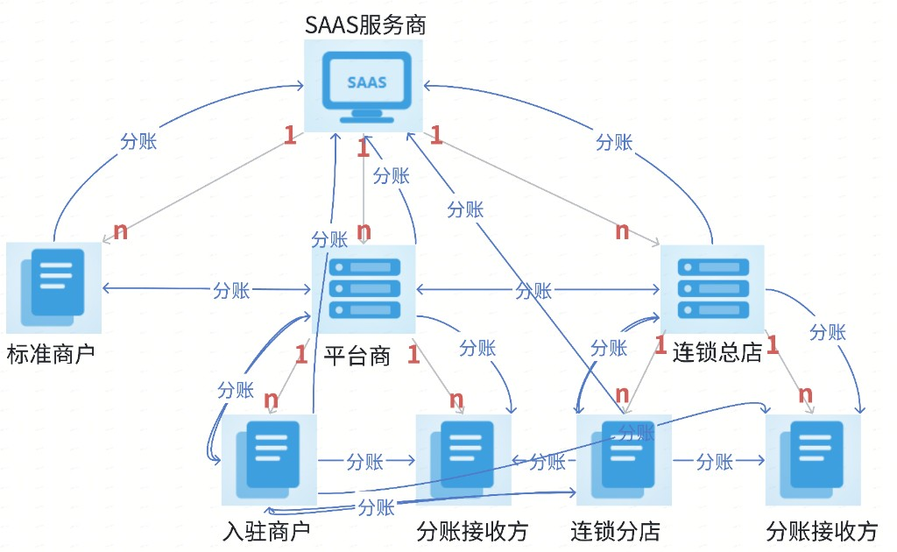
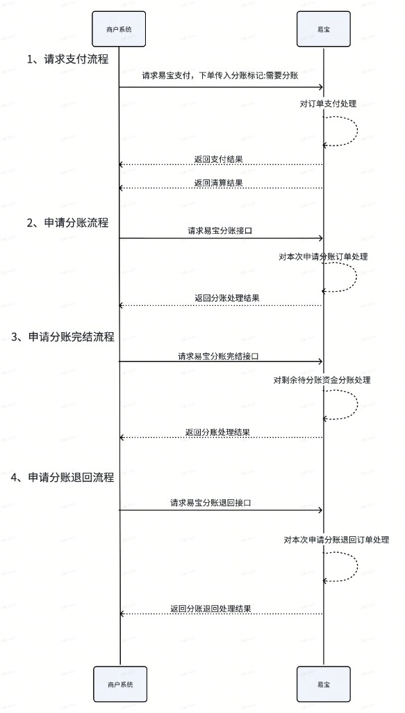
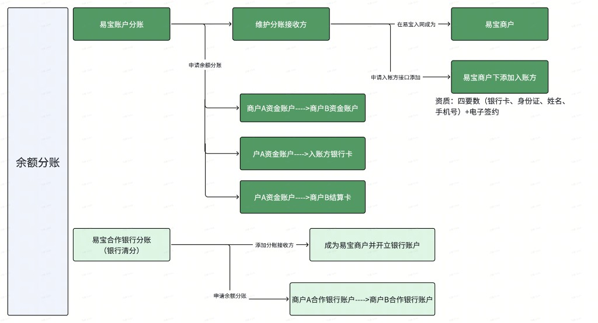

1. # 订单分账

## **服务简介：**

分账是商家收款后与上下游进行资金往来的资分配服务。

## **业务名词：**

分账方：将部分交易资金分出的一方，即收款商户

分账接收方：接收资金的一方

## **使用场景：**

1. 分润给合作伙伴

在与其他方合作的情况下，可以用“分账”服务，将交易资金分给合作伙伴，例如供应商、流量方等。

1. 平台抽佣

平台商可通过分账服务，从交易资金中收取佣金。

1. 担保交易（管理资金到账时间）

在电商平台中，平台可使用分账服务实现担保交易。用户付款后，交易资金先“冻结”在商户账户中，当在用户确认收货后，使用分账服务将资金解冻“”给商户账户。如用户确认收货前发生退款，会直接使用“冻结”的交易资金进行退款。

## **业务流程：**

1. 交易成功后，订单资金扣除支付手续费后先存放在商户待分账账户，等待分账
2. 商户根据业务需要，在一定时间后，发起分账指令，订单资金分给相关分账方

## **可以分账给谁：**



1. ## 订单分账
2. ### 开通分账服务

订单分账是服务，不是产品

**开通订单分账服务：**

- **分账证明材料：**易宝没有提供模版，需要商户出具分账场景说明相关的业务合同


```JSON
{
    "functionService": ["SHARE"],
    "functionServiceQualificationInfo": {"shareScene":"按照实际业务场景传","shareCertificate":"https://staticres.yeepay.com/xxx.文件后缀"}
}
```

---

1. ### 延迟分账

创建订单时可以不指定分账接收方，当用户支付成功后，收款资金不会立刻触发分账，需要通过调用分账申请指令发起分账，此时指定分账接收方信息和分账金额

**开发流程：**



1. #### 订单打分账标记

- 订单需要分账，需要在[【聚合支付统一下单】](https://open.yeepay.com/docs/apis/fwssfk/options__rest__v1.0__aggpay__pre-pay)接口，创建订单时，分账订单标记fundProcessType传DELAYSETTLE


1. #### 订单资金清算

需要支付订单完成清算入账后才可以发起分账！需要在创建订单时传入清算回调地址csUrl字段，收到[【清算结果通知】](https://open.yeepay.com/docs/products/fwssfk/spis/5fd03ec8f8301e001b1a8711)后，再发起分账，避免分账请求报错。

订单支付成功后，可以在5s后或接收到清算结果通知后，通过调用申请分账接口发起分账请求，可通过调用查询分账结果接口查询分账结果。（如需知晓订单的可分账金额，可通过清算结果通知 中的ypSettleAmount获取订单最大可分账金额或查询订单中的unSplitAmount获取实时剩余可分账金额）

1. #### 申请订单分账

使用说明：

1. 建议在接收支付成功结果5秒后，再调用此接口申请分账
2. 此接口会同步返回分账状态，如同步获取的分账状态为处理中（PROCESSING），可通过查询分账结果接口获取分账最终结果。
3. 一次分账请求中，有任意一个分账接收方分账失败，则这次分账请求的全部分账明细处理均会失败。
4. 支持按照指定比例或者金额执行分账。

```JSON
示例值：
按固定金额分账：
 [{"amount":"100.00","ledgerNo":"10000466938","ledgerType":"MERCHANT2MERCHANT","divideDetailDesc":"供应商结算"},{"amount":"100.00","ledgerNo":"212345678912","ledgerNoFrom":"10000466938","ledgerType":"MERCHANT2MEMBER"}] 
 按分账比例分账： 
 [{"proportion":"50.15","ledgerNo":"10000466938","ledgerType":"MERCHANT2MERCHANT","divideDetailDesc":"供应商结算"},{"proportion":"49.85","ledgerNo":"212345678912","ledgerNoFrom":"10000466938","ledgerType":"MERCHANT2MEMBER"}]
```

调用[【申请订单分账】](https://open.yeepay.com/docs/apis/INDUSTRY_SOLUTION/GENERAL/fwssfk/jiaoyi/options__rest__v1.0__divide__apply)接口，发起分账指令，接口同步返回分账结果，也可以通过[【查询订单分账结果】](https://open.yeepay.com/docs/apis/fwssfk/get__rest__v1.0__divide__query)接口获取分账结果

1. #### 订单分账-完结分账

如订单后续不需要再进行分账，可直接调用此[【订单分账-完结分账】](https://open.yeepay.com/docs/apis/INDUSTRY_SOLUTION/GENERAL/fwssfk/jiaoyi/options__rest__v1.0__divide__complete)接口将订单剩余可分账金额全部给收款商户。

**此接口非必须，也完全可以由****[【申请订单分账】](https://open.yeepay.com/docs/apis/INDUSTRY_SOLUTION/GENERAL/fwssfk/jiaoyi/options__rest__v1.0__divide__apply)****接口指定剩余待分账金额分账给收单商户代替。**

1. #### 分账退回

如需将已分账资金从分账接收方退回给分账方，可以使用[【申请订单分账资金归还】](https://open.yeepay.com/docs/apis/INDUSTRY_SOLUTION/GENERAL/fwssfk/jiaoyi/options__rest__v1.0__divide__back)接口发起申请，可调用[【查询订单分账资金归还结果】](https://open.yeepay.com/docs/apis/INDUSTRY_SOLUTION/GENERAL/fwssfk/jiaoyi/options__rest__v1.0__divide__back__query)接口查询资金归还结果

1. #### 分账回单

如需分账回单，可通过调用[【分账回单】](https://open.yeepay.com/docs/apis/INDUSTRY_SOLUTION/GENERAL/fwssfk/jiaoyi/options__yos__v1.0__divide__receipt__download)接口进行获取

---

1. ### 实时分账

创建订单时必须指定分账接收方信息和分账金额，当用户支付成功后，收款资金清算完成后，系统立刻自动触发分账

- 当该笔订单需要进行分账，需要在[【聚合支付统一下单】](https://open.yeepay.com/docs/apis/fwssfk/options__rest__v1.0__aggpay__pre-pay)接口，创建订单时，分账订单标记fundProcessType传REALTIMEDIVIDE


- 指定分账明细divideDetail和分账通知地址divideNotifyUrl，分账结果会通过[【分账结果通知】](https://open.yeepay.com/docs/products/fwssfk/spis/64f96c1b6e75f4004d657a2f)下发告知商户系统


PS：实时分账失败，可以通过调用[【申请订单分账】](https://open.yeepay.com/docs/apis/INDUSTRY_SOLUTION/GENERAL/fwssfk/jiaoyi/options__rest__v1.0__divide__apply)接口再次触发分账，isUnfreezeResidualAmount参数值要指定TRUE

---

1. # 余额分账
2. ## 余额分账
3. ### 开通余额分账产品

余额分账至入账方分为对公和对私

对公：易宝账户资金打款至企业银行对公卡

对私：易宝账户资金打款至个人银行借记卡

H5来源的入账方：

对公、对私，都需申请方签约、商户确认

PC、APP、API来源的入账方

对公申请方不签约、商户不确认

对私入账方签约、商户确认


|               |                            |                        |
| ------------- | -------------------------- | ---------------------- |
| ##### 产品名称    | ##### 产品码                  | ##### 备注               |
| 易分账_资金分账_易宝账户 | EASYSHARE_SHARE_MERCHANT   | 到易宝商户资金账户，接收方需要入网商户    |
| 余额分账_至绑定卡     | EASYSHARE_BINDCARD         | 到易宝商户绑定的结算卡上，接收方需要入网商户 |
| 余额分账_至入账方_对公  | EASYSHARE_RECEIVER_PUBLIC  | 接收方需要入入账方+商户和接收方双向签约  |
| 余额分账_至入账方_对私  | EASYSHARE_RECEIVER_PRIVATE |                        |


1. ### 涉及接口
2. #### 入网接收方
3. ##### 入网商户
4. ###### [【子商户入网资质文件上传】](https://open.yeepay.com/docs/apis/fwssfk/options__yos__v1.0__sys__merchant__qual__upload)

- **使用说明：**

通过文件上传接口上传子商户入网需要的资质照片，接口调用成功后返回资质照片对应

的易宝存储的 URL，再通过入网接口传入获取的存储 URL

- **企业/个体入网，需要通过文件上传接口上传的资质：**

1. 统一社会信用代码证照片
2. 开户许可证照片（如果没有可提供基本存款账户信息表照片）
3. 法人身份证正反面照片（正面为人像面，背面为国徽面）
4. 开通转账或代付功能需要业务合作协议（易宝侧没有协议模版，商户提供业务合作协议）
5. 证明实际分账场景的协议材料（易宝侧没有协议模版，商户提供业务分账相关说明合作协议）

- **个人小微入网，需要通过文件上传接口上传的资质：**

用户身份证正反面照片（正面为人像面，背面为国徽面）

- **图片大小限制：**

格式为 JPG（JPEG），BMP，PNG，GIF，TIFF，PDF，ZIP

用 yos.yeepay.com 域名请求文件上传接口，大小限制 6M，身份证支持 5M 以内；营业执照支持 4M 以内；其他图片支持 6M 以内

1. ###### 特约商户入网（企业/个体/小微）

- [【特约商户入网（企业/个体）】](https://open.yeepay.com/docs/apis/fwssfk/options__rest__v2.0__mer__register__saas__merchant)
- [【特约商户入网（小微）】](https://open.yeepay.com/docs/apis/fwssfk/options__rest__v2.0__mer__register__saas__micro)

1. #### 入入账方

[【申请入账方】](https://open.yeepay.com/docs/products/fwssfk/api/post__rest__v1.0__mer__receiver__apply)

商户可以通过此接口，为子商户申请添加入账方。商户可以使用易分账能力，分账至入账方的银行账户。

1. #### 申请余额分账
2. ##### 接口描述

说明：通过此接口发起的余额分账，此接口的特点是一个批次发N笔，按笔分别处理，分账结果按笔分别回调；

1.一次分账最多支持30笔明细

2.协议分账PROTOCALDIVIDE说明：针对分账给其他商户的情况若希望易宝验证分账方和接收方有关系,可以选择使用此服务,适用于协议扣款等场景,使用此服务需要接收方做短信回填确认

1. ##### 使用说明

**一、此接口支持商户易宝账户分账和合作银行账户分账**

1. 易宝账户分账支持基于商户资金账户余额分账给其他商户账户/其他商户绑定结算卡/商户下添加的入账方（银行卡）
2. 合作银行账户分账支持从商户的银行账户分账给其他商户的银行账户；此分账支持针对已分账的资金发起分账退回（详见分账退回接口）；



**二. 申请余额分账接口的响应参数code仅代表业务的受理情况，具体余额分账是否成功，需要通过查询接口（查询余额分账结果）或通知里返回的status获取最终结果。**

1. 当响应参数code=SR000000时，说明易宝已受理该笔请求，此时需要根据status来判断处理状态；
2. 当响应参数code≠SR000000时，说明易宝没有受理该笔请求，可根据返回的message进行相应处理。

**三、接口字段详解**

1. 接口中的parentMerchantNo和merchantNo需要符合易宝商户关系，即merchantNo需为parentMerchantNo下级或者两者相同；
2. 接口中的ledgerNo（分账接收方） a.如果ledgerType=RECEIVER（分账至入账方）时，ledgerNo需要先通过申请入账方接口添加为该商户下的入账方；不属于该商户（merchantNo）的入账方不可以接收其分账资金； b.如果ledgerType=MERCHANT或MERCHANTBINDCARD或BANKACCOUNT；ledgerNo均传易宝商户编号且需要与merchantNo同归属于一个SAAS/平台（跨平台需要单独找运营申请）
3. 接口中金额字段详细说明 a.当手续费为merchantNo承担且实时收取且feeChargeSide为OUTSIDE，divideAmount=100元，feeAmount=1元时；debitAmount=101，receiveAmount=100； b.当手续费为merchantNo承担且实时收取且feeChargeSide为INSIDE，divideAmount=100元，feeAmount=1元时；debitAmount=100，receiveAmount=99； c.当手续费入网指定为merchantNo承担且预付实扣和后收时，feeChargeSide不生效无需填写；divideAmount=100元，feeAmount=1元时；debitAmount=100，receiveAmount=100； d.当手续费入网指定不是merchantNo承担时feeChargeSide不生效无需填写；divideAmount=100元，feeAmount=1元时；debitAmount=100，receiveAmount=100；
4. ##### 涉及接口

[【申请余额分账】](https://open.yeepay.com/docs/products/fwssfk/api/post__rest__v1.0__divide__balance__apply)

通过该接口完成余额分账。

[【查询余额分账结果】](https://open.yeepay.com/docs/products/fwssfk/api/get__rest__v1.0__divide__balance__query)

商户可通过此接口，查询余额分账结果

---